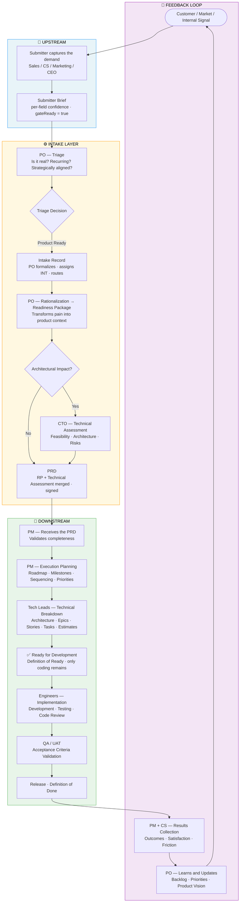
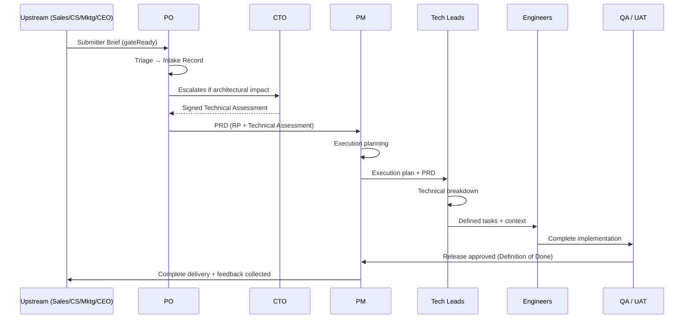

# Happy Path — From Request to Delivery

## Purpose

This document describes the ideal flow of a demand through the operational model, from the moment a signal is captured until the feedback cycle closes.

This is the happy path: every input arrives complete, every handoff is clean, every role acts within its own boundaries, and no escalation or rejection is needed.

Edge cases and failure paths are documented elsewhere.

## Flow overview

## Step-by-step description

### Step 1 — Signal capture

Who: Sales, Customer Success, Marketing, CEO (when relevant).

A customer expresses a pain point, a market signal is identified, or an internal need arises. The responsible role records the demand using the structured intake format — not as a feature request or technical specification, but as a problem statement.

Required fields:

- **Origin** (Customer / Internal / Market / Support).
- **Type** (Bug / Feature / Improvement / Compliance / Integration / Operational).
- **Problem statement** (what pain exists).
- **Business impact** (Revenue / Retention / Operational blocker / Efficiency / Competitive advantage).
- **Priority** (Critical / High / Medium / Low).
- **Stakeholders** (who is impacted, who has influence, who should be informed).
- **Assumptions** (conditions considered true — if false, the demand needs re-triage).
- **Constraints** (non-negotiable time, scope, budget, legal, or technical limits).
- **Preliminary risks** (risks visible at intake, before technical assessment — not the full register).
- **High-level scope boundaries** (what is clearly in, out, and deferred).
- **Success criteria** (value indicators at the intake level — detailed targets go in the Readiness Package).

Priority level definitions:

| Level | Meaning | Operational obligation |
|---|---|---|
| Critical | Active revenue loss, contractual violation, or production outage affecting customers | PO triages within 24h. PM capacity assessment before touching any other commitment. |
| High | A deal, renewal, or key customer retention is at risk within 30 days | PO triages within 3 business days. PM flags impact on current commitments. |
| Medium | Significant improvement with no immediate revenue or retention risk | Enters normal triage queue. Processed in the next review cycle. |
| Low | Nice-to-have, no measurable short-term impact | Goes directly to the Opportunity Backlog for future review. |

#### Readiness layer — how "complete" matured

> The fields above remain required, but what makes a record "ready for triage" is no longer binary. Capture is no longer a complete/incomplete fill-in — it is the progressive building of **confidence-graded readiness**. The full reasoning lives in [`personas/01-submitter.md`](./personas/01-submitter.md) §3–§6; the instantiated form, in [`templates/00-submitter-brief.md`](./templates/00-submitter-brief.md).

Three additions change the capture step without removing anything that already existed:

- **Confidence is first class.** Each substantive answer carries `confidence / source / status / hint`. Downstream receives *confidence-graded* answers — it knows what is firm and what still needs Discovery.
- **Readiness Score is the quantitative gate.** The record advances when all blocking requirements are resolved (`gateReady = true`), not when every field is filled. `low_confidence` counts as partial in the score (see [`references.md` § 11.1](./references.md)).
- **"I don't know" does not block.** A requirement reaches readiness through any honest disposition — `answered`, `inferred`, `assumption` (to be validated), `discovery` (to be investigated, time-boxed), or `deferred` (with an owner). The gate is "every requirement has an honest disposition", not "the Submitter knows everything".

Output: **Submitter Brief** — structured and confidence-graded, ready for PO triage.

Gate: nothing advances without a **ready** Submitter Brief — and "ready" now means `gateReady = true` (all blocking requirements resolved by an honest disposition), not just all fields filled.

### Step 2 — Initial triage (PO)

Who: PO.

The PO reviews the record independently. This step assesses whether the demand is worth processing — not whether it is technically feasible, but whether it is real, recurring, and aligned with the strategic direction. The PO inherits the record's readiness snapshot (Readiness Score, dispositions, and per-field confidence): triage already arrives knowing what is firm, what is an assumption, and what is flagged for Discovery.

Triage questions:

- Is it a real problem or a one-off request?
- Is it recurring across multiple customers or segments?
- Is it aligned with the product vision?
- Does it have measurable business impact?
- Is there urgency that justifies prioritization?

Output, one of four paths:

- **Rejected** — outside strategy, low value, or not scalable. Documented and communicated to the requester.
- **Opportunity Backlog** — valuable but not prioritized now. Held for future review.
- **Discovery** — requires investigation before the demand can be rationalized.
- **Product Ready** — sufficient context to move to rationalization.

When the decision is **Product Ready**, the PO formalizes the **Intake Record** (`01`) — assigns the `INT-YYYY-NNN` and records the routing decision (see [`templates/01-intake-record.md`](./templates/01-intake-record.md)) — opening rationalization.

Gate: the PO escalates to the CTO in this step only if an obvious architectural concern is already visible.

### Discovery flow

When it applies: the demand is real and potentially valuable, but the PO cannot yet rationalize it because information is missing — customer context, market data, technical unknowns, or unclear problem boundaries.

Who leads: PO (leads), with support from Sales, CS, or CTO depending on what is missing.

Discovery produces one of two outcomes:

- a structured problem brief, sufficient to re-enter triage as Product Ready;
- a documented reason why the demand cannot be validated, going to Opportunity Backlog or Rejected.

Steps:

| Step | Action | Owner |
|---|---|---|
| 1 | Define exactly what information is missing | PO |
| 2 | Identify the source (customer interview, CS data, CTO spike) | PO |
| 3 | Conduct investigation with a defined time-box (max. 2 weeks) | PO + relevant role |
| 4 | Document findings in a Discovery Brief | PO |
| 5 | Re-triage the demand based on the findings | PO |

Gate: Discovery does not run indefinitely. If the required information cannot be obtained within the time-box, the demand goes to the Opportunity Backlog with a documented reason. Discovery does not block the Intake queue.

### Step 3 — Rationalization and preparation (PO)

Who: PO (primary), CTO (when architectural impact is identified).

The PO transforms the validated demand from raw pain into structured product context. This is the central intellectual work of the Intake Layer — converting ambiguity into clarity.

The PO produces:

- problem framing and expected outcome;
- capability or feature definition (what the system will do, not how);
- impacted journeys and personas;
- business rules, validations, and state transitions;
- scope boundaries (included and excluded);
- success criteria (measurable outcomes);
- initial risk identification.

Architectural assessment (CTO): if the demand touches new infrastructure, platform changes, AI/runtime behavior, multi-tenancy, security, or introduces significant technical unknowns, the PO escalates to the CTO.

The CTO produces a **Technical Assessment** — a standalone artifact, authored exclusively by the CTO (see [`templates/03-technical-assessment.md`](./templates/03-technical-assessment.md)), **not** sections inside the RP:

- architectural constraints and patterns to follow;
- affected systems and components;
- technical risks and mitigations;
- firm effort and cost;
- guidelines for downstream technical breakdown.

Gate: the Readiness Package freezes (`freezeReady`) when its blocking sections are resolved and — if escalated — the Technical Assessment has been returned signed. The RP and TA then merge into the **PRD**.

### Step 4 — Readiness Package, Technical Assessment, and PRD

Who: PO (owner of the RP and PRD), CTO (owner of the Technical Assessment, when escalated).

The matured structural correction ([`personas/02-po.md` §2](./personas/02-po.md)): the RP and the Technical Assessment are **separate artifacts with different authors** that **merge into the PRD**. It is the **PRD** — not the RP alone — that opens downstream.

| Artifact | Owner | Content |
|---|---|---|
| **Readiness Package** | PO (sole author) | Vision, problem, scope, business rules, user stories, NFRs, edge cases, metrics with guardrails, success criteria |
| **Technical Assessment** | CTO (only if architectural escalation occurred) | Feasibility, architecture, integrations, technical constraints, risks, ADRs, firm cost |
| **PRD** | PO + CTO (merge) | `RP + Technical Assessment` combined — the document that opens downstream |

> Without architectural escalation, the PRD is formed from the RP alone, and the Technical Assessment reference has `Status: Not requested`.

Output: **PRD** complete and signed (RP + Technical Assessment), delivered to the PM.

Gate: the PM receives the PRD and has the authority to reject and return it to the PO if any part is missing, contradictory, or insufficient for planning.

### Step 5 — Execution planning (PM)

Who: PM.

The PM receives the PRD and translates it into a delivery plan. Before producing a schedule, the PM runs a capacity assessment. Scope is fixed in the PRD — the PM does not redefine it. The PM's focus is sequence, timing, dependencies, and team coordination.

Capacity assessment:

- **Current load** — what the team is already committed to and at what capacity percentage.
- **Skills coverage** — whether the team has the seniority and expertise for this scope.
- **Conflict map** — which existing deliverables would be impacted if the demand is absorbed now.
- **Recommendation** — descoping, phasing, deferring an existing commitment, or hiring.

If capacity is insufficient, the PM escalates to the PO with the assessment before any schedule is produced. No commitment is made under pressure without this step.

The PM then produces:

- delivery roadmap and milestones (grounded in verified capacity);
- prioritization within the approved scope;
- sprint or cycle structure;
- cross-team dependency map;
- escalation triggers (which conditions require the PM to flag a blocker).

Output: execution plan delivered to Tech Leads.

Gate: Tech Leads confirm sufficient context to start technical breakdown.

### Step 6 — Technical breakdown (Tech Leads)

Who: Tech Leads.

Tech Leads receive the PRD and the execution plan. They own all technical decisions within this scope. They translate product context into engineering-ready structure.

What they produce:

- architecture design (services, APIs, events, queues, components);
- epics, stories, and tasks with clear acceptance criteria;
- technical sequencing and dependencies;
- effort estimates;
- technical constraints and implementation guidelines;
- rollout strategy (deploy, migration, monitoring, rollback);
- Definition of Done.

Gate: the **Definition of Ready** (*Ready for Development*) — Engineers do not start work until epics, stories, and tasks are written and estimated, with context, constraints, and acceptance criteria. It is here, downstream, that the demand becomes "ready to code" — not at RP freeze.

### Step 7 — Implementation (Engineers)

Who: Engineers.

Engineers implement the work as defined by the Tech Leads. They own implementation decisions within the approved architecture. Any discovery that contradicts the defined scope or architecture is escalated to the Tech Lead — not absorbed silently.

Engineers deliver:

- code meeting acceptance criteria;
- unit and integration tests;
- completed code review;
- documentation where the Definition of Done requires it.

Gate: the code passes QA/UAT before release.

### Step 8 — QA / UAT

Who: QA (internal), relevant stakeholders for UAT.

The acceptance criteria defined in the PRD are validated. This step confirms that what was built matches what was promised.

Output: release approval.

### Step 9 — Release

Who: Tech Leads (supervise), Engineers (execute), PM (coordinates timing).

The rollout strategy defined in the Tech Backlog is executed. Monitoring and observability are active. A rollback plan is available if needed.

### Step 10 — Feedback loop

Who: PM (initiates), CS (collects customer signal), PO (synthesizes learnings).

Trigger: the PM initiates the feedback loop within 5 business days of release. It does not require a meeting — it requires a structured async summary delivered to the PO and CS. A synchronous review only happens if outcomes diverge significantly from the success criteria.

After delivery, results are collected. This is not optional — it is what closes the cycle and improves the next iteration.

CS collects:

- customer satisfaction and adoption signals;
- friction or unexpected behavior post-release;
- new pain points surfaced by the delivered feature.

PM collects:

- delivery accuracy (did we meet milestones and scope?);
- estimate accuracy;
- process friction (where did the model slow down or break?).

PO synthesizes:

- updates product vision and backlog based on outcomes;
- documents learnings that affect future triage decisions;
- feeds insights back into the next cycle.

Output: updated opportunity backlog, refined product vision, process improvement notes.

## Handoff summary

## Parallel demands

The flow above describes a single demand. In practice, several will be at different stages simultaneously. Rules for concurrent processing:

- **The PO manages the Intake queue, not individual demands** — at any given moment, several may be in Triage, Discovery, or Rationalization simultaneously.
- **Priority order comes from priority level + strategic alignment**, not order of arrival.
- **A Critical demand always interrupts the PO's current queue** — the PO pauses lower-priority rationalization to triage it within 24h.
- **Downstream only absorbs what capacity allows** — the PM's capacity assessment is the binding constraint. Multiple approved PRDs do not automatically become parallel execution.
- **The PM maintains a single sequenced execution queue** — if two demands are approved, the PM sequences them based on capacity, dependencies, and strategic priority, and communicates the sequence to the PO.
- **The PO owns the Opportunity Backlog review** — every 2 weeks, the PO reviews the backlog to promote, re-triage, or expire items. Items with more than 90 days of inactivity are escalated to the CEO for a decision or closed.

## Happy path principles

1. **Every handoff has a gate** — no role accepts incomplete input without returning it.
2. **Scope freezes at the PRD** (RP + Technical Assessment) — downstream roles execute, they do not redefine.
3. **Upstream defines the problem, downstream defines the solution** — never the reverse.
4. **The CTO is pulled, not pushed** — the PO escalates to the CTO; the CTO does not participate in every triage.
5. **Feedback is mandatory** — the loop closes on every delivery cycle.
6. **Ambiguity is escalated, not absorbed** — every role has the obligation to surface incomplete inputs.
7. **Capacity is a constraint, not a negotiation** — no commitment is made without a PM capacity assessment.
8. **Discovery is time-boxed** — every Discovery has a defined deadline and exit condition.
9. **Confidence travels with the artifact** — each answer carries how solid it is and where it came from; "I don't know, and this is the plan" is a valid form of reaching readiness, not a blocker.
