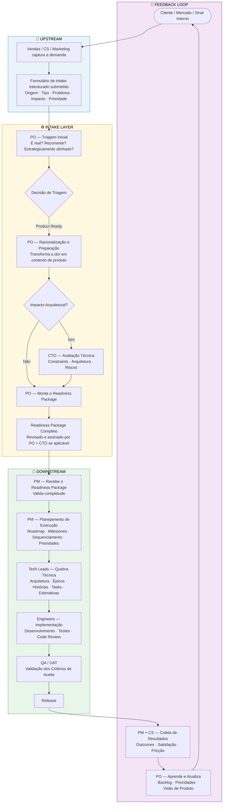
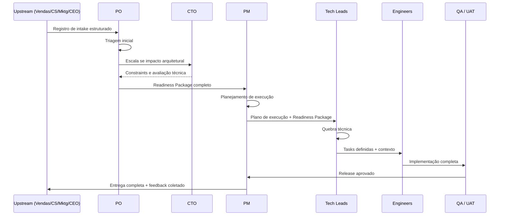

# Happy Path — Do Pedido à Entrega

## Propósito

Este documento descreve o fluxo ideal de uma demanda pelo modelo operacional, do momento em que o sinal é capturado até o ciclo de feedback fechar.

Este é o happy path: cada input chega completo, cada handoff é limpo, cada papel age dentro dos próprios limites, nenhuma escalada ou rejeição é necessária.

Casos de borda e caminhos de falha são documentados em outros lugares.

## Visão geral do fluxo

## Descrição passo a passo

### Passo 1 — Captura do sinal

Quem: Vendas, Customer Success, Marketing, CEO (quando relevante).

Um cliente expressa uma dor, um sinal de mercado é identificado ou uma necessidade interna surge. O papel responsável registra a demanda usando o formato de intake estruturado — não como solicitação de funcionalidade ou especificação técnica, e sim como enunciado de problema.

Campos obrigatórios:

- **Origem** (Cliente / Interno / Mercado / Suporte).
- **Tipo** (Bug / Funcionalidade / Melhoria / Compliance / Integração / Operacional).
- **Enunciado do problema** (qual dor existe).
- **Impacto de negócio** (Receita / Retenção / Bloqueio operacional / Eficiência / Vantagem competitiva).
- **Prioridade** (Crítica / Alta / Média / Baixa).
- **Stakeholders** (quem é impactado, quem tem influência, quem deve ser informado).
- **Premissas** (condições consideradas verdadeiras — se falsas, a demanda precisa ser retriada).
- **Constraints** (limites de tempo, escopo, orçamento, legais ou técnicos não negociáveis).
- **Riscos preliminares** (riscos visíveis no intake, antes da avaliação técnica — não o registro completo).
- **Limites de escopo de alto nível** (o que está claramente dentro, fora e adiado).
- **Critérios de sucesso** (indicadores de valor no nível do intake — metas detalhadas ficam para o Readiness Package).

Definições de nível de prioridade:

| Nível | Significado | Obrigação operacional |
|---|---|---|
| Crítica | Perda de receita ativa, violação contratual ou interrupção de produção afetando clientes | PO faz triagem em 24h. Avaliação de capacidade pelo PM antes de tocar qualquer outro compromisso. |
| Alta | Um deal, renovação ou retenção de cliente-chave está em risco em 30 dias | PO faz triagem em 3 dias úteis. PM sinaliza impacto nos compromissos atuais. |
| Média | Melhoria significativa sem risco imediato de receita ou retenção | Entra na fila normal de triagem. Processada no próximo ciclo de revisão. |
| Baixa | Nice-to-have, sem impacto mensurável no curto prazo | Entra direto no Backlog de Oportunidades para revisão futura. |

#### Camada de prontidão — como "completo" amadureceu

> Os campos acima continuam obrigatórios, mas o que torna um registro "pronto para triagem" deixou de ser binário. A captura não é mais um preenchimento completo/incompleto — é a construção progressiva de uma **prontidão graduada por confiança**. O raciocínio completo vive em [`personas/01-submitter.md`](./personas/01-submitter.md) §3–§6; a forma instanciada, em [`templates/00-submitter-brief.md`](./templates/00-submitter-brief.md).

Três adições mudam o passo de captura, sem remover nada do que já existia:

- **Confiança é de primeira classe.** Cada resposta substantiva carrega `confidence / source / status / hint`. O downstream recebe respostas *graduadas* — sabe o que é firme e o que ainda precisa de Discovery.
- **Readiness Score é o gate quantitativo.** O registro avança quando todos os requisitos bloqueantes estão resolvidos (`gateReady = true`), não quando todo campo está preenchido. `low_confidence` conta como parcial no score (ver [`references.md` § 11.1](./references.md)).
- **"Não sei" não bloqueia.** Um requisito atinge prontidão por qualquer disposição honesta — `answered`, `inferred`, `assumption` (a validar), `discovery` (a investigar, time-boxed) ou `deferred` (com dono). O gate é "todo requisito tem uma disposição honesta", não "o Submitter sabe tudo".

Output: registro de intake estruturado e graduado por confiança, pronto para triagem do PO.

Gate: nada avança sem um registro de intake **pronto** — e "pronto" agora significa `gateReady = true` (todos os requisitos bloqueantes resolvidos por uma disposição honesta), não apenas todos os campos preenchidos.

### Passo 2 — Triagem inicial (PO)

Quem: PO.

O PO revisa o registro de forma independente. Esta etapa avalia se a demanda vale ser processada — não se é tecnicamente viável, mas se é real, recorrente e alinhada com a direção estratégica. O PO herda o snapshot de prontidão do registro (Readiness Score, dispositions e confiança por campo): a triagem já chega sabendo o que é firme, o que é premissa e o que está marcado para Discovery.

Perguntas de triagem:

- É problema real ou pedido pontual?
- É recorrente em múltiplos clientes ou segmentos?
- Está alinhado com a visão de produto?
- Tem impacto de negócio mensurável?
- Há urgência que justifique priorização?

Output, um de quatro caminhos:

- **Rejeitado** — fora da estratégia, baixo valor ou não escalável. Documentado e comunicado ao solicitante.
- **Backlog de Oportunidades** — valioso, mas não priorizado agora. Retido para revisão futura.
- **Discovery** — requer investigação antes de a demanda poder ser racionalizada.
- **Product Ready** — contexto suficiente para seguir para a racionalização.

Gate: o PO só escala ao CTO neste passo se uma preocupação arquitetural óbvia já estiver visível.

### Fluxo de Discovery

Quando se aplica: a demanda é real e potencialmente valiosa, mas o PO não consegue racionalizá-la ainda porque falta informação — contexto do cliente, dados de mercado, incógnitas técnicas ou limites de problema não claros.

Quem conduz: PO (lidera), com suporte de Vendas, CS ou CTO dependendo do que está faltando.

O Discovery produz um de dois resultados:

- um brief de problema estruturado, suficiente para reentrar na triagem como Product Ready;
- uma razão documentada de por que a demanda não pode ser validada, indo para Backlog de Oportunidades ou Rejeitado.

Passos:

| Passo | Ação | Responsável |
|---|---|---|
| 1 | Definir qual informação específica falta | PO |
| 2 | Identificar a fonte (entrevista com cliente, dados de CS, spike do CTO) | PO |
| 3 | Conduzir investigação com time-box definido (máx. 2 semanas) | PO + papel relevante |
| 4 | Documentar findings em um Discovery Brief | PO |
| 5 | Retriar a demanda com base nos findings | PO |

Gate: Discovery não roda indefinidamente. Se a informação necessária não puder ser obtida dentro do time-box, a demanda vai para o Backlog de Oportunidades com razão documentada. Discovery não trava a fila do Intake.

### Passo 3 — Racionalização e preparação (PO)

Quem: PO (primário), CTO (quando impacto arquitetural é identificado).

O PO transforma a demanda validada de dor bruta em contexto de produto estruturado. É o trabalho intelectual central do Intake Layer — converter ambiguidade em clareza.

O PO produz:

- enquadramento do problema e resultado esperado;
- definição de capacidade ou funcionalidade (o que o sistema fará, não como);
- jornadas e personas impactadas;
- regras de negócio, validações e transições de estado;
- limites de escopo (incluído e excluído);
- critérios de sucesso (outcomes mensuráveis);
- identificação inicial de riscos.

Avaliação arquitetural (CTO): se a demanda toca nova infraestrutura, mudanças de plataforma, comportamento de IA/runtime, multi-tenancy, segurança, ou introduz incógnitas técnicas significativas, o PO escala ao CTO.

O CTO adiciona:

- constraints arquiteturais e padrões a seguir;
- sistemas e componentes afetados;
- riscos técnicos e mitigações;
- diretrizes para a quebra técnica downstream.

Gate: o Readiness Package não está completo até que todas as 12 seções estejam preenchidas.

### Passo 4 — Readiness Package (PO + CTO)

Quem: PO (dono e entregador), CTO (contribui com seções técnicas).

| # | Seção | Responsável |
|---|---|---|
| 1 | Resumo Executivo | PO |
| 2 | Contexto e Problema | PO |
| 3 | Objetivos | PO |
| 4 | Escopo (Incluído / Excluído) | PO |
| 5 | Personas Impactadas | PO |
| 6 | Regras de Negócio e Fluxos | PO |
| 7 | Integrações Necessárias | PO + CTO |
| 8 | Impacto Técnico | CTO |
| 9 | Riscos e Dependências | PO + CTO |
| 10 | Avaliação Interna de Esforço e Custo | PO + CTO |
| 11 | Critérios de Sucesso | PO |
| 12 | Roadmap Sugerido | PO |

Output: pacote completo e assinado, entregue ao PM.

Gate: o PM recebe o pacote e tem autoridade para rejeitá-lo e devolver ao PO se qualquer seção estiver faltando, contraditória ou insuficiente para o planejamento.

### Passo 5 — Planejamento de execução (PM)

Quem: PM.

O PM recebe o Readiness Package e o traduz em plano de entrega. Antes de produzir cronograma, o PM executa uma avaliação de capacidade. O escopo está fixo no pacote — o PM não redefine. O foco do PM é sequência, timing, dependências e coordenação da equipe.

Avaliação de capacidade:

- **Carga atual** — no que o time já está comprometido e com qual percentual de capacidade.
- **Cobertura de skill** — se o time tem a senioridade e a especialização para esse escopo.
- **Mapa de conflitos** — quais entregas existentes seriam impactadas se a demanda for absorvida agora.
- **Recomendação** — descopo, faseamento, adiamento de um compromisso existente ou contratação.

Se a capacidade for insuficiente, o PM escala ao PO com a avaliação antes de qualquer cronograma. Nenhum compromisso é feito sob pressão sem este passo.

O PM então produz:

- roadmap de entrega e milestones (fundamentados em capacidade verificada);
- priorização dentro do escopo aprovado;
- estrutura de sprint ou ciclo;
- mapa de dependências cross-team;
- gatilhos de escalada (quais condições exigem que o PM sinalize um bloqueador).

Output: plano de execução entregue aos Tech Leads.

Gate: Tech Leads confirmam contexto suficiente para iniciar a quebra técnica.

### Passo 6 — Quebra técnica (Tech Leads)

Quem: Tech Leads.

Os Tech Leads recebem o Readiness Package e o plano de execução. São donos de todas as decisões técnicas dentro deste escopo. Traduzem contexto de produto em estrutura pronta para engenharia.

O que produzem:

- design de arquitetura (serviços, APIs, eventos, filas, componentes);
- épicos, histórias e tasks com critérios de aceite claros;
- sequenciamento técnico e dependências;
- estimativas de esforço;
- constraints técnicos e diretrizes de implementação;
- estratégia de rollout (deploy, migração, monitoramento, rollback);
- Definition of Done.

Gate: Engineers não iniciam o trabalho até que as tasks estejam definidas com contexto, constraints e critérios de aceite.

### Passo 7 — Implementação (Engineers)

Quem: Engineers.

Os Engineers implementam o trabalho conforme definido pelos Tech Leads. Donos das decisões de implementação dentro da arquitetura aprovada. Qualquer descoberta que contradiz o escopo ou arquitetura definidos é escalada ao Tech Lead — não absorvida silenciosamente.

Engineers entregam:

- código atendendo aos critérios de aceite;
- testes unitários e de integração;
- code review concluído;
- documentação onde a Definition of Done exigir.

Gate: o código passa em QA/UAT antes do release.

### Passo 8 — QA / UAT

Quem: QA (interno), stakeholders relevantes para UAT.

Os critérios de aceite definidos no Readiness Package são validados. Este passo confirma que o que foi construído corresponde ao que foi prometido.

Output: aprovação de release.

### Passo 9 — Release

Quem: Tech Leads (supervisionam), Engineers (executam), PM (coordena timing).

A estratégia de rollout definida no Tech Backlog é executada. Monitoramento e observabilidade estão ativos. Plano de rollback disponível se necessário.

### Passo 10 — Feedback loop

Quem: PM (inicia), CS (coleta sinal do cliente), PO (sintetiza aprendizados).

Gatilho: o PM inicia o feedback loop em até 5 dias úteis após o release. Não exige reunião — exige um resumo assíncrono estruturado entregue ao PO e CS. Uma revisão síncrona só acontece se os outcomes divergirem significativamente dos critérios de sucesso.

Após a entrega, os resultados são coletados. Não é opcional — é o que fecha o ciclo e melhora a iteração seguinte.

CS coleta:

- satisfação do cliente e sinais de adoção;
- fricção ou comportamento inesperado pós-release;
- novos pontos de dor surfaçados pela funcionalidade entregue.

PM coleta:

- precisão da entrega (cumprimos milestones e escopo?);
- precisão das estimativas;
- fricção do processo (onde o modelo desacelerou ou quebrou?).

PO sintetiza:

- atualiza visão de produto e backlog com base nos outcomes;
- documenta aprendizados que afetam futuras decisões de triagem;
- alimenta insights de volta para o próximo ciclo.

Output: backlog de oportunidades atualizado, visão de produto refinada, notas de melhoria de processo.

## Resumo de handoffs

## Demandas paralelas

O fluxo acima descreve uma demanda isolada. Na prática, várias estarão em estágios diferentes ao mesmo tempo. As regras para o processamento concorrente:

- **O PO gerencia a fila do Intake, não demandas individuais** — a qualquer momento, várias podem estar em Triagem, Discovery ou Racionalização ao mesmo tempo.
- **A ordem de prioridade vem do nível de prioridade + alinhamento estratégico**, não da ordem de chegada.
- **Demanda Crítica sempre interrompe a fila atual do PO** — o PO pausa a racionalização de menor prioridade para triá-la em 24h.
- **O downstream só absorve o que a capacidade permite** — a avaliação de capacidade do PM é o constraint vinculante. Múltiplos Readiness Packages aprovados não viram execução paralela automaticamente.
- **O PM mantém uma única fila de execução sequenciada** — se duas demandas estão aprovadas, o PM as sequencia com base em capacidade, dependências e prioridade estratégica, e comunica a sequência ao PO.
- **O PO é dono da revisão do Backlog de Oportunidades** — a cada 2 semanas, o PO revisa o backlog para promover, retriar ou expirar itens. Itens com mais de 90 dias sem atividade são escalados ao CEO para decisão ou encerrados.

## Princípios do happy path

1. **Cada handoff tem um gate** — nenhum papel aceita input incompleto sem devolvê-lo.
2. **O escopo congela no Readiness Package** — papéis downstream executam, não redefinem.
3. **Upstream define o problema, downstream define a solução** — nunca o inverso.
4. **O CTO é puxado, não empurrado** — o PO escala ao CTO; o CTO não participa de toda triagem.
5. **Feedback é obrigatório** — o loop fecha em todo ciclo de entrega.
6. **Ambiguidade é escalada, não absorvida** — todo papel tem a obrigação de surfaçar inputs incompletos.
7. **Capacidade é constraint, não negociação** — nenhum compromisso é feito sem avaliação de capacidade do PM.
8. **Discovery é time-boxed** — todo Discovery tem prazo e condição de saída definidos.
9. **Confiança viaja com o artefato** — cada resposta carrega o quão sólida é e de onde veio; "não sei, e este é o plano" é uma forma válida de atingir prontidão, não um bloqueio.
