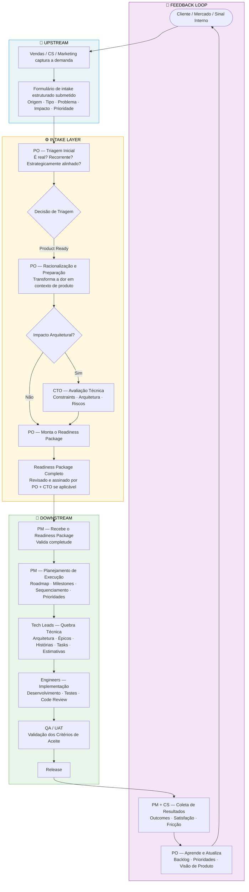
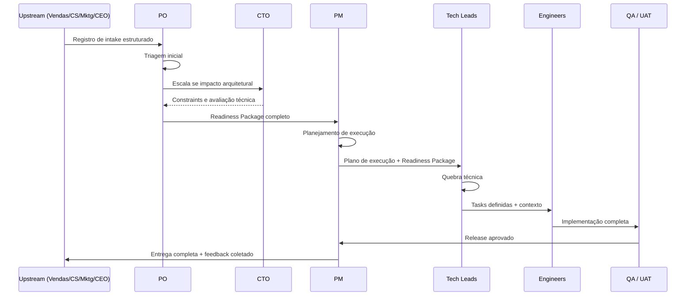

# Happy Path — Do Pedido à Entrega

## Propósito

Este documento descreve o fluxo ideal de uma demanda pelo modelo operacional, desde o momento em que um sinal de cliente ou mercado é capturado até o momento em que uma funcionalidade é entregue e o ciclo de feedback é fechado.

Este é o **happy path**: cada input é completo, cada handoff é limpo, cada papel age dentro de seus limites, e nenhuma escalada ou rejeição é necessária.

Casos de borda e caminhos de falha são documentados separadamente.

---

## Visão Geral do Fluxo

---

## Descrição Passo a Passo

### Passo 1 — Captura do Sinal

**Quem:** Vendas, Customer Success, Marketing, CEO (quando relevante)

**O que acontece:**
Um cliente expressa uma dor, um sinal de mercado é identificado, ou uma necessidade interna surge. O papel responsável registra a demanda usando o formato de intake estruturado — não como uma solicitação de funcionalidade ou especificação técnica, mas como um enunciado de problema.

**Campos obrigatórios:**
- Origem (Cliente / Interno / Mercado / Suporte)
- Tipo (Bug / Funcionalidade / Melhoria / Compliance / Integração / Operacional)
- Enunciado do problema (qual dor existe)
- Impacto de negócio (Receita / Retenção / Bloqueio operacional / Eficiência / Vantagem competitiva)
- Prioridade (Crítica / Alta / Média / Baixa)
- Stakeholders (quem é impactado, quem tem influência, quem deve ser informado)
- Premissas (condições consideradas verdadeiras — se falsas, a demanda deve ser retriaged)
- Constraints (limites de tempo, escopo, orçamento, legais ou técnicos que não podem ser negociados)
- Riscos Preliminares (riscos visíveis no intake, antes da avaliação técnica — não o registro completo de riscos)
- Limites de Escopo de Alto Nível (o que está claramente dentro, fora e adiado)
- Critérios de Sucesso (indicadores de valor no nível do intake — metas detalhadas são formalizadas no Readiness Package)

**Definições de nível de prioridade:**

| Nível | Significado | Obrigação operacional |
|---|---|---|
| Crítica | Perda de receita ativa, violação contratual ou interrupção de produção afetando clientes | PO deve triar em 24h. Avaliação de capacidade pelo PM exigida antes de tocar qualquer outro compromisso. |
| Alta | Um deal, renovação ou retenção de cliente-chave está em risco em 30 dias | PO deve triar em 3 dias úteis. PM sinaliza impacto nos compromissos atuais. |
| Média | Melhoria significativa sem risco imediato de receita ou retenção | Entra na fila normal de triagem. Processada no próximo ciclo de revisão. |
| Baixa | Nice-to-have, sem impacto mensurável no curto prazo | Entra diretamente no Backlog de Oportunidades para revisão futura. |

**Output:** Registro de intake estruturado, pronto para triagem do PO.

**Gate:** Nada avança sem um registro de intake completo.

---

### Passo 2 — Triagem Inicial (PO)

**Quem:** PO

**O que acontece:**
O PO revisa o registro de intake de forma independente. Este passo avalia se a demanda vale ser processada — não se é tecnicamente viável, mas se é real, recorrente e alinhada com a direção estratégica.

**Perguntas de triagem:**
- É um problema real ou uma solicitação pontual?
- É recorrente em múltiplos clientes ou segmentos?
- Está alinhado com a visão de produto?
- Tem impacto de negócio mensurável?
- Há urgência que justifique priorização?

**Output:** Um de quatro caminhos:
- **Rejeitado** — Fora da estratégia, baixo valor ou não escalável. Documentado e comunicado ao solicitante.
- **Backlog de Oportunidades** — Valioso, mas não priorizado agora. Retido para revisão futura.
- **Discovery** — Requer investigação adicional antes de a demanda poder ser racionalizada.
- **Product Ready** — Contexto suficiente para seguir para a racionalização.

**Gate:** O PO não escala ao CTO neste passo, a menos que uma preocupação arquitetural óbvia já seja visível.

---

### Fluxo de Discovery

**Quando se aplica:** A demanda é real e potencialmente valiosa, mas o PO não consegue racionalizá-la ainda porque informações-chave estão faltando — contexto do cliente, dados de mercado, incógnitas técnicas ou limites de problema não claros.

**Quem conduz:** PO (lidera), com suporte de Vendas, CS ou CTO dependendo do que está faltando.

**O Discovery produz um de:**
- Um brief de problema estruturado suficiente para re-entrar na triagem como **Product Ready**
- Uma razão documentada de por que a demanda não pode ser validada e deve ser movida para **Backlog de Oportunidades** ou **Rejeitado**

**Passos do Discovery:**

| Passo | Ação | Responsável |
|---|---|---|
| 1 | Definir qual informação específica está faltando | PO |
| 2 | Identificar a fonte que pode fornecê-la (entrevista com cliente, dados de CS, spike do CTO) | PO |
| 3 | Conduzir investigação com time-box definido (máx. 2 semanas) | PO + papel relevante |
| 4 | Documentar findings em um Discovery Brief | PO |
| 5 | Re-triar a demanda com base nos findings | PO |

**Gate:** O Discovery não pode rodar indefinidamente. Se a informação necessária não puder ser obtida dentro do time-box, a demanda é movida para o Backlog de Oportunidades com uma razão documentada. Não trava a fila do Intake.

---

### Passo 3 — Racionalização e Preparação (PO)

**Quem:** PO (primário), CTO (quando impacto arquitetural é identificado)

**O que acontece:**
O PO transforma a demanda validada de uma dor bruta em um contexto de produto estruturado. Este é o trabalho intelectual central do Intake Layer — convertendo ambiguidade em clareza.

**O PO produz:**
- Enquadramento do problema e resultado esperado
- Definição de capacidade ou funcionalidade (o que o sistema fará, não como)
- Jornadas e personas impactadas
- Regras de negócio, validações e transições de estado
- Limites de escopo (incluído e excluído)
- Critérios de sucesso (outcomes mensuráveis)
- Identificação inicial de riscos

**Avaliação arquitetural (CTO):**
Se a demanda tocar: nova infraestrutura, mudanças a nível de plataforma, comportamento de IA/runtime, multi-tenancy, segurança, ou introduzir incógnitas técnicas significativas — o PO escala ao CTO.

O CTO adiciona:
- Constraints arquiteturais e padrões a seguir
- Sistemas e componentes afetados
- Riscos técnicos e mitigações
- Diretrizes para a quebra técnica downstream

**Gate:** O Readiness Package não é considerado completo até que todas as 12 seções estejam preenchidas.

---

### Passo 4 — Readiness Package (PO + CTO)

**Quem:** PO (dono e entregador), CTO (contribui com seções técnicas)

**O que o pacote deve conter:**

| # | Seção | Responsável |
|---|---|---|
| 1 | Resumo Executivo | PO |
| 2 | Contexto e Problema | PO |
| 3 | Objetivos | PO |
| 4 | Escopo (Incluído / Excluído) | PO |
| 5 | Personas Impactadas | PO |
| 6 | Regras de Negócio e Fluxos | PO |
| 7 | Integrações Necessárias | PO + CTO |
| 8 | Impacto Técnico | CTO |
| 9 | Riscos e Dependências | PO + CTO |
| 10 | Avaliação Interna de Esforço e Custo | PO + CTO |
| 11 | Critérios de Sucesso | PO |
| 12 | Roadmap Sugerido | PO |

**Output:** Um Readiness Package completo e assinado, entregue ao PM.

**Gate:** O PM recebe este pacote e tem autoridade para rejeitá-lo e devolvê-lo ao PO se qualquer seção estiver faltando, contraditória ou insuficiente para o planejamento de execução.

---

### Passo 5 — Planejamento de Execução (PM)

**Quem:** PM

**O que acontece:**
O PM recebe o Readiness Package e o traduz em um plano de entrega. Antes de produzir qualquer cronograma, o PM deve executar uma avaliação de capacidade. O PM não redefine escopo — o escopo está fixo no pacote. O PM foca em sequência, timing, dependências e coordenação da equipe.

**O PM primeiro executa uma Avaliação de Capacidade:**
- **Carga atual** — o que a equipe já está comprometida e com que percentual de capacidade
- **Cobertura de skill** — se a equipe tem a senioridade e especialização necessárias para este escopo
- **Mapa de conflitos** — quais entregas existentes seriam impactadas se esta demanda for absorvida agora
- **Recomendação** — desescopo, faseamento, adiamento de um compromisso existente, ou contratação

Se a capacidade for insuficiente, o PM escala ao PO com a avaliação antes de qualquer cronograma ser definido. Nenhum compromisso é feito sob pressão sem este passo.

**O PM então produz:**
- Roadmap de entrega e milestones (fundamentados em capacidade verificada)
- Priorização dentro do escopo aprovado
- Estrutura de sprint ou ciclo
- Mapa de dependências cross-team
- Gatilhos de escalada (quais condições exigem que o PM sinalize um bloqueador)

**Output:** Plano de execução entregue aos Tech Leads.

**Gate:** Tech Leads confirmam que têm contexto suficiente para iniciar a quebra técnica.

---

### Passo 6 — Quebra Técnica (Tech Leads)

**Quem:** Tech Leads

**O que acontece:**
Tech Leads recebem o Readiness Package e o plano de execução do PM. Eles são responsáveis por todas as decisões técnicas dentro deste escopo. Traduzem contexto de produto em uma estrutura pronta para engenharia.

**Tech Leads produzem:**
- Design de arquitetura (serviços, APIs, eventos, filas, componentes)
- Épicos, histórias e tasks com critérios de aceite claros
- Sequenciamento técnico e dependências
- Estimativas de esforço
- Constraints técnicos e diretrizes de implementação
- Estratégia de rollout (deploy, migração, monitoramento, rollback)
- Definition of Done

**Gate:** Engineers não iniciam o trabalho até que as tasks estejam completamente definidas com contexto, constraints e critérios de aceite.

---

### Passo 7 — Implementação (Engineers)

**Quem:** Engineers

**O que acontece:**
Engineers implementam o trabalho conforme definido pelos Tech Leads. Eles possuem decisões de implementação dentro da arquitetura aprovada. Qualquer descoberta que contradiz o escopo ou arquitetura definidos é imediatamente escalada ao Tech Lead — não absorvida silenciosamente.

**Engineers entregam:**
- Código implementado atendendo aos critérios de aceite
- Testes unitários e de integração
- Code review concluído
- Documentação onde exigida pela Definition of Done

**Gate:** O código passa em QA/UAT antes do release.

---

### Passo 8 — QA / UAT

**Quem:** QA (interno), stakeholders relevantes para UAT

**O que acontece:**
Os critérios de aceite definidos no Readiness Package são validados. Este passo confirma que o que foi construído corresponde ao que foi prometido.

**Output:** Aprovação de release.

---

### Passo 9 — Release

**Quem:** Tech Leads (supervisionam), Engineers (executam), PM (coordena timing)

**O que acontece:**
A estratégia de rollout definida no Tech Backlog é executada. Monitoramento e observabilidade estão confirmados como ativos. Plano de rollback está disponível se necessário.

---

### Passo 10 — Feedback Loop

**Quem:** PM (inicia), CS (coleta sinal do cliente), PO (sintetiza aprendizados)

**Gatilho:** O PM inicia o feedback loop dentro de 5 dias úteis após o release. Não requer uma reunião — requer um resumo assíncrono estruturado entregue ao PO e CS. Uma revisão síncrona é realizada apenas se os outcomes divergirem significativamente dos critérios de sucesso.

**O que acontece:**
Após a entrega, os resultados são coletados. Isso não é opcional — é o que fecha o ciclo e melhora a próxima iteração.

**CS coleta:**
- Satisfação do cliente e sinais de adoção
- Fricção ou comportamento inesperado pós-release
- Novos pontos de dor surfaçados pela funcionalidade entregue

**PM coleta:**
- Precisão da entrega (cumprimos milestones e escopo?)
- Precisão das estimativas
- Fricção do processo (onde o modelo desacelerou ou quebrou?)

**PO sintetiza:**
- Atualiza visão de produto e backlog com base nos outcomes
- Documenta aprendizados que afetam futuras decisões de triagem
- Alimenta insights de volta para o próximo ciclo

**Output:** Backlog de oportunidades atualizado, visão de produto refinada, notas de melhoria de processo.

---

## Resumo de Handoffs

---

## Demandas Paralelas

O fluxo acima descreve uma única demanda isoladamente. Na prática, múltiplas demandas estarão em estágios diferentes simultaneamente. As seguintes regras governam o processamento concorrente:

- **O PO gerencia a fila do Intake, não demandas individuais** — a qualquer momento, múltiplas demandas podem estar em Triagem, Discovery ou Racionalização simultaneamente.
- **A ordem de prioridade é determinada pelo nível de prioridade + alinhamento estratégico**, não pela ordem de chegada.
- **Uma demanda Crítica sempre interrompe a fila atual do PO** — o PO pausa a racionalização de menor prioridade para triá-la em 24h.
- **O Downstream só pode absorver o que a capacidade permite** — a avaliação de capacidade do PM é o constraint vinculante. Múltiplos Readiness Packages aprovados não se traduzem automaticamente em execução paralela.
- **O PM mantém uma única fila de execução sequenciada** — se duas demandas estão aprovadas, o PM as sequencia com base em capacidade, dependências e prioridade estratégica, e comunica a sequência ao PO.
- **O PO é dono da revisão do Backlog de Oportunidades** — a cada 2 semanas, o PO revisa o backlog para promover, re-triar ou expirar itens. Itens com mais de 90 dias sem atividade são escalados ao CEO para decisão ou encerrados.

---

## Princípios-Chave do Happy Path

1. **Cada handoff tem um gate** — nenhum papel aceita inputs incompletos sem devolvê-los.
2. **O escopo é congelado no Readiness Package** — papéis downstream executam, não redefinem.
3. **Upstream define o problema, downstream define a solução** — nunca invertido.
4. **O CTO é puxado, não empurrado** — o PO escala ao CTO; o CTO não participa de toda triagem.
5. **Feedback é obrigatório, não opcional** — o loop fecha em todo ciclo de entrega.
6. **Ambiguidade é escalada, não absorvida** — todo papel tem a obrigação de surfaçar inputs incompletos.
7. **Capacidade é um constraint, não uma negociação** — nenhum compromisso é feito sem avaliação de capacidade do PM.
8. **Discovery é time-boxed, não aberto** — todo Discovery tem prazo e condição de saída definidos.
