# From Customer Request to Execution

> Operational process for transforming demand into delivery.

---

## Infographic

---

## Why this model exists

> The design of this model draws from Stage-Gate (Cooper), Dual-Track / Continuous Discovery (Cagan, Torres), Theory of Constraints (Goldratt), Lean Software Development (Poppendieck), Product Development Flow (Reinertsen), and Team Topologies (Skelton & Pais). The mapping of each decision is in [`references.md`](./references.md).

There are two different types of work that tend to get mixed together in startups:

1. Understanding the business and rationalizing the problem (upstream).
2. Executing with quality and predictability (downstream).

When these two types of work happen in the same layer, Engineering becomes a help desk, the PO becomes a meeting note-taker, and the CTO becomes a firefighter. The model described here separates the two and places a translation layer between them: the intake. This separation is the Dual-Track Development of Patton and Cagan (see [`references.md` § 1](./references.md#1-upstream--downstream-separation--dual-track-development)).

Most startups break between capture and execution. The rationalization step is missing. The signal arrives raw to Engineering, someone improvises their interpretation, and the result is a feature that does not solve the problem.

The risk this model eliminates is the most common one in startups that already have paying customers: mixing sales, discovery, definition, and execution in the same operational layer. When that happens, the backlog becomes chaos and no one owns anything.

---

## The translation layer: CTO + PO

CTO and PO form the layer that transforms demand into an executable artifact. They stop merely receiving requests and instead produce context, scope, and direction. In startups working with AI, agents, fintech, and distributed workflows, this work is not optional — without it, every feature becomes a technical negotiation from scratch.

The reduction in rework, misalignment, and misinterpreted requirements comes from this. Not from the process itself, but from having a layer responsible for consolidating context before execution begins.

Without an intake layer before the CTO/PO, the CTO becomes a bottleneck. In small teams it can start as an accumulated function (PM, Product Ops, Chief of Staff, Founder Associate), but it must exist. It is what Goldratt calls "elevating the constraint" in the Theory of Constraints (see [`references.md` § 5](./references.md#5-ctopo-as-managed-bottleneck--theory-of-constraints-goldratt)), and the Product Ops function described by Perri & Tilles (see [`references.md` § 9](./references.md#9-product-operations--perri--tilles-cagan)).

---

## What downstream receives

Downstream does not receive a loose idea, a recorded call, a Slack message, or an audio clip. It receives a package with:

- Objectives and expected outcome
- Consolidated context and business rules
- Success criteria
- Mapped risks and dependencies
- Architectural vision (when there is impact)

This package is the minimum condition for downstream to begin. Without it, the downstream team would be doing discovery, not execution. Operationally, it is a more robust version of Scrum's Definition of Ready and the commitment point of Upstream Kanban, and functions as the Stage-Gate decision gate of Cooper (see [`references.md` § 2](./references.md#2-intake-layer-with-gates--stage-gate-cooper) and [§ 8](./references.md#8-commitment-point-rpprd--definition-of-ready--scrum--safe--upstream-kanban)).

In downstream the focus shifts: it is no longer about discovering what to do, it is about executing with quality. The PM organizes execution, defines milestones, manages dependencies, removes blockers, and coordinates squads — and should not need to invent requirements. Tech Leads receive rationalized context and clear artifacts, and carry out technical breakdown, architecture, sequencing, estimation, and implementation guidance. This design — downstream as stream-aligned team and CTO+PO as enabling team — is what Skelton & Pais formalize in Team Topologies (see [`references.md` § 7](./references.md#7-role-structure--team-topologies)).

---

## Upstream rule

Upstream does not define APIs, databases, architecture, technical implementation, or engineering tasks. The focus stays on problem, context, value, and impact.

If the intake record contains a proposed solution, it is returned for reformulation.

---

## Lightweight Architecture Governance

In startups working with AI, agents, fintech, workflows, multi-tenant, integrations, and distributed runtimes, without standards and RFCs each technical decision is made from scratch. The goal is to have an architectural decision log and some guidelines — not to create a committee.

---

## What changes in practice

The difference this model makes is shifting from ticket-driven engineering to context-driven engineering. This affects quality, ownership, scalability, and predictability — not as rhetoric, but because the team arrives at execution with the problem already understood rather than trying to deduce it. In terms of Lean Software Development (Poppendieck), this eliminates five of the seven canonical wastes: handoffs, relearning, partial work, task switching, and defects (see [`references.md` § 10](./references.md#10-lean-software-development--poppendieck-seven-principles-and-seven-wastes)).

At the end of the cycle, the process delivers:

- Demands rationalized before Engineering execution.
- Product and technical context formalized in a single artifact.
- Risks, integrations, and costs visible before commitment.
- Engineering receiving an execution-ready package, not a loose message.

---

## 1. The three layers

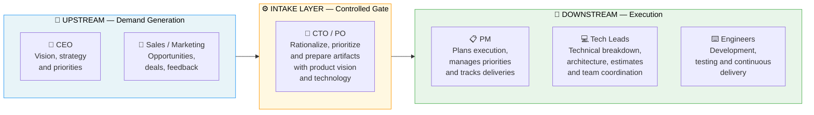

---

## 2. Full flow — from signal to delivery

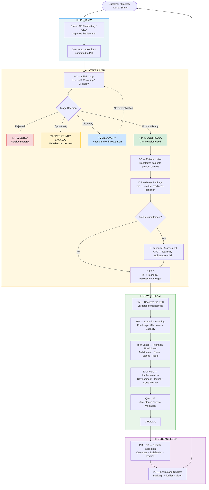

---

## 3. Intake Layer in detail

```mermaid
flowchart LR
    subgraph S1 ["1 - Capture"]
        direction TB
        C1["Origin: Sales,\nMarketing, CS,\nSupport, CEO,\nInternal"]
        C2["Records the pain /\nopportunity without\ndefining a solution"]
        C3["Standardized form\nor record"]
        C4["Focus on the problem,\nnot the implementation"]
    end

    subgraph S2 ["2 - Initial Triage"]
        direction TB
        T1["Owner: CTO/PO"]
        T2["Is it a real problem?"]
        T3["Is it recurring?"]
        T4["Fits the product\nvision?"]
        T5["What is the technical\nand business impact?"]
        T6["Urgency and impact?"]
    end

    subgraph S3 ["3 - Path Decision"]
        direction TB
        D1["🚫 REJECTED\nOutside strategy or\nlow value"]
        D2["📦 OPPORTUNITY\nBACKLOG\nInteresting, but\nnot a priority now"]
        D3["🔍 DISCOVERY\nNeeds further\ninvestigation with customer,\nmarket, flows and\ndata"]
        D4["✅ PRODUCT READY\nValidated demand\nready for artifact\npreparation"]
    end

    subgraph S4 ["4 - Rationalization"]
        direction TB
        R1["Owner: CTO/PO"]
        R2["Understands the business\nand objective"]
        R3["Defines initial scope\nand rules"]
        R4["Maps technical impact,\nintegrations and risks"]
        R5["Defines success\ncriteria"]
    end

    subgraph S5 ["5 - PRD (RP + Technical Assessment)"]
        direction TB
        RP1["RP (PO) + Technical\nAssessment (CTO)\nmerged into PRD"]
        RP2["PRD delivered to PM\nwith everything needed\nfor planning and\ntechnical breakdown"]
        RP3["✅ Demand leaves Intake\nonly when READY\nfor execution"]
    end

    subgraph S6 ["6 - Feedback Loop"]
        direction TB
        F1["Continuous learning"]
        F2["After delivery, collects\nresults, learnings\nand satisfaction to\nfeed priorities\nand improve the process"]
    end

    S1 --> S2 --> S3 --> S4 --> S5 --> S6

    style S1 fill:#e8f4f8,stroke:#2196F3,color:#000
    style S2 fill:#fff8e1,stroke:#FF9800,color:#000
    style S3 fill:#f3e5f5,stroke:#9C27B0,color:#000
    style S4 fill:#fff8e1,stroke:#FF9800,color:#000
    style S5 fill:#d4edda,stroke:#28a745,color:#000
    style S6 fill:#f3e5f5,stroke:#9C27B0,color:#000
```

---

## 4. What the intake produces — RP + Technical Assessment → PRD

> The intake produces a **PRD**: the merge of the **Readiness Package** (product — PO) with the **Technical Assessment** (technical — CTO). The product sections operationalize validated learning (Ries), opportunity solution tree (Torres), and delay commitment (Poppendieck); the technical sections live in the CTO's artifact. Details in [`references.md` § 3](./references.md#3-readiness-package--problem-before-solution--lean-startup--continuous-discovery) and [`personas/02-po.md`](./personas/02-po.md).

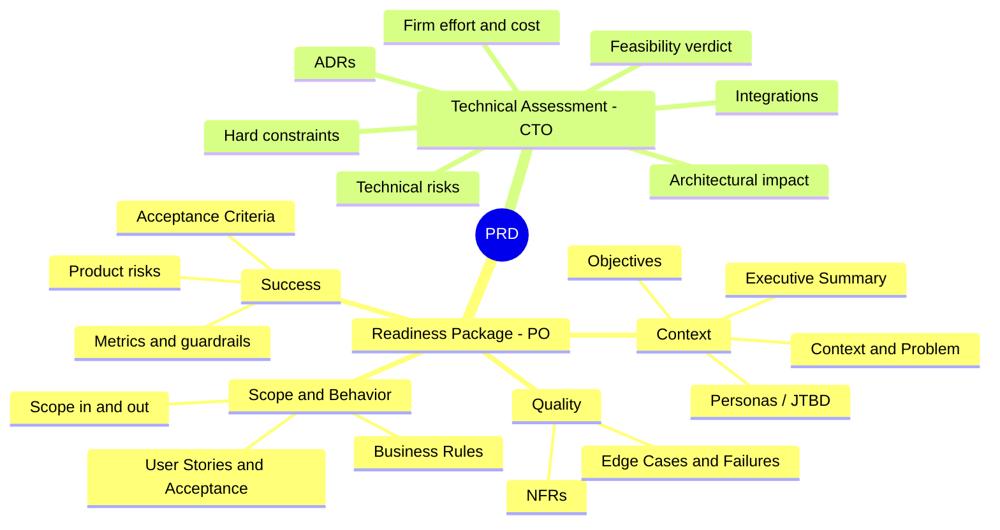

---

## 5. Delivery to downstream

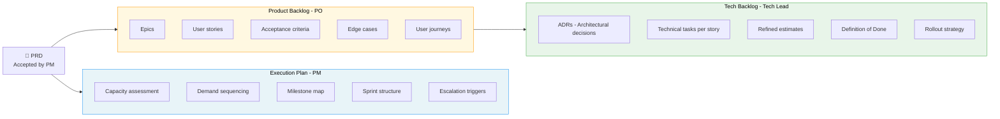

---

## 6. Risk management

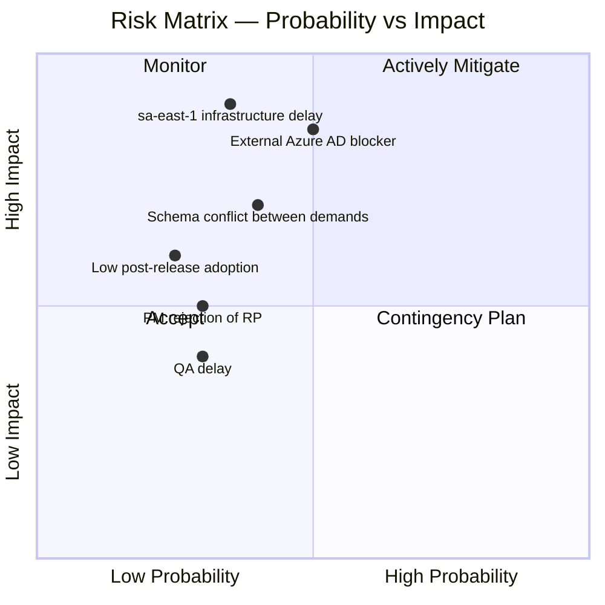

---

## 7. Responsibility matrix

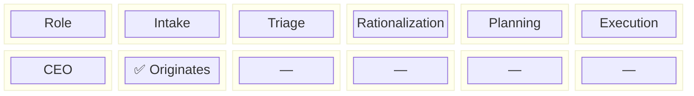

---

## 8. Handoff sequence

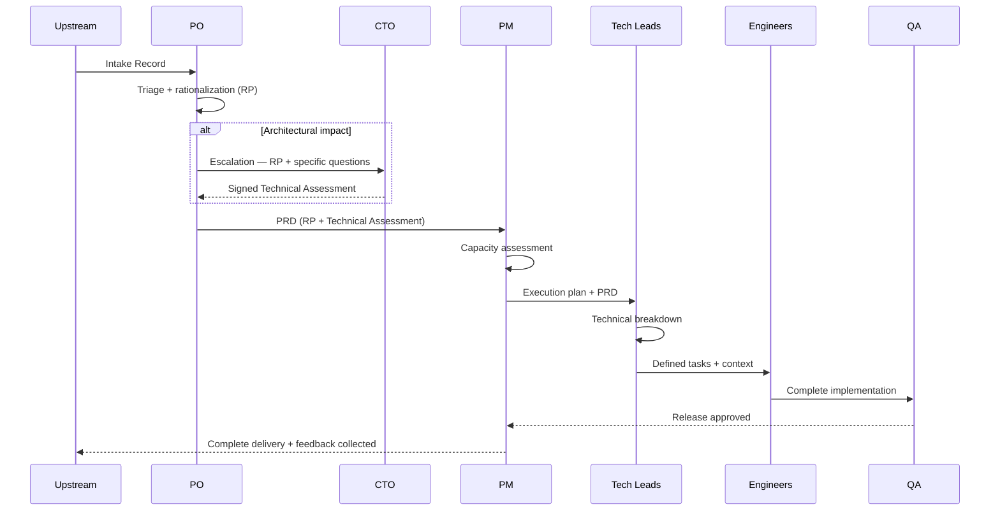

---

## 9. Demand states

> Explicit states are a core Kanban rule ("make process policies explicit", Anderson, 2010), and the way to make visible the queues that Reinertsen identifies as the greatest obstacle to product flow. Details in [`references.md` § 6](./references.md#6-flow-management-and-wip--reinertsen-product-development-flow).
>
> The **Captured → InTriage** transition is no longer instantaneous: during capture, the record progressively builds readiness and is only handed off to the PO when the **Readiness Score** reaches the gate (`gateReady = true` — every blocking requirement resolved by an honest disposition). See [`personas/01-submitter.md`](./personas/01-submitter.md), [`metrics.md`](./metrics.md), and [`references.md` § 11](./references.md).

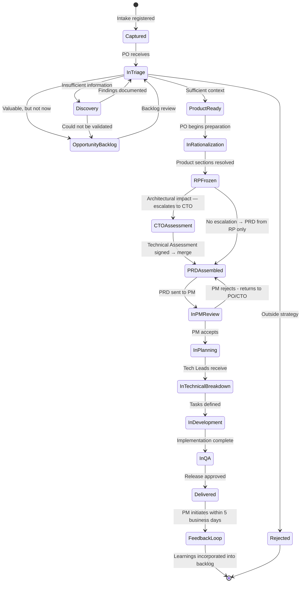

---

## 10. Golden rules of intake

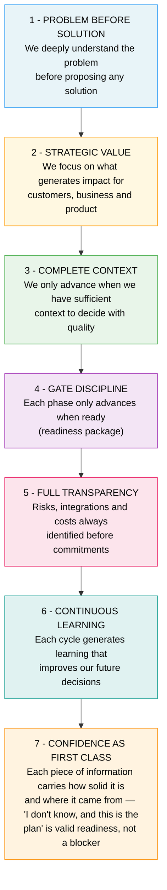

---

## 11. Summary flow

```mermaid
flowchart LR
    D(["📥 Demand\nCustomer, market,\nidea or data"])
    CA["📝 Capture\nStructured record\nin intake"]
    TR["🔍 Triage\nCTO/PO evaluates\nand defines path"]
    RA["📦 Rationalization\nArtifact creation\nand product vision"]
    RP(["📄 PRD\nReady for\nplanning"])
    PL["📋 Planning\nPM organizes execution\nand roadmap"]
    QB["⚙️ Technical Breakdown\nTech Leads define\nand estimate"]
    EX["👨‍💻 Execution\nEngineering delivers\nvalue to the customer"]
    FB["🔁 Feedback\nMeasures result\nand feeds the cycle"]

    D --> CA --> TR --> RA --> RP --> PL --> QB --> EX --> FB --> D

    style D fill:#e8f4f8,stroke:#2196F3,color:#000
    style RP fill:#d4edda,stroke:#28a745,color:#000
    style FB fill:#f3e5f5,stroke:#9C27B0,color:#000
```

---

## 12. Artifact index

| Artifact | Owner | When created | Reference file |
|---|---|---|---|
| Submitter Brief | Submitter (Sales / CS / CEO / Marketing) | At the time of capture | `00-submitter-brief-*.md` |
| Intake Record | PO (act 1 — triage) | Upon receiving the brief (`gateReady`) | `01-intake-record-*.md` |
| Readiness Package | PO (act 2 — rationalization) | After Product Ready triage | `02-readiness-package-*.md` |
| Technical Assessment | CTO (sole author) | When architectural escalation occurs | `03-technical-assessment-*.md` |
| PRD (RP + Technical Assessment) | PO + CTO (merge) | Before handoff to PM | `04-prd-*.md` |
| Execution Plan | PM | After PRD acceptance | `05-execution-plan.md` |
| Product Backlog | PO | After PRD acceptance | `06.1-product-backlog-*.md` / `07.1-product-backlog-*.md` |
| Tech Backlog | Tech Lead | After Product Backlog baselined | `06.2-tech-backlog-*.md` / `07.2-tech-backlog-*.md` |

> **Artifact chain (correction matured in personas).** The Submitter (`00`) and the PO have distinct artifacts — the PO formalizes/triages (`01`) and then rationalizes in the RP (`02`). The RP (PO) and the Technical Assessment (CTO) are **separate** and merge into the **PRD** — and it is the PRD, not the RP, that opens downstream. See [`personas/02-po.md` §2 and §3](./personas/02-po.md).

### Governance documents

| Document | Purpose |
|---|---|
| [`README.md`](./README.md) | Process overview and diagrams |
| [`01-roles.md`](./01-roles.md) | Roles and responsibilities |
| [`02-happy-path.md`](./02-happy-path.md) | Happy path of a demand |
| [`03-slas.md`](./03-slas.md) | SLAs by demand state |
| [`metrics.md`](./metrics.md) | Metrics and observability (demand · portfolio · post-handoff outcome) |
| [`personas/01-submitter.md`](./personas/01-submitter.md) | Submitter persona — reasoning, data structure, and screen value |
| [`personas/02-po.md`](./personas/02-po.md) | PO persona — triage, rationalization, RP → PRD chain, and screen value |
| [`references.md`](./references.md) | Academic foundations and framework mapping |

---

## 13. Final principle

The goal of this model is not bureaucracy. It is operational clarity, readiness for execution, and reduced ambiguity between business and engineering. When the process starts becoming bureaucracy, the rule is to simplify — not add another field.

The gain does not come from the process itself: it comes from every role knowing what it delivers and what it receives.

> For those who question whether this approach follows any recognized reference, [`references.md`](./references.md) maps each structural decision to the canonical frameworks of product management, engineering, and operations.
