# Do Pedido do Cliente à Execução

> Processo operacional para transformar demanda em entrega.

---

## Infográfico

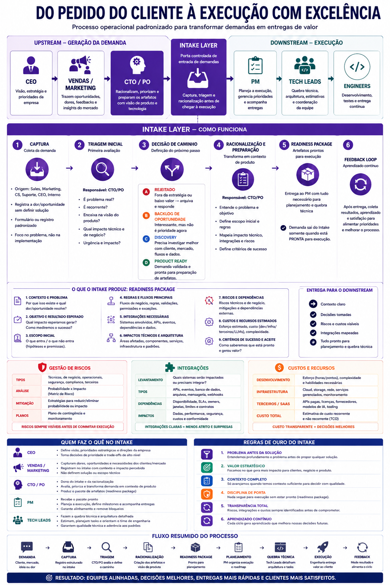

---

## Por que esse modelo existe

> O desenho deste modelo puxa de Stage-Gate (Cooper), Dual-Track / Continuous Discovery (Cagan, Torres), Theory of Constraints (Goldratt), Lean Software Development (Poppendieck), Product Development Flow (Reinertsen) e Team Topologies (Skelton & Pais). O mapeamento de cada decisão está em [`references.md`](./references.md).

Existem dois trabalhos diferentes que costumam ficar misturados em startups:

1. Entender o negócio e racionalizar o problema (upstream).
2. Executar com qualidade e previsibilidade (downstream).

Quando esses dois trabalhos acontecem na mesma camada, a engenharia vira balcão de atendimento, o PO vira anotador de reunião e o CTO vira bombeiro. O modelo aqui descrito separa os dois e coloca uma camada de tradução entre eles: o intake. Essa separação é o Dual-Track Development de Patton e Cagan (ver [`references.md` § 1](./references.md#1-separação-upstream--downstream--dual-track-development)).

A maioria das startups quebra entre captura e execução. Falta a etapa de racionalização. O sinal chega cru na engenharia, alguém improvisa o que entendeu, e o resultado é uma feature que não resolve o problema.

O risco que esse modelo elimina é o mais comum em startups que já têm clientes pagantes: misturar venda, descoberta, definição e execução na mesma camada operacional. Quando isso acontece, o backlog vira caos e ninguém é dono de nada.

---

## A camada de tradução: CTO + PO

CTO e PO formam a camada que transforma demanda em artefato executável. Eles deixam de apenas receber pedido e passam a produzir contexto, escopo e direção. Em startups que trabalham com IA, agentes, fintech e workflows distribuídos, esse trabalho não é opcional — sem ele, cada feature vira uma negociação técnica do zero.

A redução de retrabalho, desalinhamento e interpretação errada de requisito vem daí. Não vem do processo em si, vem de ter uma camada responsável por consolidar contexto antes da execução começar.

Sem uma camada de intake antes do CTO/PO, o CTO vira gargalo. Em times pequenos ela pode começar como uma função acumulada (PM, Product Ops, Chief of Staff, Founder Associate), mas precisa existir. É o que Goldratt chama de "elevar a restrição" na Theory of Constraints (ver [`references.md` § 5](./references.md#5-ctopo-como-gargalo-gerenciado--theory-of-constraints-goldratt)), e a função de Product Ops descrita por Perri & Tilles (ver [`references.md` § 9](./references.md#9-product-operations--perri--tilles-cagan)).

---

## O que o downstream recebe

O downstream não recebe ideia solta, call gravada, mensagem no Slack ou áudio. Recebe um pacote com:

- Objetivos e resultado esperado
- Contexto consolidado e regras de negócio
- Critérios de sucesso
- Riscos e dependências mapeados
- Visão arquitetural (quando há impacto)

Esse pacote é a condição mínima para o downstream começar. Sem ele, o time downstream estaria fazendo discovery, não execução. Operacionalmente, é uma versão mais robusta da Definition of Ready do Scrum e do commitment point do Upstream Kanban, e funciona como o gate decision do Stage-Gate de Cooper (ver [`references.md` § 2](./references.md#2-intake-layer-com-gates--stage-gate-cooper) e [§ 8](./references.md#8-definition-of-ready--commitment-point--scrum--upstream-kanban)).

No downstream o foco muda: não é mais descobrir o que fazer, é executar com qualidade. O PM organiza execução, define milestones, gerencia dependências, remove bloqueios e coordena squads, e não deveria precisar inventar requisito. Os Tech Leads recebem contexto racionalizado e artefatos claros, e fazem quebra técnica, arquitetura, sequenciamento, estimativa e orientação de implementação. Esse desenho — downstream como stream-aligned team e CTO+PO como enabling team — é o que Skelton & Pais formalizam em Team Topologies (ver [`references.md` § 7](./references.md#7-estrutura-de-papéis--team-topologies)).

---

## Regra do upstream

O upstream não define API, banco de dados, arquitetura, implementação técnica ou tasks de engenharia. O foco fica em problema, contexto, valor e impacto.

Se o registro de intake contém solução proposta, ele volta para reformulação.

---

## Architecture Governance leve

Em startups que mexem com IA, agentes, fintech, workflows, multi-tenant, integrações e runtime distribuído, sem padrões e RFCs cada decisão técnica é refeita do zero. O objetivo é ter um log de decisões arquiteturais e algumas guidelines — não criar comitê.

---

## O que muda na prática

A diferença que esse modelo faz é mudar engenharia orientada a tickets por engenharia orientada a contexto. Isso afeta qualidade, ownership, escalabilidade e previsibilidade — não como discurso, mas porque o time chega na execução com o problema já entendido em vez de tentando deduzir. Em termos de Lean Software Development (Poppendieck), isso elimina cinco dos sete desperdícios canônicos: handoffs, relearning, partial work, task switching e defects (ver [`references.md` § 10](./references.md#10-lean-software-development--poppendieck-sete-princípios-e-sete-desperdícios)).

Ao final do ciclo, o processo entrega:

- Demandas racionalizadas antes da execução de engenharia.
- Contexto de produto e técnico formalizado num artefato único.
- Riscos, integrações e custos visíveis antes do compromisso.
- Engenharia recebendo um pacote pronto para execução, não uma mensagem solta.

---

## 1. As três camadas

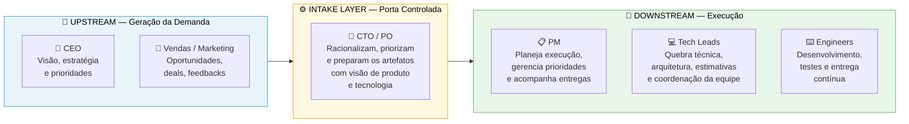

---

## 2. Fluxo completo — do sinal à entrega

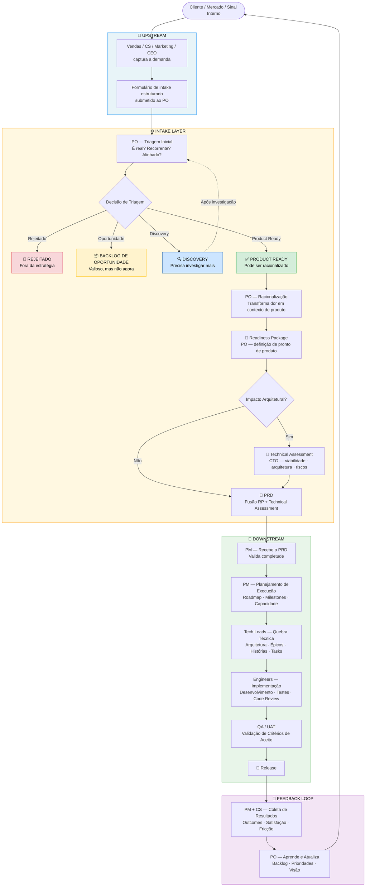

---

## 3. Intake Layer em detalhe

```mermaid
flowchart LR
    subgraph S1 ["1 - Captura"]
        direction TB
        C1["Origem: Sales,\nMarketing, CS,\nSupporte, CEO,\nInterno"]
        C2["Registra a dor /\noportunidade sem\ndefinir solução"]
        C3["Formulário ou\nregistro padronizado"]
        C4["Foco no problema,\nnão na implementação"]
    end

    subgraph S2 ["2 - Triagem Inicial"]
        direction TB
        T1["Responsável: CTO/PO"]
        T2["É um problema real?"]
        T3["É recorrente?"]
        T4["Encaixa na visão\ndo produto?"]
        T5["Qual impacto técnico\ne de negócio?"]
        T6["Urgência e impacto?"]
    end

    subgraph S3 ["3 - Decisão de Caminho"]
        direction TB
        D1["🚫 REJEITADO\nFora da estratégia ou\nbaixo valor"]
        D2["📦 BACKLOG DE\nOPORTUNIDADE\nInteressante, mas\nnão prioritário agora"]
        D3["🔍 DISCOVERY\nPrecisa investigar\nmelhor com cliente,\nmercado, fluxos e\ndados"]
        D4["✅ PRODUCT READY\nDemanda validada e\npronta para preparação\nde artefatos"]
    end

    subgraph S4 ["4 - Racionalização"]
        direction TB
        R1["Responsável: CTO/PO"]
        R2["Entende o negócio\ne objetivo"]
        R3["Define escopo inicial\ne regras"]
        R4["Mapeia impacto técnico,\nintegrações e riscos"]
        R5["Define critérios\nde sucesso"]
    end

    subgraph S5 ["5 - PRD (RP + Technical Assessment)"]
        direction TB
        RP1["RP (PO) + Technical\nAssessment (CTO)\nfundidos no PRD"]
        RP2["PRD entregue ao PM\ncom tudo necessário\npara planejamento e\nquebra técnica"]
        RP3["✅ Demanda sai do Intake\nsomente quando está\nPRONTA para execução"]
    end

    subgraph S6 ["6 - Feedback Loop"]
        direction TB
        F1["Aprendizado contínuo"]
        F2["Após entrega, coleta\nresultados, aprendizado\ne satisfação para\nalimentar prioridades\ne melhorar o processo"]
    end

    S1 --> S2 --> S3 --> S4 --> S5 --> S6

    style S1 fill:#e8f4f8,stroke:#2196F3,color:#000
    style S2 fill:#fff8e1,stroke:#FF9800,color:#000
    style S3 fill:#f3e5f5,stroke:#9C27B0,color:#000
    style S4 fill:#fff8e1,stroke:#FF9800,color:#000
    style S5 fill:#d4edda,stroke:#28a745,color:#000
    style S6 fill:#f3e5f5,stroke:#9C27B0,color:#000
```

---

## 4. O que o intake produz — RP + Technical Assessment → PRD

> O intake produz um **PRD**: a fusão do **Readiness Package** (produto — PO) com o **Technical Assessment** (técnico — CTO). As seções de produto operacionalizam validated learning (Ries), opportunity solution tree (Torres) e delay commitment (Poppendieck); as seções técnicas vivem no artefato do CTO. Detalhes em [`references.md` § 3](./references.md#3-readiness-package--problema-antes-da-solução--lean-startup--continuous-discovery) e [`personas/02-po.md`](./personas/02-po.md).

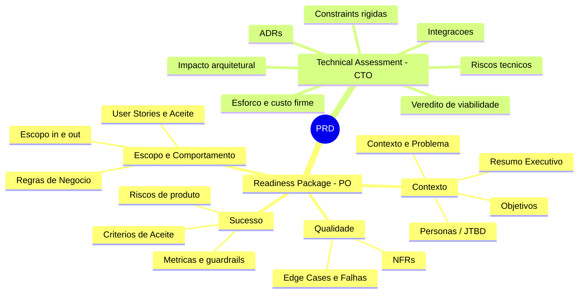

---

## 5. Entrega para o downstream

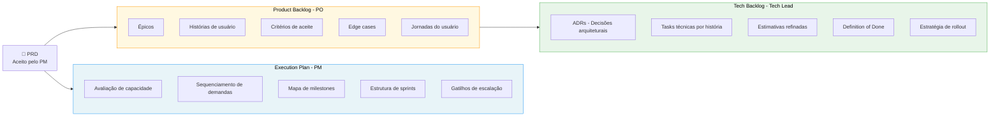

---

## 6. Gestão de riscos

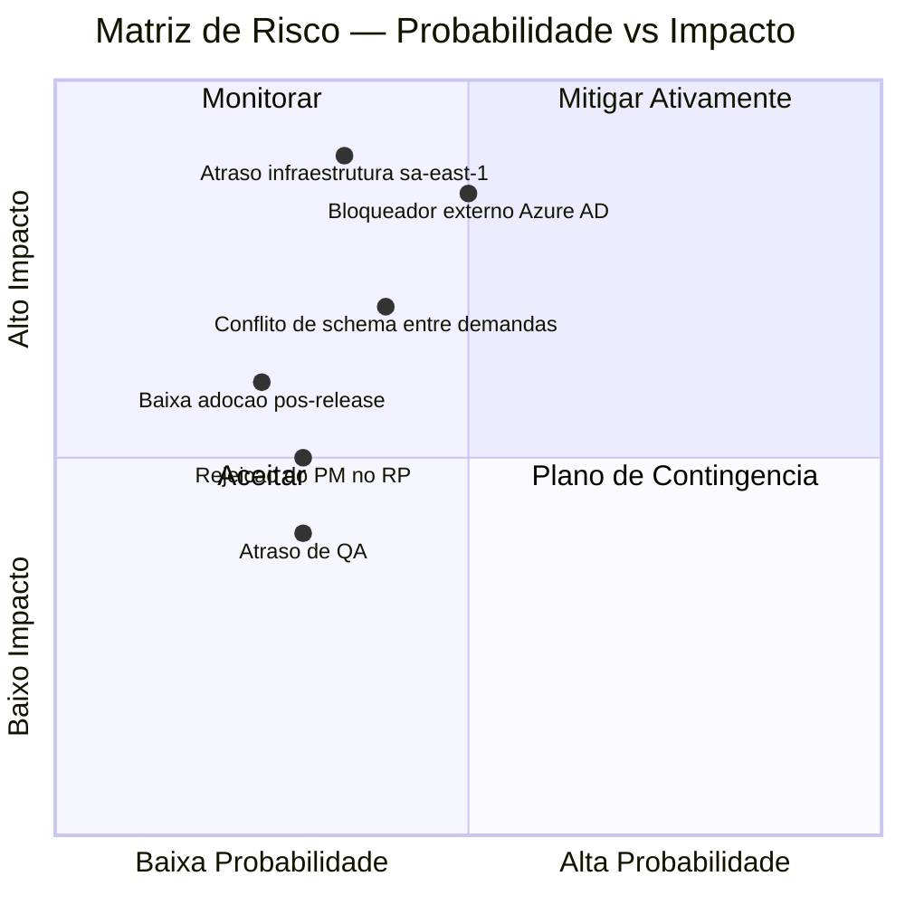

---

## 7. Matriz de responsabilidades

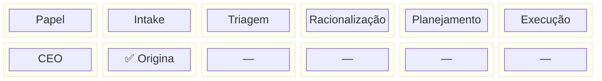

---

## 8. Sequência de handoffs

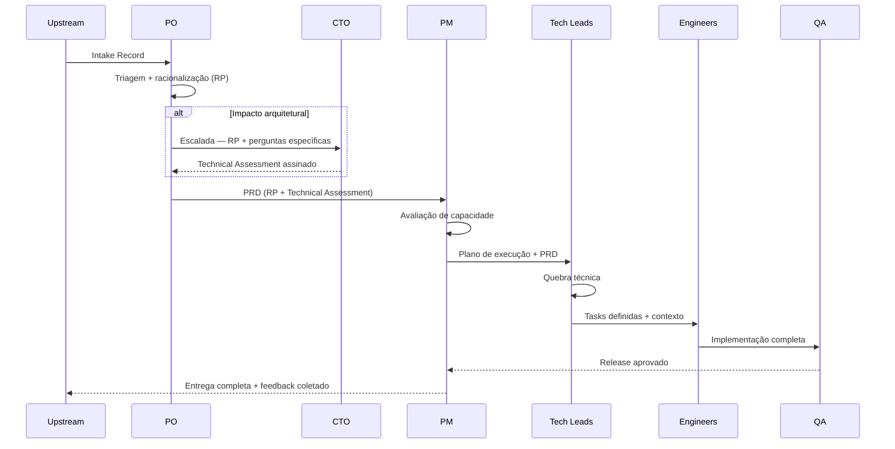

---

## 9. Estados de uma demanda

> Estados explícitos são uma regra central de Kanban ("make process policies explicit", Anderson, 2010), e a forma de tornar visíveis as filas que Reinertsen identifica como o maior obstáculo ao fluxo de produto. Detalhes em [`references.md` § 6](./references.md#6-gestão-de-fluxo-e-wip--reinertsen-product-development-flow).
>
> A transição **Capturada → EmTriagem** deixou de ser instantânea: durante a captura, o registro constrói prontidão de forma progressiva e só é entregue ao PO quando o **Readiness Score** atinge o gate (`gateReady = true` — todo requisito bloqueante resolvido por uma disposição honesta). Ver [`personas/01-submitter.md`](./personas/01-submitter.md), [`metrics.md`](./metrics.md) e [`references.md` § 11](./references.md).

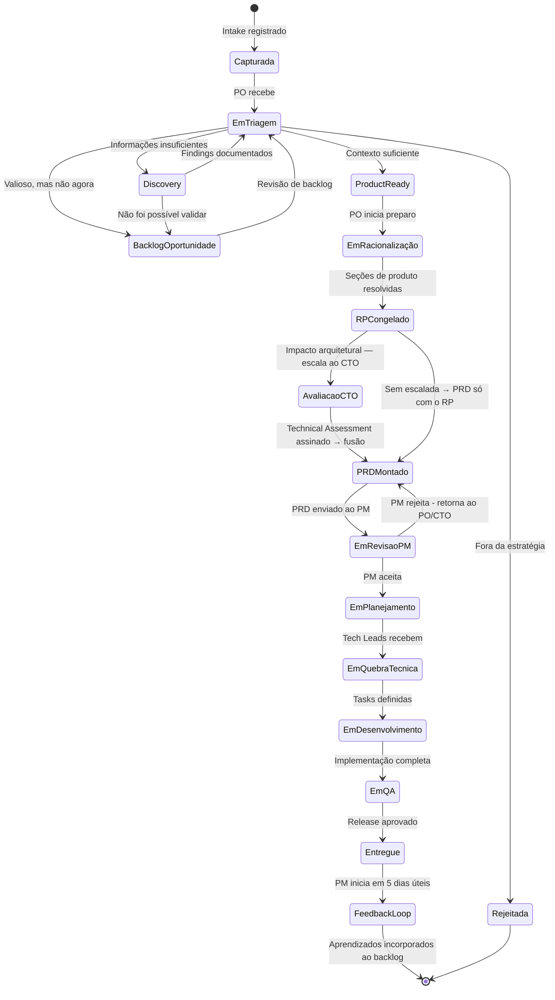

---

## 10. Regras de ouro do intake

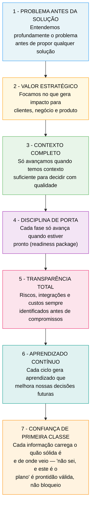

---

## 11. Fluxo resumido

```mermaid
flowchart LR
    D(["📥 Demanda\nCliente, mercado,\nideia ou dado"])
    CA["📝 Captura\nRegistro estruturado\nno intake"]
    TR["🔍 Triagem\nCTO/PO avalia\ne define caminho"]
    RA["📦 Racionalização\nCriação dos artefatos\ne visão de produto"]
    RP(["📄 PRD\nPronto para\nplanejamento"])
    PL["📋 Planejamento\nPM organiza execução\ne roadmap"]
    QB["⚙️ Quebra Técnica\nTech Leads definem\ne estimam"]
    EX["👨‍💻 Execução\nEngenharia entrega\nvalor ao cliente"]
    FB["🔁 Feedback\nMede resultado\ne alimenta o ciclo"]

    D --> CA --> TR --> RA --> RP --> PL --> QB --> EX --> FB --> D

    style D fill:#e8f4f8,stroke:#2196F3,color:#000
    style RP fill:#d4edda,stroke:#28a745,color:#000
    style FB fill:#f3e5f5,stroke:#9C27B0,color:#000
```

---

## 12. Índice de artefatos

| Artefato | Dono | Quando é criado | Arquivo de referência |
|---|---|---|---|
| Documento do Submitter | Submitter (Sales / CS / CEO / Marketing) | No momento da captura | `00-submitter-brief-*.md` |
| Intake Record | PO (ato 1 — triagem) | Ao receber o brief (`gateReady`) | `01-intake-record-*.md` |
| Readiness Package | PO (ato 2 — racionalização) | Após triagem Product Ready | `02-readiness-package-*.md` |
| Technical Assessment | CTO (sozinho) | Quando há escalada arquitetural | `03-technical-assessment-*.md` |
| PRD (RP + Technical Assessment) | PO + CTO (fusão) | Antes do handoff ao PM | `04-prd-*.md` |
| Execution Plan | PM | Após aceite do PRD | `05-execution-plan.md` |
| Product Backlog | PO | Após aceite do PRD | `06.1-product-backlog-*.md` / `07.1-product-backlog-*.md` |
| Tech Backlog | Tech Lead | Após Product Backlog baselined | `06.2-tech-backlog-*.md` / `07.2-tech-backlog-*.md` |

> **Cadeia de artefatos (correção amadurecida nas personas).** O Submitter (`00`) e o PO têm artefatos distintos — o PO formaliza/tria (`01`) e depois racionaliza no RP (`02`). O RP (PO) e o Technical Assessment (CTO) são **separados** e se fundem no **PRD** — e é o PRD, não o RP, que abre o downstream. Ver [`personas/02-po.md` §2 e §3](./personas/02-po.md).

### Documentos de governança

| Documento | Propósito |
|---|---|
| [`README.md`](./README.md) | Visão geral do processo e diagramas |
| [`01-roles.md`](./01-roles.md) | Papéis e responsabilidades |
| [`02-happy-path.md`](./02-happy-path.md) | Caminho esperado de uma demanda |
| [`03-slas.md`](./03-slas.md) | SLAs por estado da demanda |
| [`metrics.md`](./metrics.md) | Métricas e observabilidade (demanda · portfólio · resultado pós-handoff) |
| [`personas/01-submitter.md`](./personas/01-submitter.md) | Persona da Submitter — raciocínio, estrutura de dados e valor em tela |
| [`personas/02-po.md`](./personas/02-po.md) | Persona do PO — triagem, racionalização, cadeia RP → PRD e valor em tela |
| [`references.md`](./references.md) | Fundamentação acadêmica e mapeamento de frameworks |

---

## 13. Princípio final

O objetivo deste modelo não é burocracia. É clareza operacional, prontidão para execução e redução de ambiguidade entre negócio e engenharia. Quando o processo começa a virar burocracia, a regra é simplificar, não adicionar mais um campo.

O ganho não vem do processo em si: vem de cada papel saber o que entrega e o que recebe.

> Para quem questiona se essa abordagem segue alguma referência reconhecida, [`references.md`](./references.md) mapeia cada decisão estrutural aos frameworks canônicos de gestão de produto, engenharia e operações.
