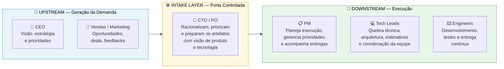
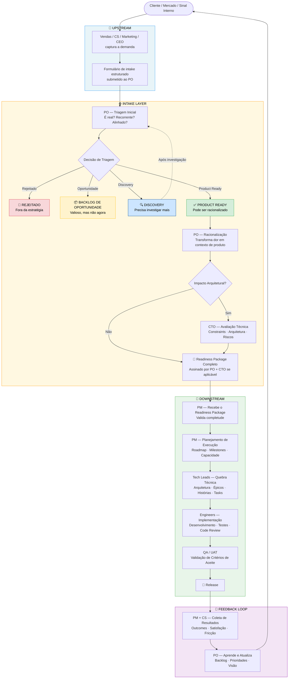
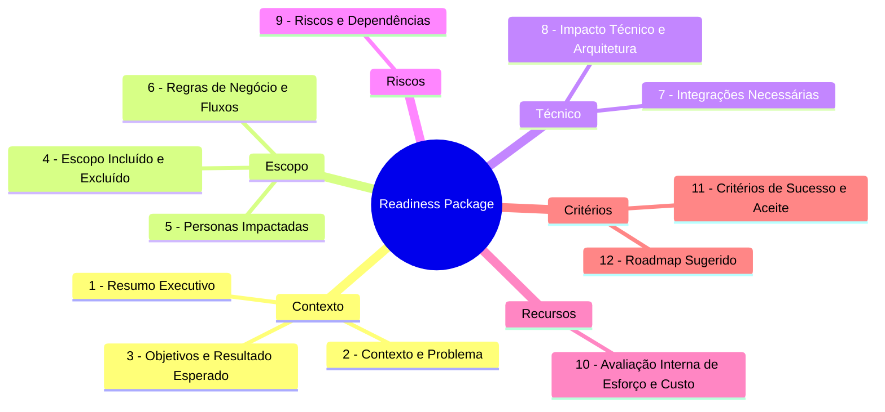
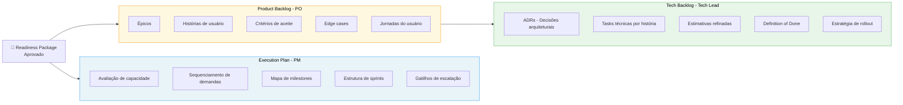
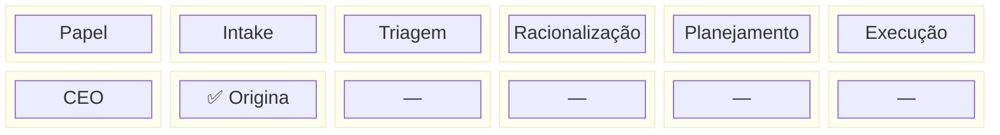
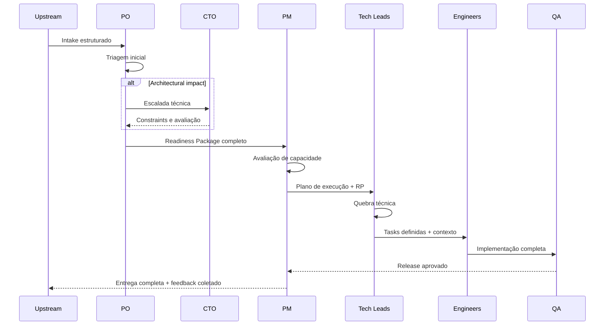
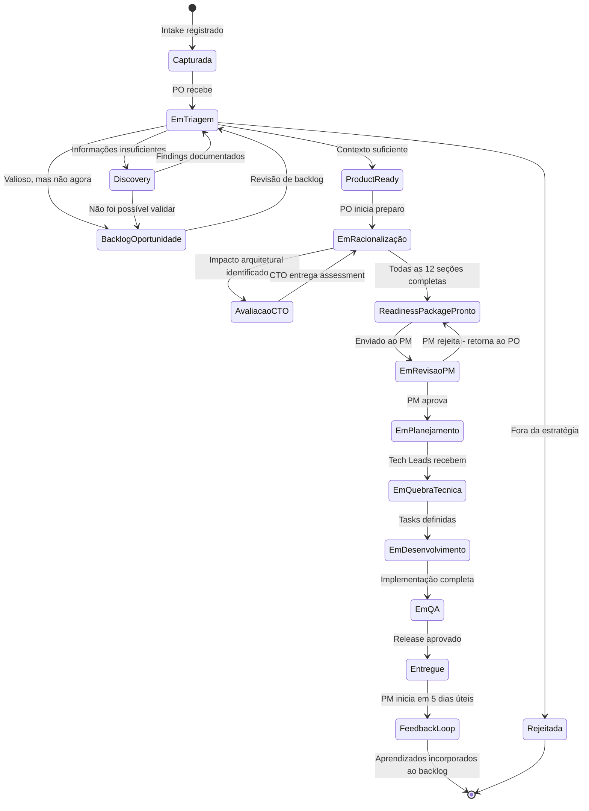
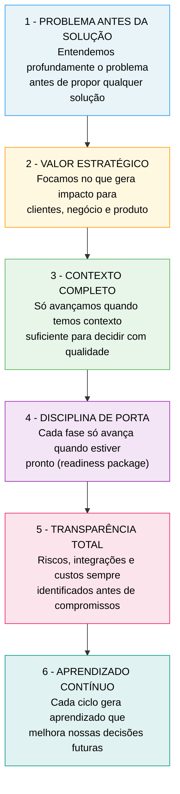

# Do Pedido do Cliente à Execução com Excelência

> Processo operacional padronizado para transformar demandas em entregas de valor.

---

## 1. Visão Geral — As Três Camadas

---

## 2. Fluxo Completo — Do Sinal à Entrega

---

## 3. Intake Layer — Como Funciona em Detalhe

```mermaid
flowchart LR
    subgraph S1 ["1 - Captura"]
        direction TB
        C1["Origem: Sales,\nMarketing, CS,\nSupporte, CEO,\nInterno"]
        C2["Registra a dor /\noportunidade sem\ndefinir solução"]
        C3["Formulário ou\nregistro padronizado"]
        C4["Foco no problema,\nnão na implementação"]
    end

    subgraph S2 ["2 - Triagem Inicial"]
        direction TB
        T1["Responsável: CTO/PO"]
        T2["É um problema real?"]
        T3["É recorrente?"]
        T4["Encaixa na visão\ndo produto?"]
        T5["Qual impacto técnico\ne de negócio?"]
        T6["Urgência e impacto?"]
    end

    subgraph S3 ["3 - Decisão de Caminho"]
        direction TB
        D1["🚫 REJEITADO\nFora da estratégia ou\nbaixo valor"]
        D2["📦 BACKLOG DE\nOPORTUNIDADE\nInteressante, mas\nnão prioritário agora"]
        D3["🔍 DISCOVERY\nPrecisa investigar\nmelhor com cliente,\nmercado, fluxos e\ndados"]
        D4["✅ PRODUCT READY\nDemanda validada e\npronta para preparação\nde artefatos"]
    end

    subgraph S4 ["4 - Racionalização"]
        direction TB
        R1["Responsável: CTO/PO"]
        R2["Entende o negócio\ne objetivo"]
        R3["Define escopo inicial\ne regras"]
        R4["Mapeia impacto técnico,\nintegrações e riscos"]
        R5["Define critérios\nde sucesso"]
    end

    subgraph S5 ["5 - Readiness Package"]
        direction TB
        RP1["Artefatos prontos\npara execução"]
        RP2["Entrega ao PM com tudo\nnecessário para\nplanejamento e quebra\ntécnica"]
        RP3["✅ Demanda sai do Intake\nsomente quando está\nPRONTA para execução"]
    end

    subgraph S6 ["6 - Feedback Loop"]
        direction TB
        F1["Aprendizado contínuo"]
        F2["Após entrega, coleta\nresultados, aprendizado\ne satisfação para\nalimentar prioridades\ne melhorar o processo"]
    end

    S1 --> S2 --> S3 --> S4 --> S5 --> S6

    style S1 fill:#e8f4f8,stroke:#2196F3,color:#000
    style S2 fill:#fff8e1,stroke:#FF9800,color:#000
    style S3 fill:#f3e5f5,stroke:#9C27B0,color:#000
    style S4 fill:#fff8e1,stroke:#FF9800,color:#000
    style S5 fill:#d4edda,stroke:#28a745,color:#000
    style S6 fill:#f3e5f5,stroke:#9C27B0,color:#000
```

---

## 4. O que o Intake Produz — Readiness Package

---

## 5. Entrega para o Downstream

---

## 6. Gestão de Riscos

---

## 7. Quem Faz o Quê — Matriz de Responsabilidades

---

## 8. Sequência de Handoffs

---

## 9. Estados de uma Demanda

---

## 10. Regras de Ouro do Intake

---

## 11. Fluxo Resumido do Processo

```mermaid
flowchart LR
    D(["📥 Demanda\nCliente, mercado,\nideia ou dado"])
    CA["📝 Captura\nRegistro estruturado\nno intake"]
    TR["🔍 Triagem\nCTO/PO avalia\ne define caminho"]
    RA["📦 Racionalização\nCriação dos artefatos\ne visão de produto"]
    RP(["📄 Readiness Package\nPronto para\nplanejamento"])
    PL["📋 Planejamento\nPM organiza execução\ne roadmap"]
    QB["⚙️ Quebra Técnica\nTech Leads definem\ne estimam"]
    EX["👨‍💻 Execução\nEngenharia entrega\nvalor ao cliente"]
    FB["🔁 Feedback\nMede resultado\ne alimenta o ciclo"]

    D --> CA --> TR --> RA --> RP --> PL --> QB --> EX --> FB --> D

    style D fill:#e8f4f8,stroke:#2196F3,color:#000
    style RP fill:#d4edda,stroke:#28a745,color:#000
    style FB fill:#f3e5f5,stroke:#9C27B0,color:#000
```

---

## 12. Índice de Artefatos

| Artefato | Dono | Quando é criado | Arquivo de referência |
|---|---|---|---|
| Intake Record | Sales / CS / CEO | No momento da captura | `01-intake-*.md` |
| Readiness Package | PO + CTO | Após triagem Product Ready | `03-readiness-package-*.md` / `04-readiness-package-*.md` |
| Execution Plan | PM | Após aprovação do RP | `05-execution-plan.md` |
| Product Backlog | PO | Após aprovação do RP | `06.1-product-backlog-*.md` / `07.1-product-backlog-*.md` |
| Tech Backlog | Tech Lead | Após Product Backlog baselined | `06.2-tech-backlog-*.md` / `07.2-tech-backlog-*.md` |

---

## 13. Resultado Esperado

> **Equipes alinhadas, decisões melhores, entregas mais rápidas e clientes mais satisfeitos.**
