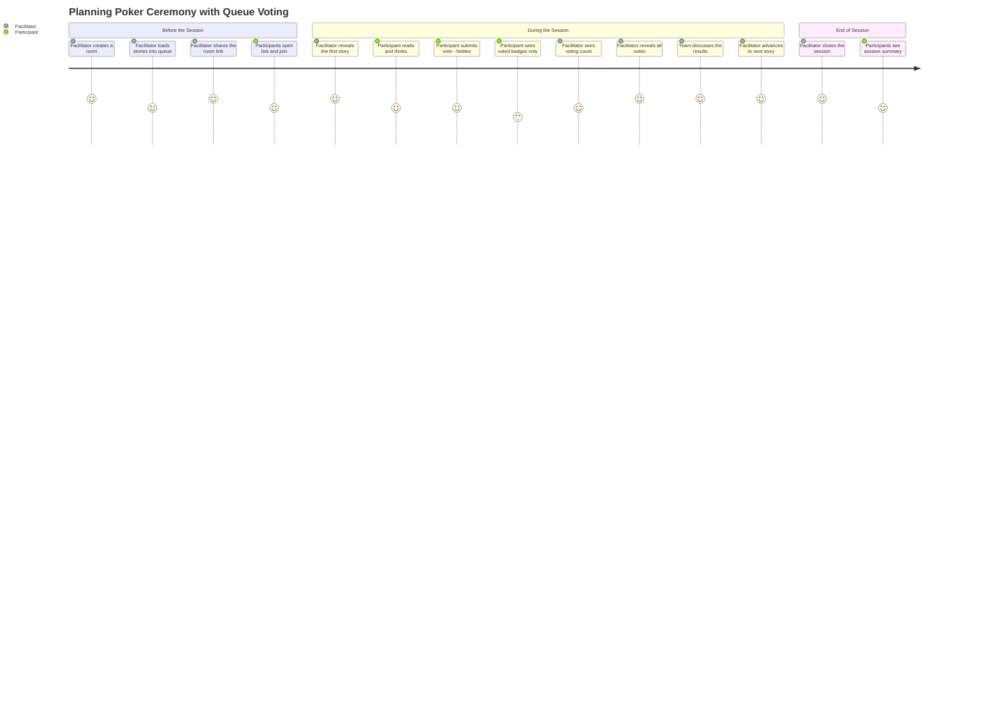
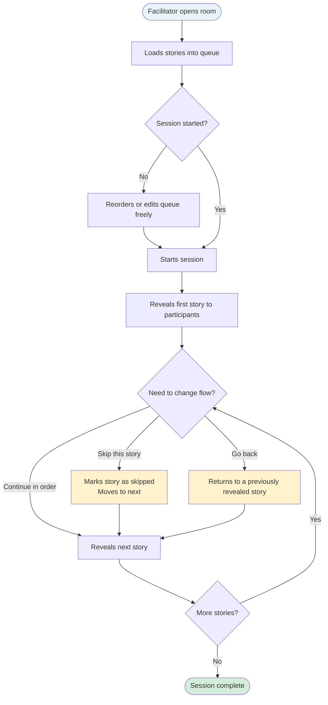
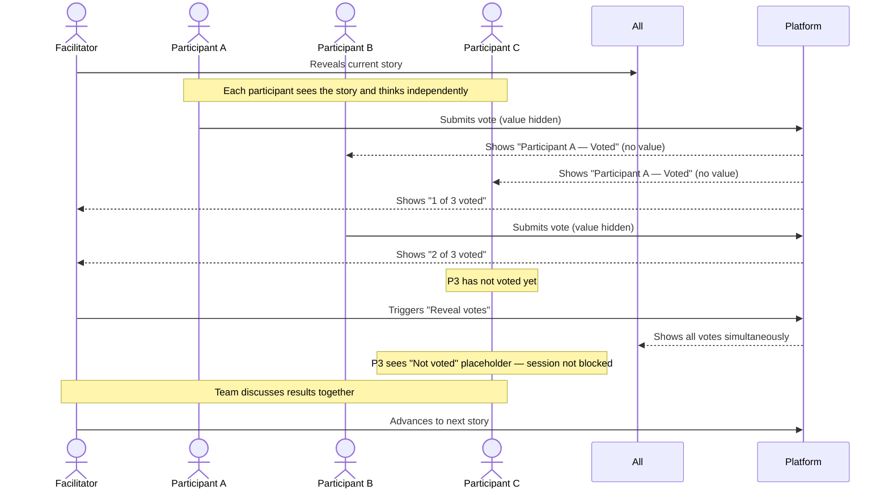
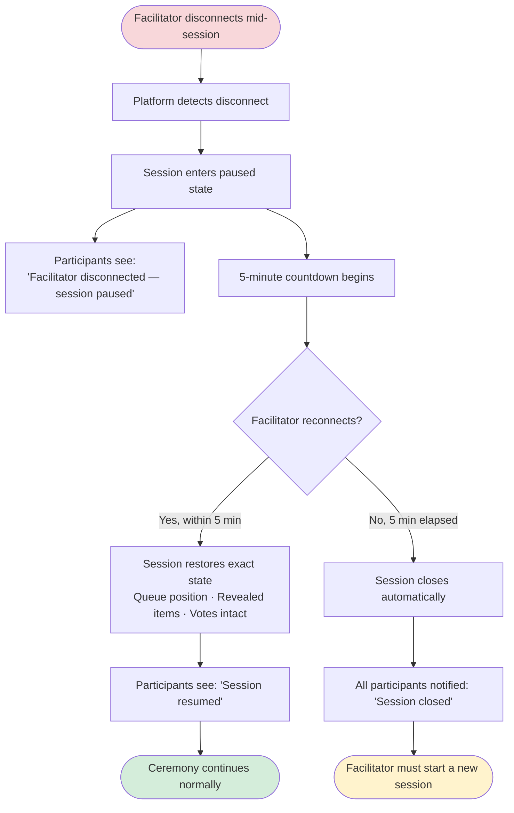
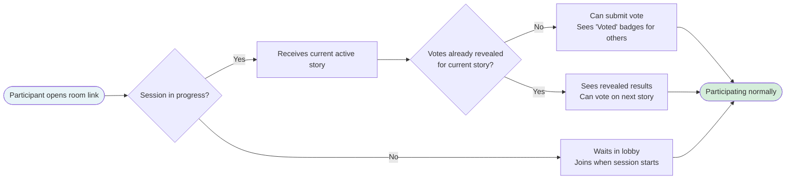

# Product Backlog — Queue Voting

## Metadata

| Field | Value |
|---|---|
| **Backlog ID** | PB-2024-001 |
| **Version** | v1 |
| **Linked RP** | RP-2024-001 v2 |
| **Owned by** | Lucas Mendes (PO) |
| **Status** | Baselined — approved for tech breakdown |
| **Baselined date** | 2024-04-03 |

> This document defines **what** will be built and **for whom**, from the user's perspective.
> It does not define how it will be built. Technical decisions, tasks, and implementation approach belong to the Tech Breakdown (TB-2024-001).

## Revision History

| Version | Date | Author | Summary |
|---|---|---|---|
| v1 | 2024-04-03 | Lucas Mendes (PO) | Initial backlog. Epics and stories derived from RP-2024-001 v2. Baselined with PM. |

---

## Epic Map

| Epic | Description | Priority |
|---|---|---|
| EP-001 | Queue Management | Must Have |
| EP-002 | Vote Concealment | Must Have |
| EP-003 | Session Resilience | Must Have |
| EP-004 | Observability | Should Have |

---

## User Journey

### Overall Journey — Facilitator + Participant

The end-to-end experience from ceremony setup to results, for both personas.

---

### EP-001 — Queue Management Journey

How the facilitator controls the flow of stories during the ceremony.

---

### EP-002 — Vote Concealment Journey

How votes are collected and revealed without anchoring bias.

---

### EP-003 — Session Resilience Journey

What each persona experiences when the facilitator loses connection.

---

### Late-Join Journey

What a participant experiences when joining a session already in progress.

---

## EP-001 — Queue Management

**Goal:** Give the facilitator control over what participants see and when, eliminating read-ahead and premature opinion formation.

---

### ST-001 — Load and manage a question queue

**As a** facilitator,
**I want to** load a list of stories or questions into a queue before or during a session,
**so that** I control the estimation sequence and participants cannot read ahead.

**Acceptance Criteria:**
- [ ] I can add items to the queue from the room panel before the session starts
- [ ] I can add items to the queue while a session is already in progress
- [ ] I can reorder items in the queue before any item has been revealed
- [ ] I can delete an item from the queue as long as it has not yet been revealed
- [ ] The queue supports up to 100 items
- [ ] Only I (the facilitator) can see the full queue — participants see nothing until an item is revealed

**Edge Cases:**
- [ ] If I try to add a 101st item, I see a clear limit warning and the item is not added
- [ ] If I try to reorder items after the session has started and an item is already revealed, only unrevealed items can be reordered
- [ ] If I try to delete the currently active (revealed) item, the action is blocked with an explanation
- [ ] If I add an item with an empty title, the form prevents submission
- [ ] If two browser tabs are open for the same facilitator account, queue edits in one tab are reflected in the other without conflict

---

### ST-002 — Reveal items one at a time

**As a** facilitator,
**I want to** reveal items from the queue one at a time,
**so that** participants focus only on the current item being estimated.

**Acceptance Criteria:**
- [ ] I have a "Reveal next item" control that advances the queue by one
- [ ] When I reveal an item, all participants see it simultaneously
- [ ] Participants cannot see items that have not yet been revealed
- [ ] The currently active item is clearly indicated in my facilitator view

**Edge Cases:**
- [ ] If I click "Reveal next item" when the queue is empty, the action is disabled with a tooltip: "No items in the queue"
- [ ] If I reveal the last item in the queue, the "Reveal next item" button is replaced by "End session"
- [ ] If a participant joins exactly as an item is being revealed, they receive the item — not a blank screen
- [ ] If the reveal event fails to reach one participant (network drop), that participant sees the item upon reconnect without requiring the facilitator to re-reveal

---

### ST-003 — Skip and return to items

**As a** facilitator,
**I want to** skip an item or go back to a previously revealed one,
**so that** I can manage the ceremony flow without being forced into a strict sequence.

**Acceptance Criteria:**
- [ ] I can skip the current item — it is marked as skipped in the session history
- [ ] I can navigate back to a previously revealed item
- [ ] Participants see the item change immediately when I skip or return
- [ ] Skipped items are visible in the session history with a "skipped" label

**Edge Cases:**
- [ ] If I skip an item where votes have already been submitted, I see a confirmation: "Votes submitted for this item will be discarded. Continue?"
- [ ] If I navigate back to a previously revealed item, existing votes for that item are restored — not reset
- [ ] If I try to go back before the first item, the "Go back" control is disabled
- [ ] If I skip the last item in the queue, the session moves to an "All items reviewed" state rather than hanging

---

## EP-002 — Vote Concealment

**Goal:** Eliminate anchoring bias by ensuring participants cannot see each other's votes until the facilitator chooses to reveal them.

---

### ST-004 — Votes are hidden until the facilitator reveals them

**As a** participant,
**I want** my vote and others' votes to remain hidden until the facilitator reveals them,
**so that** my estimate is not influenced by what others have submitted.

**Acceptance Criteria:**
- [ ] After I submit a vote, I see a confirmation that my vote was received
- [ ] I see that others have voted (e.g., "Voted" badge) but not their values
- [ ] The facilitator sees how many people have voted but not the values
- [ ] No vote value is visible to anyone until the facilitator triggers the reveal

**Edge Cases:**
- [ ] If I change my vote before the reveal, my new vote replaces the old one — the "Voted" badge remains but only the latest value is stored
- [ ] If I disconnect and reconnect before the reveal, my submitted vote is preserved
- [ ] If a participant submits a vote and is then removed from the session before reveal, their vote is not shown in the results
- [ ] If the session loses connectivity briefly during vote collection, votes submitted during the gap are not silently lost — participants see a retry prompt
- [ ] A participant cannot submit more than one vote per item — double-click or fast resubmit is idempotent

---

### ST-005 — Facilitator reveals all votes at once

**As a** facilitator,
**I want to** reveal all submitted votes simultaneously with a single action,
**so that** the entire team sees the results at the same time.

**Acceptance Criteria:**
- [ ] I have a "Reveal votes" control available at any time after the item is active
- [ ] When I trigger the reveal, all submitted votes are shown to everyone simultaneously
- [ ] Participants who have not voted when I reveal see a "Not voted" placeholder — the session is not blocked
- [ ] After the reveal, I can move to the next item or restart voting on the current item

**Edge Cases:**
- [ ] If no one has voted when I trigger reveal, I see a warning: "No votes have been submitted. Reveal anyway?" — the action requires confirmation
- [ ] If I trigger reveal and a vote is in-flight (submitted at the exact same moment), that vote is included in the results — not dropped
- [ ] If I restart voting on the current item, all previous votes for that item are cleared and participants can vote again
- [ ] After restarting a vote, participants who already voted see their vote input reset to blank — not pre-filled with their previous value

---

## EP-003 — Session Resilience

**Goal:** Ensure that connectivity issues do not destroy an active ceremony.

---

### ST-006 — Session recovers if the facilitator disconnects

**As a** facilitator,
**I want** the session to resume from where it was if I briefly lose connection,
**so that** a connectivity issue does not force the team to restart the ceremony.

**Acceptance Criteria:**
- [ ] If I disconnect, participants see a clear message: "Facilitator disconnected — session paused"
- [ ] If I reconnect within 5 minutes, the session resumes from the exact state it was in
- [ ] If 5 minutes pass without reconnect, the session closes with a notification to all participants
- [ ] After reconnect, the queue position, revealed items, and all submitted votes are intact

**Edge Cases:**
- [ ] If a participant disconnects (not the facilitator), the session continues uninterrupted — only the facilitator disconnect pauses the session
- [ ] If the facilitator reconnects at 4 min 58 sec, the session is restored — the timer does not close the session before reconnect is fully confirmed
- [ ] If the facilitator reconnects but with a different browser or device, the session state is fully restored on the new connection
- [ ] If the facilitator's session snapshot is corrupted or unavailable, the session closes cleanly rather than restoring a broken state — participants are notified

---

### ST-007 — Participant joining mid-session sees the correct state

**As a** participant joining a session that is already in progress,
**I want to** see the current active item immediately,
**so that** I can participate without disrupting the flow or asking the facilitator to catch me up.

**Acceptance Criteria:**
- [ ] When I join a session in progress, I see the current active item
- [ ] I can submit a vote for the current item even if others have already voted
- [ ] I do not see the queue or any items that have not yet been revealed
- [ ] If votes have already been revealed for the current item, I see the revealed results

**Edge Cases:**
- [ ] If I join during the exact moment a vote reveal is happening, I see the revealed state — not an empty or inconsistent view
- [ ] If I join while the facilitator is disconnected (session paused), I see the paused state immediately rather than a normal session view
- [ ] If I join a session that has already ended, I see a clear message: "This session has ended" rather than a blank room
- [ ] If I join and the session has no active item yet (facilitator has not revealed the first item), I see a waiting state: "Waiting for the facilitator to begin"

---

## EP-004 — Observability

**Goal:** Capture data to measure whether the feature delivers the promised outcome of reducing ceremony duration.

---

### ST-008 — Session and per-item timing is captured

**As a** product team member,
**I want** session duration and per-item voting time to be captured automatically,
**so that** we can measure whether ceremony duration improves after this feature ships.

**Acceptance Criteria:**
- [ ] Total session duration is recorded from session start to session end
- [ ] Time from item reveal to vote reveal is recorded per item
- [ ] This data is available for analysis within 24 hours of session completion
- [ ] No additional action is required from the facilitator or participants to capture this data

**Edge Cases:**
- [ ] If a session closes unexpectedly (facilitator timeout), the duration is still recorded up to the close event — not discarded
- [ ] If an item is skipped, it is recorded in telemetry with duration = 0 and status = skipped
- [ ] If the facilitator restarts voting on an item, both the original and restart cycles are recorded separately — not merged
- [ ] If a participant joins and leaves without voting, their presence is not counted in the vote participation rate for that item

---

## Out of Scope (for this release)

The following items were explicitly excluded and must not be introduced during delivery. Any addition requires a new Intake record.

| Item | Reason |
|---|---|
| Per-item countdown timer | Separate backlog item — adds complexity to facilitator UX |
| Auto-reveal after all participants vote | Future preference toggle — out of scope for MVP |
| Multi-facilitator co-control | Architectural change — not required by current clients |
| Mobile-specific redesign | Existing mobile layout applies |
| Queue template reuse across sessions | Future phase |
| Jira / Linear integration for queue import | Future phase |
| Ceremony analytics dashboard | Future phase |
