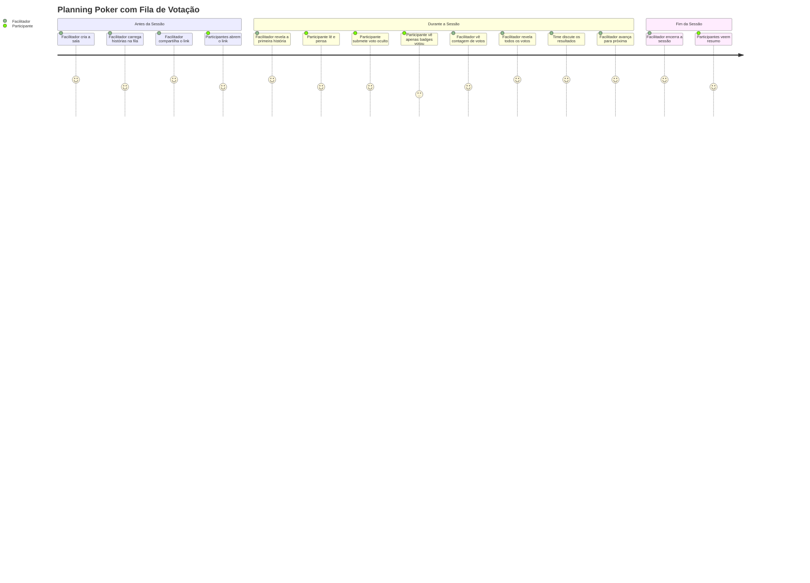
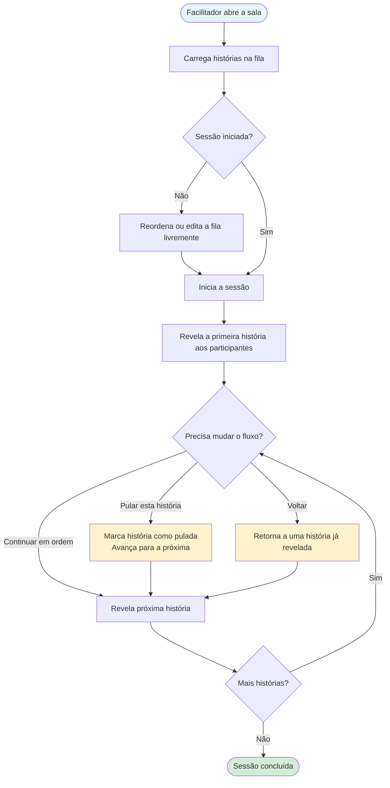
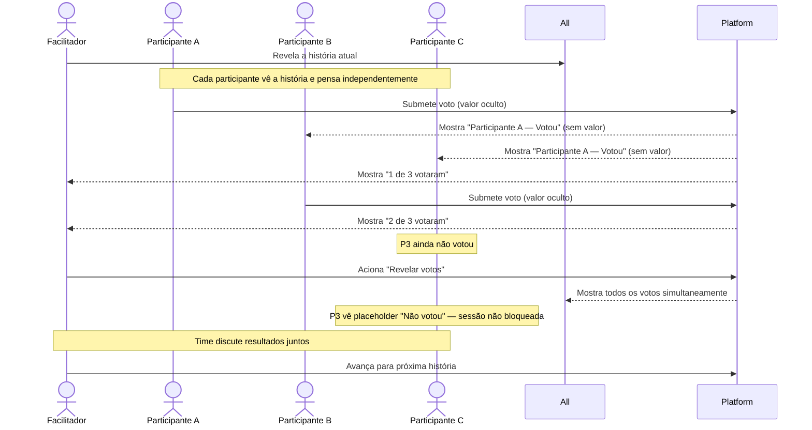
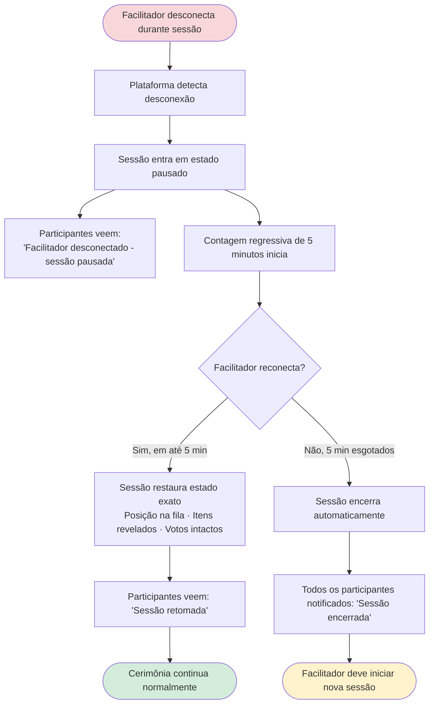
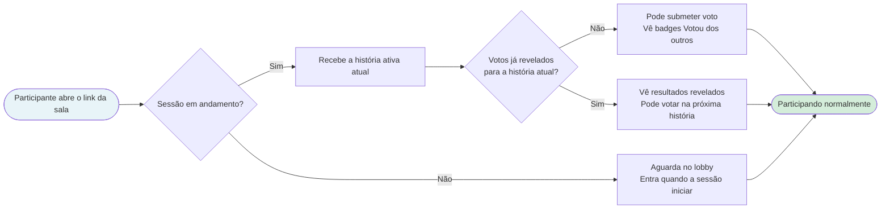

# Product Backlog — Queue Voting (Fila de Votação)

## Metadados

| Campo | Valor |
|---|---|
| **ID do Backlog** | PB-2024-001 |
| **Versão** | v1 |
| **RP vinculado** | RP-2024-001 v2 |
| **Responsável** | Lucas Mendes (PO) |
| **Status** | Baseline — aprovado para breakdown técnico |
| **Data de baseline** | 2024-04-03 |

> Este documento define **o que** será construído e **para quem**, da perspectiva do usuário.
> Não define como será construído. Decisões técnicas, tarefas e abordagem de implementação pertencem ao Tech Backlog (TB-2024-001).

## Histórico de Revisão

| Versão | Data | Autor | Resumo |
|---|---|---|---|
| v1 | 2024-04-03 | Lucas Mendes (PO) | Backlog inicial. Épicos e histórias derivados do RP-2024-001 v2. Baseline alinhada com o PM. |

---

## Mapa de Épicos

| Épico | Descrição | Prioridade |
|---|---|---|
| EP-001 | Gerenciamento de Fila | Must Have |
| EP-002 | Ocultação de Votos | Must Have |
| EP-003 | Resiliência de Sessão | Must Have |
| EP-004 | Observabilidade | Should Have |

---

## Jornada do Usuário

### Jornada Geral — Facilitador + Participante

A experiência end-to-end desde a configuração da cerimônia até os resultados, para ambas as personas.

---

### EP-001 — Jornada de Gerenciamento de Fila

Como o facilitador controla o fluxo de histórias durante a cerimônia.

---

### EP-002 — Jornada de Ocultação de Votos

Como os votos são coletados e revelados sem viés de ancoragem.

---

### EP-003 — Jornada de Resiliência de Sessão

O que cada persona experimenta quando o facilitador perde a conexão.

---

### Jornada de Entrada Tardia

O que um participante experimenta ao entrar em uma sessão já em andamento.

---

## EP-001 — Gerenciamento de Fila

**Objetivo:** Dar ao facilitador controle sobre o que os participantes veem e quando, eliminando leitura antecipada e formação prematura de opiniões.

---

### ST-001 — Carregar e gerenciar uma fila de questões

**Como** facilitador,
**quero** carregar uma lista de histórias ou questões em uma fila antes ou durante uma sessão,
**para que** eu controle a sequência de estimativas e os participantes não possam ler à frente.

**Critérios de Aceite:**
- [ ] Posso adicionar itens à fila pelo painel da sala antes da sessão iniciar
- [ ] Posso adicionar itens à fila enquanto uma sessão já está em andamento
- [ ] Posso reordenar itens na fila antes que qualquer item tenha sido revelado
- [ ] Posso excluir um item da fila desde que ainda não tenha sido revelado
- [ ] A fila suporta até 100 itens
- [ ] Apenas eu (o facilitador) posso ver a fila completa — participantes não veem nada até um item ser revelado

**Edge Cases:**
- [ ] Se eu tentar adicionar um 101º item, vejo um aviso claro de limite e o item não é adicionado
- [ ] Se eu tentar reordenar itens após a sessão ter iniciado e um item já estar revelado, apenas itens não revelados podem ser reordenados
- [ ] Se eu tentar excluir o item atualmente ativo (revelado), a ação é bloqueada com uma explicação
- [ ] Se eu adicionar um item com título vazio, o formulário impede a submissão
- [ ] Se duas abas do browser estiverem abertas para a mesma conta do facilitador, edições na fila em uma aba são refletidas na outra sem conflito

---

### ST-002 — Revelar itens um de cada vez

**Como** facilitador,
**quero** revelar itens da fila um de cada vez,
**para que** os participantes foquem apenas no item atual sendo estimado.

**Critérios de Aceite:**
- [ ] Tenho um controle "Revelar próximo item" que avança a fila em um
- [ ] Quando revelo um item, todos os participantes o veem simultaneamente
- [ ] Participantes não podem ver itens que ainda não foram revelados
- [ ] O item atualmente ativo está claramente indicado na minha visão de facilitador

**Edge Cases:**
- [ ] Se eu clicar em "Revelar próximo item" quando a fila estiver vazia, a ação fica desabilitada com tooltip: "Nenhum item na fila"
- [ ] Se eu revelar o último item da fila, o botão "Revelar próximo item" é substituído por "Encerrar sessão"
- [ ] Se um participante entrar exatamente quando um item está sendo revelado, ele recebe o item — não uma tela em branco
- [ ] Se o evento de revelação não chegar a um participante (queda de rede), esse participante vê o item ao reconectar sem que o facilitador precise revelar novamente

---

### ST-003 — Pular e retornar a itens

**Como** facilitador,
**quero** pular um item ou voltar a um já revelado,
**para que** eu possa gerenciar o fluxo da cerimônia sem ser forçado a uma sequência estrita.

**Critérios de Aceite:**
- [ ] Posso pular o item atual — ele é marcado como pulado no histórico da sessão
- [ ] Posso navegar de volta a um item anteriormente revelado
- [ ] Os participantes veem a mudança de item imediatamente quando pulo ou retorno
- [ ] Itens pulados são visíveis no histórico da sessão com um rótulo "pulado"

**Edge Cases:**
- [ ] Se eu pular um item onde votos já foram submetidos, vejo uma confirmação: "Votos submetidos para este item serão descartados. Continuar?"
- [ ] Se eu navegar de volta a um item anteriormente revelado, os votos existentes para aquele item são restaurados — não resetados
- [ ] Se eu tentar voltar antes do primeiro item, o controle "Voltar" fica desabilitado
- [ ] Se eu pular o último item da fila, a sessão move para um estado "Todos os itens revisados" em vez de travar

---

## EP-002 — Ocultação de Votos

**Objetivo:** Eliminar o viés de ancoragem garantindo que os participantes não possam ver os votos uns dos outros até que o facilitador escolha revelá-los.

---

### ST-004 — Votos ficam ocultos até o facilitador revelá-los

**Como** participante,
**quero** que meu voto e os votos dos outros fiquem ocultos até o facilitador revelá-los,
**para que** minha estimativa não seja influenciada pelo que os outros submeteram.

**Critérios de Aceite:**
- [ ] Após submeter um voto, vejo uma confirmação de que meu voto foi recebido
- [ ] Vejo que os outros votaram (ex.: badge "Votou") mas não seus valores
- [ ] O facilitador vê quantas pessoas votaram mas não os valores
- [ ] Nenhum valor de voto é visível a ninguém até o facilitador acionar a revelação

**Edge Cases:**
- [ ] Se eu mudar meu voto antes da revelação, meu novo voto substitui o antigo — o badge "Votou" permanece mas apenas o valor mais recente é armazenado
- [ ] Se eu desconectar e reconectar antes da revelação, meu voto submetido é preservado
- [ ] Se um participante submeter um voto e for removido da sessão antes da revelação, seu voto não é exibido nos resultados
- [ ] Se a sessão perder conectividade brevemente durante a coleta de votos, votos submetidos durante a lacuna não são silenciosamente perdidos — participantes veem um prompt de retry
- [ ] Um participante não pode submeter mais de um voto por item — duplo clique ou resubmissão rápida é idempotente

---

### ST-005 — Facilitador revela todos os votos de uma vez

**Como** facilitador,
**quero** revelar todos os votos submetidos simultaneamente com uma única ação,
**para que** toda a equipe veja os resultados ao mesmo tempo.

**Critérios de Aceite:**
- [ ] Tenho um controle "Revelar votos" disponível a qualquer momento após o item estar ativo
- [ ] Quando aciono a revelação, todos os votos submetidos são mostrados a todos simultaneamente
- [ ] Participantes que não votaram quando revelo veem um placeholder "Não votou" — a sessão não fica bloqueada
- [ ] Após a revelação, posso avançar para o próximo item ou reiniciar a votação no item atual

**Edge Cases:**
- [ ] Se ninguém votou quando aciono a revelação, vejo um aviso: "Nenhum voto foi submetido. Revelar mesmo assim?" — a ação requer confirmação
- [ ] Se aciono a revelação e um voto está em trânsito (submetido no exato mesmo momento), esse voto é incluído nos resultados — não descartado
- [ ] Se reiniciar a votação no item atual, todos os votos anteriores para aquele item são limpos e os participantes podem votar novamente
- [ ] Após reiniciar um voto, participantes que já votaram veem seu input de voto resetado para branco — não pré-preenchido com seu valor anterior

---

## EP-003 — Resiliência de Sessão

**Objetivo:** Garantir que problemas de conectividade não destruam uma cerimônia ativa.

---

### ST-006 — Sessão recupera se o facilitador desconectar

**Como** facilitador,
**quero** que a sessão retome de onde estava se eu perder a conexão brevemente,
**para que** um problema de conectividade não force a equipe a reiniciar a cerimônia.

**Critérios de Aceite:**
- [ ] Se eu desconectar, os participantes veem uma mensagem clara: "Facilitador desconectado — sessão pausada"
- [ ] Se eu reconectar em até 5 minutos, a sessão retoma do estado exato em que estava
- [ ] Se 5 minutos passarem sem reconexão, a sessão encerra com notificação a todos os participantes
- [ ] Após reconexão, a posição na fila, itens revelados e todos os votos submetidos estão intactos

**Edge Cases:**
- [ ] Se um participante desconectar (não o facilitador), a sessão continua ininterrupta — apenas a desconexão do facilitador pausa a sessão
- [ ] Se o facilitador reconectar aos 4 min 58 seg, a sessão é restaurada — o timer não encerra a sessão antes que a reconexão seja totalmente confirmada
- [ ] Se o facilitador reconectar com um browser ou dispositivo diferente, o estado da sessão é totalmente restaurado na nova conexão
- [ ] Se o snapshot de sessão do facilitador estiver corrompido ou indisponível, a sessão encerra limpo em vez de restaurar um estado quebrado — participantes são notificados

---

### ST-007 — Participante que entra no meio da sessão vê o estado correto

**Como** participante entrando em uma sessão já em andamento,
**quero** ver o item ativo atual imediatamente,
**para que** eu possa participar sem interromper o fluxo ou pedir ao facilitador que me atualize.

**Critérios de Aceite:**
- [ ] Quando entro em uma sessão em andamento, vejo o item ativo atual
- [ ] Posso submeter um voto para o item atual mesmo que outros já tenham votado
- [ ] Não vejo a fila nem qualquer item que ainda não foi revelado
- [ ] Se os votos já foram revelados para o item atual, vejo os resultados revelados

**Edge Cases:**
- [ ] Se entrar durante o exato momento em que uma revelação de voto está acontecendo, vejo o estado revelado — não uma visão vazia ou inconsistente
- [ ] Se entrar enquanto o facilitador está desconectado (sessão pausada), vejo o estado pausado imediatamente em vez de uma visão de sessão normal
- [ ] Se entrar em uma sessão que já terminou, vejo uma mensagem clara: "Esta sessão foi encerrada" em vez de uma sala vazia
- [ ] Se entrar e a sessão não tiver um item ativo ainda (facilitador não revelou o primeiro item), vejo um estado de espera: "Aguardando o facilitador iniciar"

---

## EP-004 — Observabilidade

**Objetivo:** Capturar dados para medir se a funcionalidade entrega o resultado prometido de redução da duração das cerimônias.

---

### ST-008 — Temporização de sessão e por item é capturada

**Como** membro do time de produto,
**quero** que a duração da sessão e o tempo de votação por item sejam capturados automaticamente,
**para que** possamos medir se a duração das cerimônias melhora após o ship desta funcionalidade.

**Critérios de Aceite:**
- [ ] A duração total da sessão é registrada do início ao fim da sessão
- [ ] O tempo desde a revelação do item até a revelação dos votos é registrado por item
- [ ] Esses dados estão disponíveis para análise em até 24 horas após o encerramento da sessão
- [ ] Nenhuma ação adicional é necessária do facilitador ou dos participantes para capturar esses dados

**Edge Cases:**
- [ ] Se uma sessão encerrar inesperadamente (timeout do facilitador), a duração ainda é registrada até o evento de encerramento — não descartada
- [ ] Se um item for pulado, ele é registrado na telemetria com duração = 0 e status = pulado
- [ ] Se o facilitador reiniciar a votação em um item, tanto o ciclo original quanto o reiniciado são registrados separadamente — não mesclados
- [ ] Se um participante entrar e sair sem votar, sua presença não é contada na taxa de participação de votos para aquele item

---

## Fora do Escopo (neste release)

Os itens a seguir foram explicitamente excluídos e não devem ser introduzidos durante a entrega. Qualquer adição requer um novo registro de intake.

| Item | Motivo |
|---|---|
| Timer de contagem regressiva por item | Item de backlog separado — adiciona complexidade à UX do facilitador |
| Auto-revelação após todos os participantes votarem | Toggle de preferência futuro — fora do escopo do MVP |
| Co-controle multi-facilitador | Mudança arquitetural — não requerida pelos clientes atuais |
| Redesign específico para mobile | Layout mobile existente se aplica |
| Reuso de template de fila entre sessões | Fase futura |
| Integração Jira / Linear para importação de fila | Fase futura |
| Dashboard de analytics de cerimônias | Fase futura |
