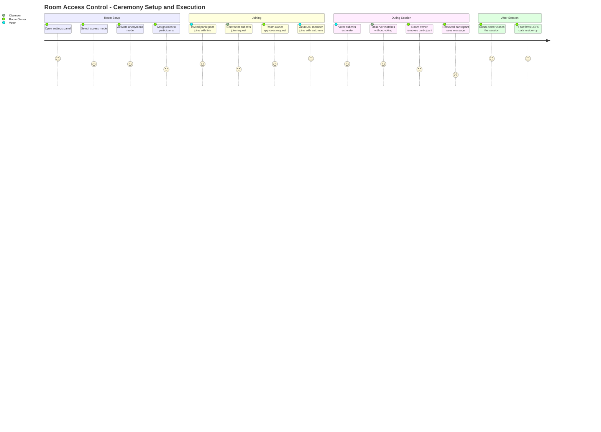
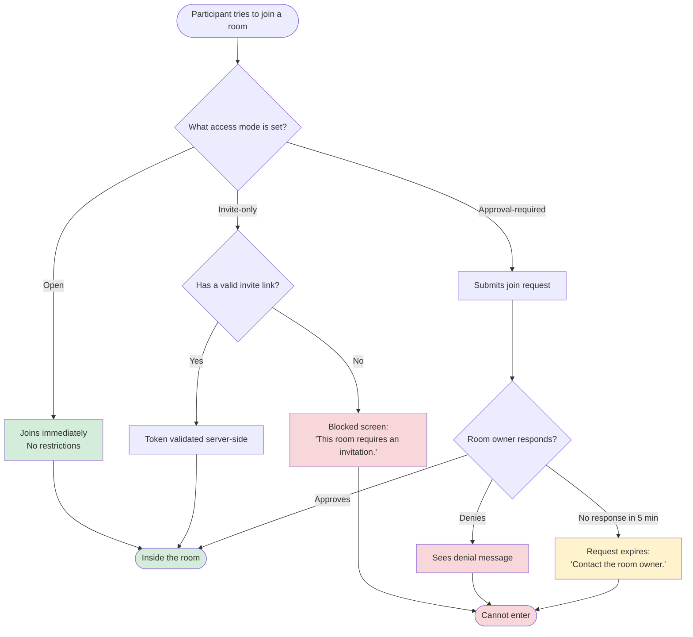
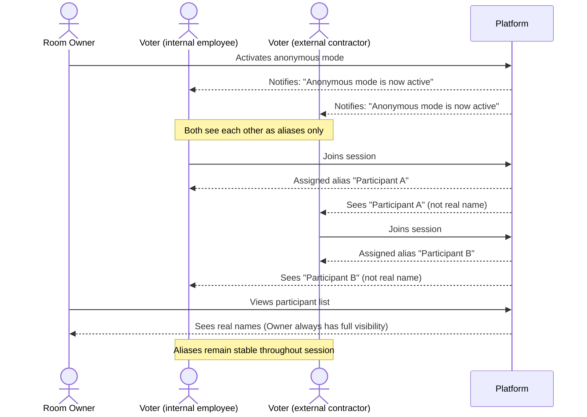
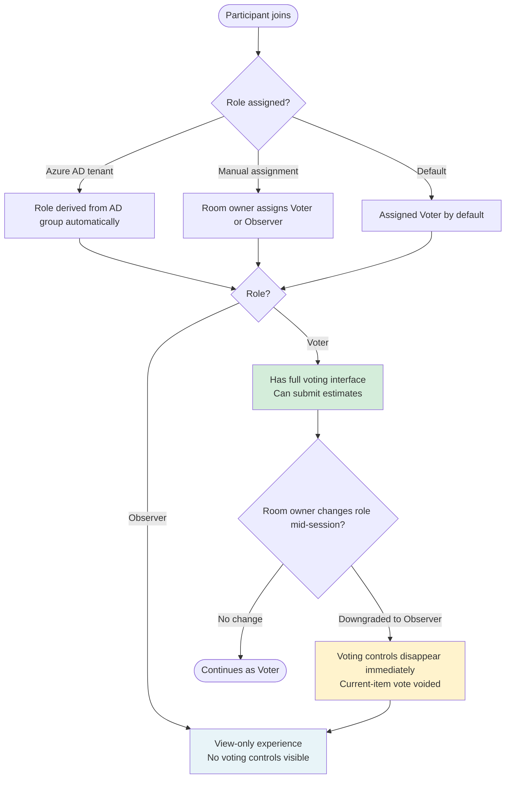
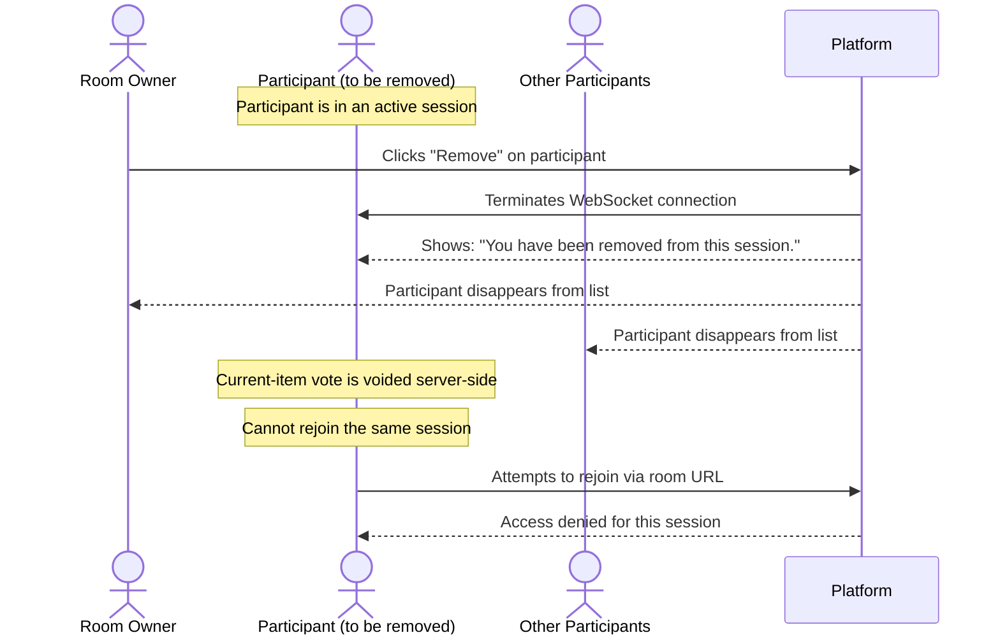
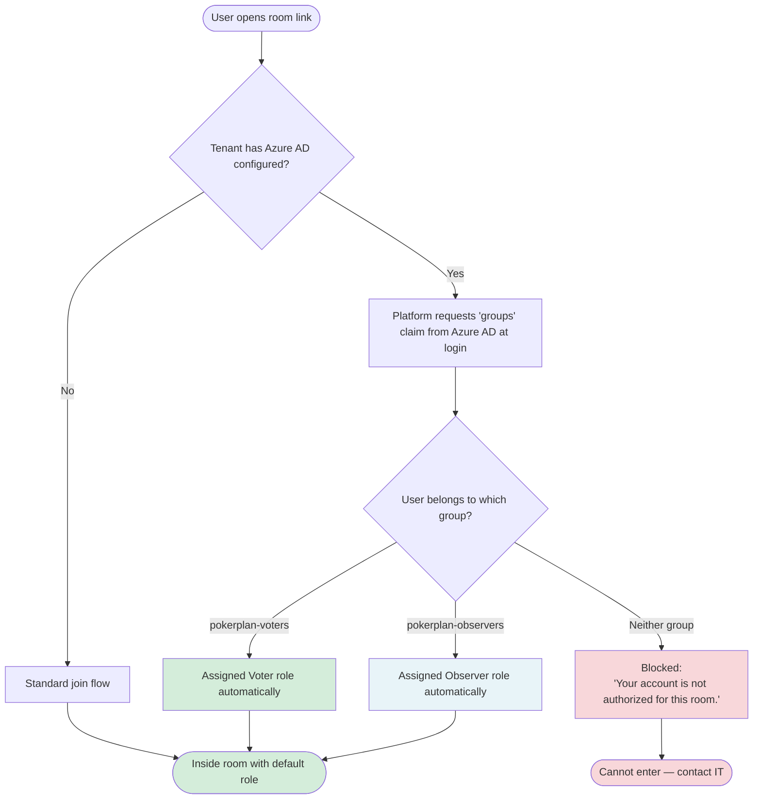
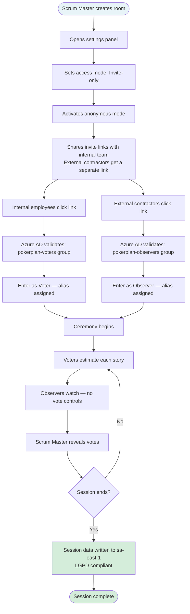

# Product Backlog — Room Access Control

## Metadata

| Field | Value |
|---|---|
| **Backlog ID** | PB-2024-002 |
| **Version** | v1 |
| **Linked RP** | RP-2024-002 v1 |
| **Owned by** | Lucas Mendes (PO) |
| **Status** | Baselined — approved for tech breakdown |
| **Baselined date** | 2024-04-05 |

> This document defines **what** will be built and **for whom**, from the user's perspective.
> It does not define how it will be built. Technical decisions, tasks, and implementation approach belong to the Tech Breakdown (TB-2024-002).

## Revision History

| Version | Date | Author | Summary |
|---|---|---|---|
| v1 | 2024-04-05 | Lucas Mendes (PO) | Initial backlog. Epics and stories derived from RP-2024-002 v1, including Discovery findings (Azure AD, LGPD). Baselined with PM. |

---

## Epic Map

| Epic | Description | Priority |
|---|---|---|
| EP-001 | Access Modes | Must Have |
| EP-002 | Anonymous Mode | Must Have |
| EP-003 | Role Management | Must Have |
| EP-004 | Participant Removal | Must Have |
| EP-005 | Azure AD Integration | Must Have (deal blocker) |
| EP-006 | LGPD Data Residency | Must Have (legal requirement) |
| EP-007 | Room Owner Settings | Must Have |

---

## User Journey

### Overall Journey — Room Owner + Participants

End-to-end experience of setting up and running a controlled ceremony.

---

### EP-001 — Access Modes Journey

The three paths a participant can take to enter a room depending on the mode set by the owner.

---

### EP-002 — Anonymous Mode Journey

How identities are handled when the room owner enables anonymity.

---

### EP-003 — Role Management Journey

How the room owner controls who votes and who observes.

---

### EP-004 — Participant Removal Journey

What each persona experiences when a removal happens during an active session.

---

### EP-005 — Azure AD Integration Journey

How a Construtora Ágil employee or contractor joins with automatic role assignment.

---

### Combined Ceremony Journey — Construtora Ágil Scenario

Full end-to-end journey showing all features working together for the target client.

---

## EP-001 — Access Modes

**Goal:** Give the room owner control over who can enter a session, replacing the current open-link-only model.

---

### ST-001 — Open mode (current behavior preserved)

**As a** room owner,
**I want** the current open-link behavior to remain the default,
**so that** existing rooms and users are not disrupted by this change.

**Acceptance Criteria:**
- [ ] Rooms without an explicit access mode set behave exactly as they do today
- [ ] No existing user is required to take any action due to this release

**Edge Cases:**
- [ ] If an existing room is opened after this release with no access mode configured, it continues to work without prompting the owner to configure access
- [ ] If a participant joins an open room while a migration is in progress, the join succeeds — the migration does not cause a join failure

---

### ST-002 — Invite-only access

**As a** room owner,
**I want to** generate invite links so that only people I invite can join,
**so that** I control exactly who participates in the session.

**Acceptance Criteria:**
- [ ] I can generate one or more invite links from the room settings panel
- [ ] Only a person with a valid invite link can enter the room
- [ ] A person without an invite who tries to join via the room URL sees: "This room requires an invitation."
- [ ] I can revoke an invite link before it has been used
- [ ] Used invite links cannot be reused

**Edge Cases:**
- [ ] If someone uses a revoked invite link, they see: "This invite link is no longer valid."
- [ ] If someone tries to reuse an already-used invite link, they see: "This invite link has already been used."
- [ ] If I switch the room from Invite-only to Open mode after sending links, people with links can still enter (now via open mode) — existing tokens are invalidated
- [ ] If I generate 10+ invite links and the panel becomes long, it remains scrollable and usable — no UI overflow
- [ ] If the same person uses two different invite links in quick succession (race condition), only one session is created — not two

---

### ST-003 — Approval-required access

**As a** room owner,
**I want to** approve or deny join requests in real time,
**so that** I decide who enters on a case-by-case basis without distributing invite links.

**Acceptance Criteria:**
- [ ] Any person with the room URL can submit a request to join
- [ ] I receive an immediate notification when someone requests to join: "User X is requesting to join"
- [ ] I can approve the request (they enter immediately) or deny it (they see a denial message)
- [ ] If I do not respond within 5 minutes, the request expires and the person sees: "Request expired. Contact the room owner."
- [ ] Approved participants enter with the default role (voter) unless I assign otherwise

**Edge Cases:**
- [ ] If 5+ people request to join simultaneously, I see all pending requests in a queue — none are silently dropped
- [ ] If I am disconnected when a request arrives, the request remains pending and I see it upon reconnect (if within expiry window)
- [ ] If I approve a request but the participant has already navigated away, they are marked as approved — if they return within the session, they enter without re-requesting
- [ ] If the same person submits multiple join requests in quick succession (double-click), only one request is created
- [ ] If a denied participant immediately submits a new request, they can do so — the denial does not permanently block them from requesting again

---

## EP-002 — Anonymous Mode

**Goal:** Allow the room owner to hide participant identities from each other to support compliant ceremonies with mixed internal and external attendees.

---

### ST-004 — Room owner activates anonymous mode

**As a** room owner,
**I want to** activate a mode where participants cannot see each other's real names,
**so that** I can run ceremonies with external contractors without exposing identities.

**Acceptance Criteria:**
- [ ] I can activate anonymous mode from the room settings panel before or during a session
- [ ] Once activated, anonymous mode cannot be turned off for the rest of that session
- [ ] All participants are notified when anonymous mode is activated
- [ ] I always see real names regardless of whether anonymous mode is on

**Edge Cases:**
- [ ] If I accidentally click the anonymous mode toggle, a confirmation dialog prevents accidental activation: "Anonymous mode cannot be undone for this session. Activate?"
- [ ] If anonymous mode is activated while a vote is in progress, participants who have already voted retain their vote — their display name switches to an alias immediately
- [ ] If a new participant joins after anonymous mode has been activated, they are immediately assigned an alias — they never see real names

---

### ST-005 — Participants see aliases in anonymous mode

**As a** participant in an anonymous session,
**I want to** see other participants as aliases (e.g., "Participant A", "Participant B") instead of names,
**so that** my identity and others' identities are not exposed during the ceremony.

**Acceptance Criteria:**
- [ ] Each participant in the room is represented by a consistent alias throughout the session
- [ ] The same person always appears as the same alias — it does not change mid-session
- [ ] I never see another participant's real name in anonymous mode
- [ ] The facilitator can still see real names in their own view

**Edge Cases:**
- [ ] If a participant disconnects and reconnects, they receive the same alias they had before — not a new one
- [ ] If a participant is removed and a new participant joins, the new participant does not receive the removed participant's alias — aliases are not recycled within the same session
- [ ] If all 26 single-letter aliases are exhausted (26+ participants), aliases continue with a defined extension pattern (e.g., "Participant AA") without breaking
- [ ] If the page is refreshed by a participant, their alias is the same after reload — not re-assigned

---

## EP-003 — Role Management

**Goal:** Allow the room owner to distinguish between participants who vote and those who observe, so that non-estimating attendees do not influence results.

---

### ST-006 — Room owner assigns Voter or Observer role

**As a** room owner,
**I want to** assign each participant as a Voter or an Observer,
**so that** product managers or executives can attend without voting.

**Acceptance Criteria:**
- [ ] I can assign or change any participant's role before the session starts or between items
- [ ] A Voter who I downgrade to Observer mid-item has their current vote voided
- [ ] I cannot upgrade an Observer to Voter after voting has already started for the current item
- [ ] The participant is notified when their role changes

**Edge Cases:**
- [ ] If I downgrade a Voter to Observer and immediately upgrade them back (before any votes), their vote input is re-enabled cleanly
- [ ] If I downgrade a Voter who has already voted, a confirmation is shown: "This will void their current vote. Continue?"
- [ ] If a participant's role is changed while they are disconnected, they see the updated role upon reconnect
- [ ] The room owner's own role cannot be changed by anyone, including themselves

---

### ST-007 — Observer experience

**As an** observer,
**I want to** follow the session in real time without any voting controls,
**so that** I can stay informed without accidentally influencing estimates.

**Acceptance Criteria:**
- [ ] I can see all session content — current item, votes after reveal, participant list
- [ ] I have no voting interface — no way to submit a vote even if I try
- [ ] If I am downgraded from Voter to Observer during a session, my voting controls disappear immediately
- [ ] The facilitator sees my role labeled as "Observer" in the participant list

**Edge Cases:**
- [ ] If I am downgraded to Observer in the middle of submitting a vote (race condition), the vote is not accepted — I see a message: "Your role changed. Your vote was not submitted."
- [ ] If I try to interact with vote controls through browser developer tools, the server rejects the submission silently and my Observer status is unchanged
- [ ] If I am an Observer in anonymous mode, I am still shown as an alias to other participants — not as "Observer [real name]"

---

## EP-004 — Participant Removal

**Goal:** Allow the room owner to remove a participant from an active session when needed.

---

### ST-008 — Room owner removes a participant

**As a** room owner,
**I want to** remove a participant from an active session at any time,
**so that** I can manage access and resolve situations where someone should not be in the room.

**Acceptance Criteria:**
- [ ] I can remove any participant at any time during an active session
- [ ] The removed participant immediately sees: "You have been removed from this session."
- [ ] Any vote the removed participant submitted for the current item is voided
- [ ] The removed participant cannot rejoin the same session after being removed

**Edge Cases:**
- [ ] I cannot remove myself (the room owner) — the remove action does not appear on my own participant entry
- [ ] If I remove a participant while votes are being revealed (race condition), the removal succeeds but their vote — if already included in the reveal payload — is still shown in the current reveal and voided from the next item onwards
- [ ] If a removed participant attempts to rejoin using an invite link that was generated before removal, the link is invalid for this session — they see the removed state message
- [ ] If I accidentally remove a participant, there is no undo — they must request to join again (if the room is in approval mode) or receive a new invite link

---

## EP-005 — Azure AD Integration

**Goal:** Allow Construtora Ágil participants to join rooms with their roles assigned automatically from their Azure AD groups, without manual configuration by the room owner.

> ⚠️ **External dependency:** This epic requires Construtora Ágil's IT team to register the platform as an approved application in their Azure AD tenant and provide the tenant ID. This must be completed by 2024-04-14 for the delivery timeline to hold.

---

### ST-009 — Roles are assigned automatically from Azure AD group membership

**As a** Construtora Ágil employee or contractor,
**I want** my platform role to be set automatically when I join a room based on my Azure AD group,
**so that** the room owner does not need to manually configure who is a voter and who is an observer.

**Acceptance Criteria:**
- [ ] When I join a room as a member of the `pokerplan-voters` Azure AD group, I am assigned the Voter role automatically
- [ ] When I join as a member of `pokerplan-observers`, I am assigned the Observer role automatically
- [ ] If I do not belong to either group, I cannot join and I see: "Your account is not authorized for this room."
- [ ] This behavior only applies to rooms owned by tenants with Azure AD configured — other tenants are unaffected

**Edge Cases:**
- [ ] If I belong to both `pokerplan-voters` and `pokerplan-observers` groups simultaneously, the Voter role takes precedence — the conflict resolution rule is documented and consistent
- [ ] If the Azure AD `groups` claim is missing or empty in the token (e.g., Azure AD misconfiguration on client side), I am blocked with a clear message: "Unable to verify your authorization. Contact your IT administrator."
- [ ] If the Azure AD service is temporarily unavailable when I try to join, I see: "Authorization service unavailable. Please try again in a moment." — the platform does not fail open and grant me access
- [ ] If my Azure AD group membership changes between sessions (e.g., moved from Voters to Observers by IT), my role reflects the updated group on my next join — not the cached previous role

---

## EP-006 — LGPD Data Residency

**Goal:** Ensure that participant identity data for Construtora Ágil is stored in Brazil, meeting their legal data governance requirements under LGPD.

> ⚠️ **Infrastructure prerequisite:** The Brazil-region (`sa-east-1`) database endpoint must be provisioned by the CTO before this epic can be delivered. Target: 2024-05-05.

---

### ST-010 — Participant data for LGPD-flagged tenants is stored in Brazil

**As** Construtora Ágil,
**I need** all participant session data — names, emails, and session records — to be stored in Brazil,
**so that** the platform meets our LGPD data governance obligations.

**Acceptance Criteria:**
- [ ] Participant session data for our account is stored exclusively in the Brazil region (`sa-east-1`)
- [ ] No participant data from our account is stored in any other region
- [ ] This is confirmed in writing by the platform team before we go live
- [ ] Other tenants' data storage is not affected by this change

**Edge Cases:**
- [ ] If the `sa-east-1` database endpoint is temporarily unavailable, the session join fails with a clear error — the platform does not fall back to `us-east-1` and silently store data outside Brazil
- [ ] If a participant's data is partially written before a connection failure mid-join, the partial record is rolled back — no incomplete records in either region
- [ ] If the LGPD tenant flag is incorrectly unset after go-live (misconfiguration), a monitoring alert is triggered and data written to the wrong region is flagged for immediate review

---

## EP-007 — Room Owner Settings

**Goal:** Provide a single, coherent settings panel where the room owner can configure all access and anonymity options.

---

### ST-011 — Room owner manages all access settings from one panel

**As a** room owner,
**I want** a clear settings panel where I can configure how my room handles access and participant visibility,
**so that** I do not need to go to multiple places to set up a ceremony.

**Acceptance Criteria:**
- [ ] The settings panel is accessible from the room dashboard before the session starts and during an active session
- [ ] I can select the access mode (Open / Invite-only / Approval-required) from the panel
- [ ] When Invite-only is selected, I can generate and revoke invite links from the same panel
- [ ] I can activate anonymous mode from the panel, with a clear warning that it cannot be undone mid-session
- [ ] All settings take effect immediately — no page reload required

**Edge Cases:**
- [ ] If I change the access mode while participants are actively joining, in-flight join attempts that started under the previous mode are resolved under that previous mode — not silently rejected
- [ ] If I switch from Approval-required to Open mode while pending requests exist, all pending requests are automatically approved — not left hanging indefinitely
- [ ] If I switch from Invite-only to Approval-required mode, previously generated invite links are invalidated — users attempting to join with them are redirected to the approval request flow
- [ ] If the settings panel fails to load (network error), I see a clear error state — not a blank panel that silently ignores my changes

---

## Out of Scope (for this release)

The following items were explicitly excluded. Any addition requires a new Intake record.

| Item | Reason |
|---|---|
| Full SSO / SAML enterprise integration | Separate roadmap item — not required for deal close |
| Audit log (who joined, when, what they voted) | Future compliance phase |
| Organization-level default access settings | Future phase |
| Bulk invite via CSV or team roster | Future phase |
| Guest access without account registration | Future phase |
| Room password protection | Out of scope — access modes cover the requirement |
| Jira integration for room pre-population | Moved to BACKLOG-2024-007 during Discovery |
| Compliance export for governance reporting | Future compliance phase |
