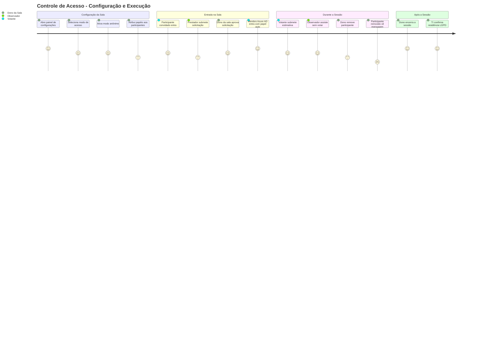
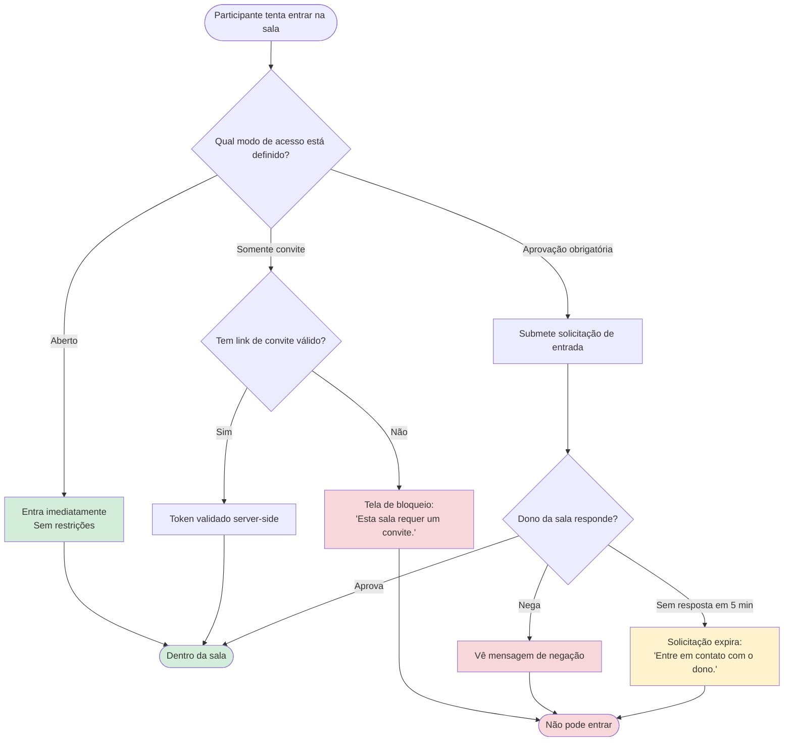
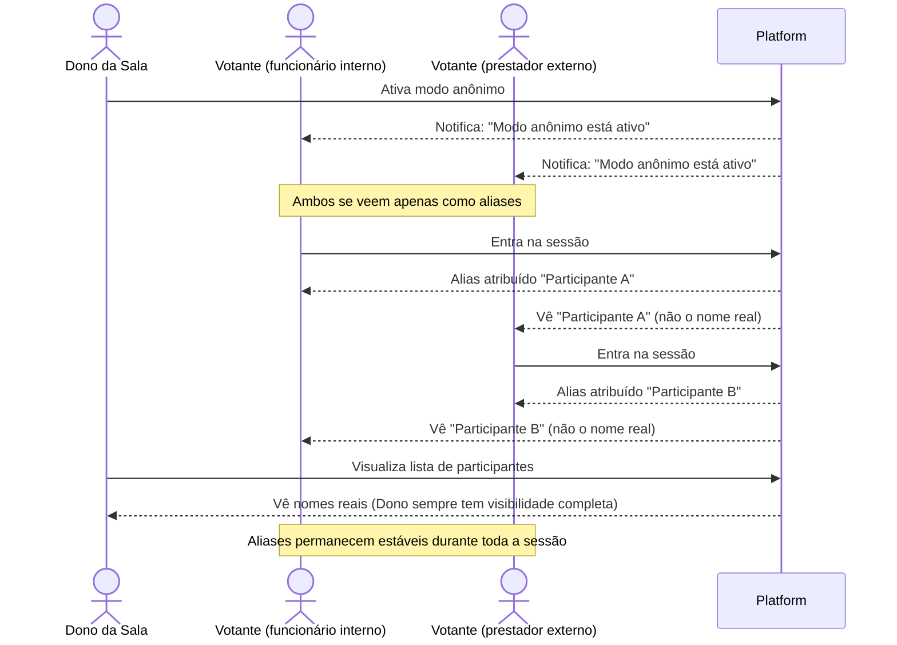
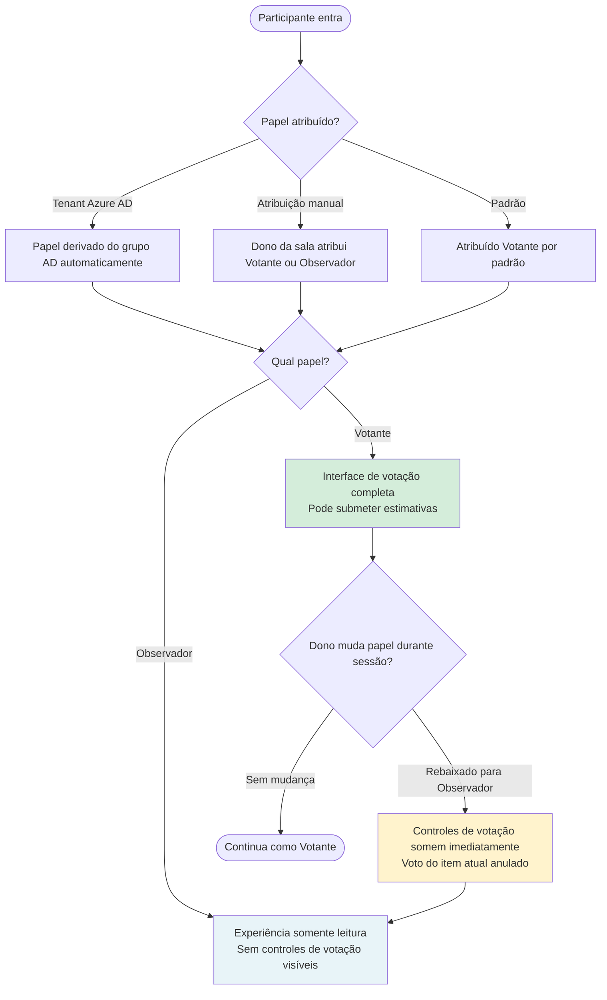
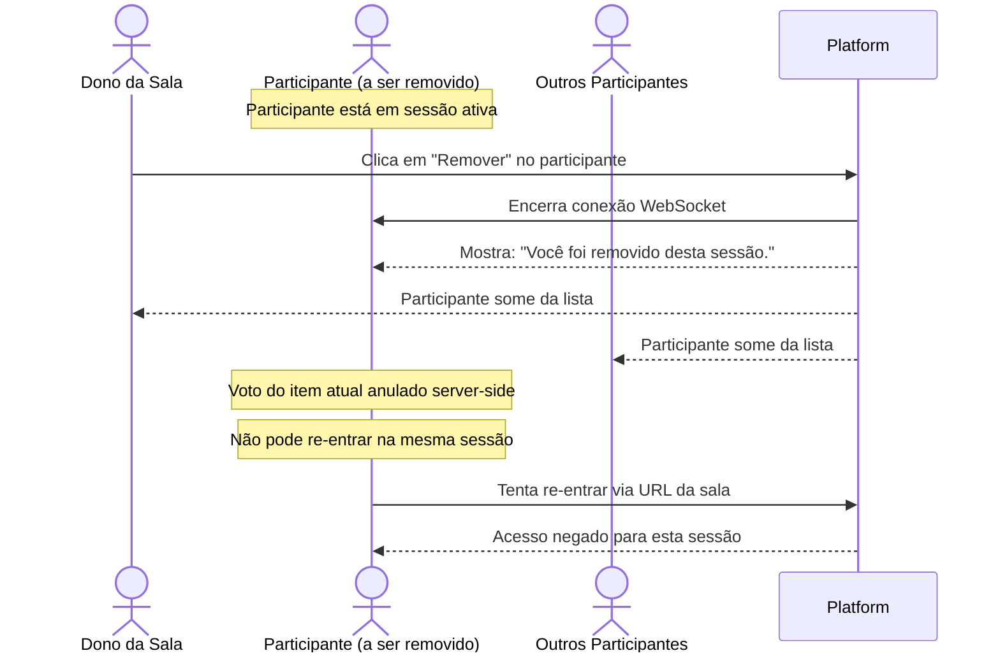
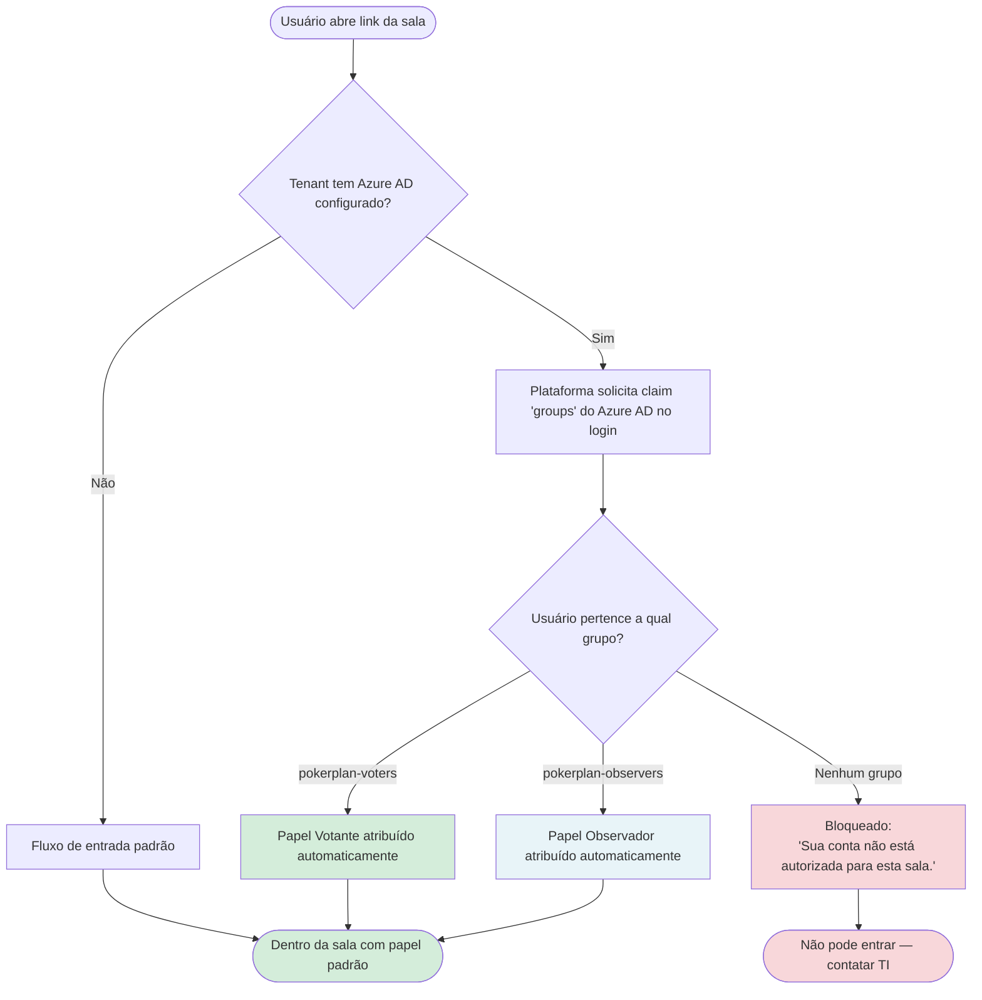
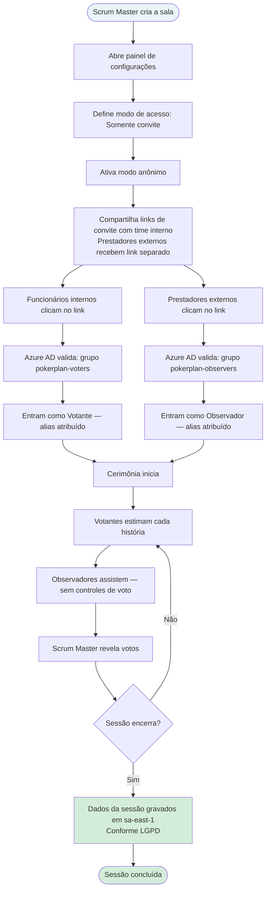

# Product Backlog — Room Access Control (Controle de Acesso à Sala)

## Metadados

| Campo | Valor |
|---|---|
| **ID do Backlog** | PB-2024-002 |
| **Versão** | v1 |
| **RP vinculado** | RP-2024-002 v1 |
| **Responsável** | Lucas Mendes (PO) |
| **Status** | Baseline — aprovado para breakdown técnico |
| **Data de baseline** | 2024-04-05 |

> Este documento define **o que** será construído e **para quem**, da perspectiva do usuário.
> Não define como será construído. Decisões técnicas, tarefas e abordagem de implementação pertencem ao Tech Backlog (TB-2024-002).

## Histórico de Revisão

| Versão | Data | Autor | Resumo |
|---|---|---|---|
| v1 | 2024-04-05 | Lucas Mendes (PO) | Backlog inicial. Épicos e histórias derivados do RP-2024-002 v1, incluindo findings do Discovery (Azure AD, LGPD). Baseline alinhada com o PM. |

---

## Mapa de Épicos

| Épico | Descrição | Prioridade |
|---|---|---|
| EP-001 | Modos de Acesso | Must Have |
| EP-002 | Modo Anônimo | Must Have |
| EP-003 | Gerenciamento de Papéis | Must Have |
| EP-004 | Remoção de Participante | Must Have |
| EP-005 | Integração Azure AD | Must Have (bloqueador de deal) |
| EP-006 | Residência de Dados LGPD | Must Have (requisito legal) |
| EP-007 | Configurações do Dono da Sala | Must Have |

---

## Jornada do Usuário

### Jornada Geral — Dono da Sala + Participantes

Experiência end-to-end de configuração e execução de uma cerimônia controlada.

---

### EP-001 — Jornada de Modos de Acesso

Os três caminhos que um participante pode percorrer para entrar em uma sala dependendo do modo configurado pelo dono.

---

### EP-002 — Jornada do Modo Anônimo

Como as identidades são tratadas quando o dono da sala habilita o anonimato.

---

### EP-003 — Jornada de Gerenciamento de Papéis

Como o dono da sala controla quem vota e quem observa.

---

### EP-004 — Jornada de Remoção de Participante

O que cada persona experimenta quando uma remoção ocorre durante uma sessão ativa.

---

### EP-005 — Jornada de Integração Azure AD

Como um funcionário ou prestador da Construtora Ágil entra com atribuição automática de papel.

---

### Jornada Combinada da Cerimônia — Cenário Construtora Ágil

Jornada end-to-end completa mostrando todas as funcionalidades trabalhando juntas para o cliente-alvo.

---

## EP-001 — Modos de Acesso

**Objetivo:** Dar ao dono da sala controle sobre quem pode entrar em uma sessão, substituindo o modelo atual de link aberto.

---

### ST-001 — Modo aberto (comportamento atual preservado)

**Como** dono da sala,
**quero** que o comportamento atual de link aberto permaneça o padrão,
**para que** salas e usuários existentes não sejam perturbados por esta mudança.

**Critérios de Aceite:**
- [ ] Salas sem modo de acesso explícito configurado se comportam exatamente como hoje
- [ ] Nenhum usuário existente é obrigado a tomar qualquer ação devido a este release

**Edge Cases:**
- [ ] Se uma sala existente for aberta após este release sem modo de acesso configurado, continua funcionando sem solicitar ao dono que configure o acesso
- [ ] Se um participante entrar em uma sala aberta enquanto uma migração está em andamento, o join tem sucesso — a migração não causa falha no join

---

### ST-002 — Acesso somente por convite

**Como** dono da sala,
**quero** gerar links de convite para que apenas pessoas que convidei possam entrar,
**para que** eu controle exatamente quem participa da sessão.

**Critérios de Aceite:**
- [ ] Posso gerar um ou mais links de convite pelo painel de configurações da sala
- [ ] Apenas uma pessoa com link de convite válido pode entrar na sala
- [ ] Uma pessoa sem convite que tenta entrar via URL da sala vê: "Esta sala requer um convite."
- [ ] Posso revogar um link de convite antes que tenha sido usado
- [ ] Links de convite usados não podem ser reutilizados

**Edge Cases:**
- [ ] Se alguém usar um link de convite revogado, vê: "Este link de convite não é mais válido."
- [ ] Se alguém tentar reutilizar um link já utilizado, vê: "Este link de convite já foi usado."
- [ ] Se eu mudar a sala de Somente convite para Aberto após enviar links, pessoas com links ainda podem entrar (agora via modo aberto) — tokens existentes são invalidados
- [ ] Se eu gerar 10+ links de convite e o painel ficar longo, ele permanece rolável e utilizável — sem overflow de UI
- [ ] Se a mesma pessoa usar dois links de convite diferentes em rápida sucessão (condição de corrida), apenas uma sessão é criada — não duas

---

### ST-003 — Acesso com aprovação obrigatória

**Como** dono da sala,
**quero** aprovar ou negar solicitações de entrada em tempo real,
**para que** eu decida quem entra caso a caso sem distribuir links de convite.

**Critérios de Aceite:**
- [ ] Qualquer pessoa com a URL da sala pode submeter uma solicitação de entrada
- [ ] Recebo uma notificação imediata quando alguém solicita entrar: "Usuário X está solicitando entrada"
- [ ] Posso aprovar a solicitação (ele entra imediatamente) ou negar (ele vê uma mensagem de negação)
- [ ] Se eu não responder em 5 minutos, a solicitação expira e a pessoa vê: "Solicitação expirada. Entre em contato com o dono da sala."
- [ ] Participantes aprovados entram com o papel padrão (votante) a menos que eu atribua diferente

**Edge Cases:**
- [ ] Se 5+ pessoas solicitarem entrar simultaneamente, vejo todas as solicitações pendentes em uma fila — nenhuma é silenciosamente descartada
- [ ] Se eu estiver desconectado quando uma solicitação chega, ela permanece pendente e a vejo ao reconectar (se dentro da janela de expiração)
- [ ] Se eu aprovar uma solicitação mas o participante já tiver navegado para outro lugar, ele é marcado como aprovado — se retornar dentro da sessão, entra sem re-solicitar
- [ ] Se a mesma pessoa submeter múltiplas solicitações em rápida sucessão (duplo clique), apenas uma solicitação é criada
- [ ] Se um participante negado submeter imediatamente uma nova solicitação, pode fazê-lo — a negação não o bloqueia permanentemente de solicitar novamente

---

## EP-002 — Modo Anônimo

**Objetivo:** Permitir que o dono da sala oculte as identidades dos participantes uns dos outros para suportar cerimônias em conformidade com participantes internos e externos misturados.

---

### ST-004 — Dono da sala ativa o modo anônimo

**Como** dono da sala,
**quero** ativar um modo onde os participantes não podem ver os nomes reais uns dos outros,
**para que** eu possa realizar cerimônias com prestadores externos sem expor identidades.

**Critérios de Aceite:**
- [ ] Posso ativar o modo anônimo pelo painel de configurações da sala antes ou durante uma sessão
- [ ] Uma vez ativado, o modo anônimo não pode ser desligado pelo resto daquela sessão
- [ ] Todos os participantes são notificados quando o modo anônimo é ativado
- [ ] Sempre vejo os nomes reais independentemente de o modo anônimo estar ativo

**Edge Cases:**
- [ ] Se eu clicar acidentalmente no toggle do modo anônimo, um diálogo de confirmação previne ativação acidental: "O modo anônimo não pode ser desfeito nesta sessão. Ativar?"
- [ ] Se o modo anônimo for ativado enquanto uma votação está em andamento, participantes que já votaram mantêm seu voto — seu nome de exibição muda para um alias imediatamente
- [ ] Se um novo participante entrar após o modo anônimo ter sido ativado, ele recebe um alias imediatamente — nunca vê nomes reais

---

### ST-005 — Participantes veem aliases no modo anônimo

**Como** participante em uma sessão anônima,
**quero** ver outros participantes como aliases (ex.: "Participante A", "Participante B") em vez de nomes,
**para que** minha identidade e a dos outros não sejam expostas durante a cerimônia.

**Critérios de Aceite:**
- [ ] Cada participante na sala é representado por um alias consistente durante toda a sessão
- [ ] A mesma pessoa sempre aparece com o mesmo alias — ele não muda durante a sessão
- [ ] Nunca vejo o nome real de outro participante no modo anônimo
- [ ] O facilitador ainda pode ver os nomes reais na sua própria visão

**Edge Cases:**
- [ ] Se um participante desconectar e reconectar, recebe o mesmo alias que tinha antes — não um novo
- [ ] Se um participante for removido e um novo participante entrar, o novo não recebe o alias do removido — aliases não são reciclados na mesma sessão
- [ ] Se todos os 26 aliases de letra única forem esgotados (26+ participantes), os aliases continuam com um padrão de extensão definido (ex.: "Participante AA") sem quebrar
- [ ] Se a página for recarregada por um participante, seu alias é o mesmo após o reload — não re-atribuído

---

## EP-003 — Gerenciamento de Papéis

**Objetivo:** Permitir que o dono da sala distinga entre participantes que votam e os que observam, para que participantes não estimadores não influenciem os resultados.

---

### ST-006 — Dono da sala atribui papel Votante ou Observador

**Como** dono da sala,
**quero** atribuir cada participante como Votante ou Observador,
**para que** gerentes de produto ou executivos possam participar sem votar.

**Critérios de Aceite:**
- [ ] Posso atribuir ou alterar o papel de qualquer participante antes da sessão iniciar ou entre itens
- [ ] Um Votante que rebaixo para Observador durante um item tem seu voto atual anulado
- [ ] Não posso promover um Observador para Votante após a votação já ter iniciado para o item atual
- [ ] O participante é notificado quando seu papel muda

**Edge Cases:**
- [ ] Se eu rebaixar um Votante para Observador e imediatamente promovê-lo de volta (antes de qualquer voto), seu input de voto é reabilitado limpo
- [ ] Se eu rebaixar um Votante que já votou, uma confirmação é exibida: "Isso anulará o voto atual dele. Continuar?"
- [ ] Se o papel de um participante mudar enquanto ele está desconectado, ele vê o papel atualizado ao reconectar
- [ ] O papel do dono da sala não pode ser alterado por ninguém, incluindo por ele mesmo

---

### ST-007 — Experiência do observador

**Como** observador,
**quero** acompanhar a sessão em tempo real sem nenhum controle de votação,
**para que** eu possa me manter informado sem influenciar acidentalmente as estimativas.

**Critérios de Aceite:**
- [ ] Posso ver todo o conteúdo da sessão — item atual, votos após revelação, lista de participantes
- [ ] Não tenho interface de votação — nenhuma forma de submeter um voto mesmo que tente
- [ ] Se eu for rebaixado de Votante para Observador durante uma sessão, meus controles de votação somem imediatamente
- [ ] O facilitador vê meu papel rotulado como "Observador" na lista de participantes

**Edge Cases:**
- [ ] Se eu for rebaixado para Observador no meio de uma submissão de voto (condição de corrida), o voto não é aceito — vejo uma mensagem: "Seu papel mudou. Seu voto não foi submetido."
- [ ] Se eu tentar interagir com controles de voto via ferramentas de desenvolvedor do browser, o servidor rejeita a submissão silenciosamente e meu status de Observador permanece inalterado
- [ ] Se eu for Observador em modo anônimo, ainda apareço como alias para outros participantes — não como "Observador [nome real]"

---

## EP-004 — Remoção de Participante

**Objetivo:** Permitir que o dono da sala remova um participante de uma sessão ativa quando necessário.

---

### ST-008 — Dono da sala remove um participante

**Como** dono da sala,
**quero** remover um participante de uma sessão ativa a qualquer momento,
**para que** eu possa gerenciar o acesso e resolver situações onde alguém não deveria estar na sala.

**Critérios de Aceite:**
- [ ] Posso remover qualquer participante a qualquer momento durante uma sessão ativa
- [ ] O participante removido imediatamente vê: "Você foi removido desta sessão."
- [ ] Qualquer voto que o participante removido submeteu para o item atual é anulado
- [ ] O participante removido não pode re-entrar na mesma sessão após ser removido

**Edge Cases:**
- [ ] Não posso remover a mim mesmo (o dono da sala) — a ação de remover não aparece na minha própria entrada de participante
- [ ] Se eu remover um participante enquanto os votos estão sendo revelados (condição de corrida), a remoção tem sucesso mas seu voto — se já incluído no payload de revelação — ainda é mostrado na revelação atual e anulado a partir do próximo item
- [ ] Se um participante removido tentar re-entrar usando um link de convite gerado antes da remoção, o link é inválido para esta sessão — ele vê a mensagem de estado removido
- [ ] Se eu remover acidentalmente um participante, não há desfazer — ele deve solicitar entrar novamente (se a sala estiver em modo aprovação) ou receber um novo link de convite

---

## EP-005 — Integração Azure AD

**Objetivo:** Permitir que participantes da Construtora Ágil entrem em salas com seus papéis atribuídos automaticamente pelos seus grupos Azure AD, sem configuração manual pelo dono da sala.

> Dependência externa: este épico exige que a equipe de TI da Construtora Ágil registre a plataforma como aplicação aprovada no tenant Azure AD e forneça o ID do tenant. Precisa estar concluído até 2024-04-14 para o prazo de entrega se manter.

---

### ST-009 — Papéis são atribuídos automaticamente pelo membership de grupo Azure AD

**Como** funcionário ou prestador da Construtora Ágil,
**quero** que meu papel na plataforma seja definido automaticamente quando entro em uma sala com base no meu grupo Azure AD,
**para que** o dono da sala não precise configurar manualmente quem é votante e quem é observador.

**Critérios de Aceite:**
- [ ] Quando entro em uma sala como membro do grupo Azure AD `pokerplan-voters`, recebo o papel Votante automaticamente
- [ ] Quando entro como membro de `pokerplan-observers`, recebo o papel Observador automaticamente
- [ ] Se eu não pertencer a nenhum grupo, não posso entrar e vejo: "Sua conta não está autorizada para esta sala."
- [ ] Esse comportamento só se aplica a salas de tenants com Azure AD configurado — outros tenants não são afetados

**Edge Cases:**
- [ ] Se eu pertencer a ambos os grupos `pokerplan-voters` e `pokerplan-observers` simultaneamente, o papel Votante tem precedência — a regra de resolução de conflito é documentada e consistente
- [ ] Se o claim `groups` do Azure AD estiver faltando ou vazio no token (ex.: má configuração do Azure AD no lado do cliente), sou bloqueado com mensagem clara: "Não foi possível verificar sua autorização. Entre em contato com o administrador de TI."
- [ ] Se o serviço Azure AD estiver temporariamente indisponível quando tento entrar, vejo: "Serviço de autorização indisponível. Tente novamente em um momento." — a plataforma não falha aberta e me concede acesso
- [ ] Se meu membership de grupo Azure AD mudar entre sessões (ex.: movido de Votantes para Observadores pelo TI), meu papel reflete o grupo atualizado no meu próximo join — não o papel anterior em cache

---

## EP-006 — Residência de Dados LGPD

**Objetivo:** Garantir que dados de identidade de participantes da Construtora Ágil sejam armazenados no Brasil, atendendo seus requisitos legais de governança de dados sob a LGPD.

> Pré-requisito de infraestrutura: o endpoint de banco de dados na região do Brasil (`sa-east-1`) precisa ser provisionado pelo CTO antes deste épico ser entregue. Alvo: 2024-05-05.

---

### ST-010 — Dados de participantes de tenants com flag LGPD são armazenados no Brasil

**Como** Construtora Ágil,
**preciso** que todos os dados de sessão de participantes — nomes, emails e registros de sessão — sejam armazenados no Brasil,
**para que** a plataforma atenda nossas obrigações de governança de dados sob a LGPD.

**Critérios de Aceite:**
- [ ] Dados de sessão de participantes da nossa conta são armazenados exclusivamente na região do Brasil (`sa-east-1`)
- [ ] Nenhum dado de participante da nossa conta é armazenado em qualquer outra região
- [ ] Isso é confirmado por escrito pela equipe da plataforma antes de entrarmos em produção
- [ ] O armazenamento de dados de outros tenants não é afetado por esta mudança

**Edge Cases:**
- [ ] Se o endpoint de banco de dados `sa-east-1` estiver temporariamente indisponível, o join de sessão falha com erro claro — a plataforma não faz fallback para `us-east-1` e armazena dados fora do Brasil silenciosamente
- [ ] Se os dados de um participante forem parcialmente gravados antes de uma falha de conexão durante o join, o registro parcial é revertido — sem registros incompletos em nenhuma região
- [ ] Se a flag de tenant LGPD for incorretamente desativada após o go-live (má configuração), um alerta de monitoramento é disparado e dados gravados na região errada são sinalizados para revisão imediata

---

## EP-007 — Configurações do Dono da Sala

**Objetivo:** Fornecer um painel de configurações único e coerente onde o dono da sala pode configurar todas as opções de acesso e anonimato.

---

### ST-011 — Dono da sala gerencia todas as configurações de acesso de um painel

**Como** dono da sala,
**quero** um painel de configurações claro onde posso configurar como minha sala trata o acesso e a visibilidade dos participantes,
**para que** eu não precise ir a múltiplos lugares para configurar uma cerimônia.

**Critérios de Aceite:**
- [ ] O painel de configurações está acessível pelo dashboard da sala antes da sessão iniciar e durante uma sessão ativa
- [ ] Posso selecionar o modo de acesso (Aberto / Somente convite / Aprovação obrigatória) pelo painel
- [ ] Quando Somente convite é selecionado, posso gerar e revogar links de convite pelo mesmo painel
- [ ] Posso ativar o modo anônimo pelo painel, com aviso claro de que não pode ser desfeito durante a sessão
- [ ] Todas as configurações têm efeito imediato — sem necessidade de recarregar a página

**Edge Cases:**
- [ ] Se eu mudar o modo de acesso enquanto participantes estão ativamente entrando, tentativas de join em andamento que iniciaram sob o modo anterior são resolvidas sob aquele modo anterior — não silenciosamente rejeitadas
- [ ] Se eu mudar de Aprovação obrigatória para Aberto enquanto solicitações pendentes existem, todas as solicitações pendentes são automaticamente aprovadas — não deixadas indefinidamente em espera
- [ ] Se eu mudar de Somente convite para Aprovação obrigatória, links de convite previamente gerados são invalidados — usuários tentando entrar com eles são redirecionados para o fluxo de solicitação de aprovação
- [ ] Se o painel de configurações falhar ao carregar (erro de rede), vejo um estado de erro claro — não um painel em branco que silenciosamente ignora minhas mudanças

---

## Fora do Escopo (neste release)

Os itens a seguir foram explicitamente excluídos. Qualquer adição requer um novo registro de intake.

| Item | Motivo |
|---|---|
| Integração SSO / SAML enterprise completa | Item separado no roadmap — não obrigatório para fechar o deal |
| Audit log (quem entrou, quando, o que votou) | Fase futura de compliance |
| Configurações padrão de acesso a nível de organização | Fase futura |
| Convite em massa via CSV ou roster de equipe | Fase futura |
| Guest access sem registro de conta | Fase futura |
| Proteção de sala com senha | Fora do escopo — modos de acesso cobrem o requisito |
| Integração Jira para pré-população de sala | Movido para BACKLOG-2024-007 durante Discovery |
| Exportação de compliance para relatório de governança | Fase futura de compliance |
