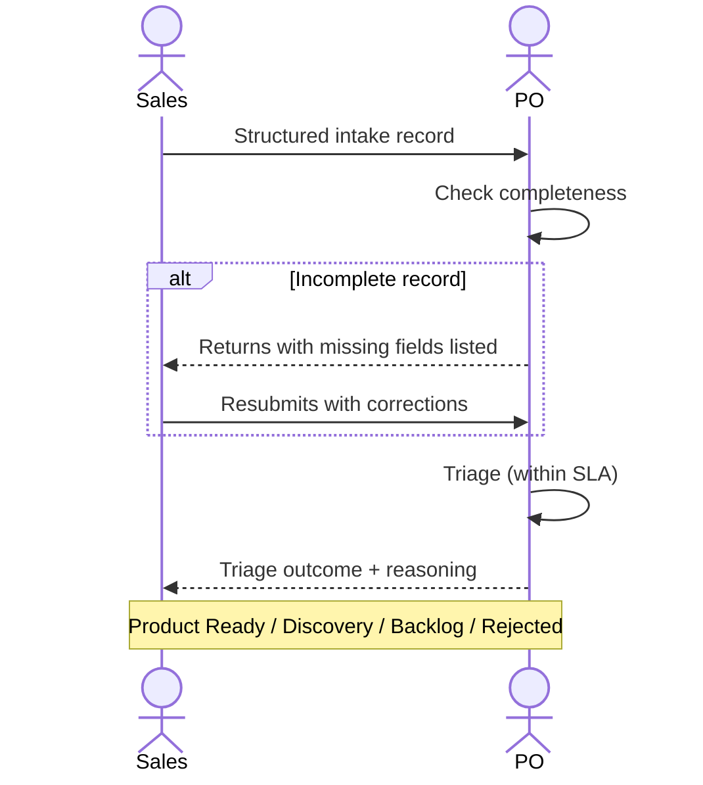

# Interaction 01 — Sales → PO

**Direction:** Sales initiates. PO receives.
**Layer:** Upstream → Intake Layer

---

## Trigger

A prospect or existing client expresses a pain, gap, or need tied to a deal or renewal.

---

## What Sales Must Provide

- Structured intake record with: origin, type, problem statement, business impact, priority
- Commercial context: which client, deal stage, revenue at risk, time sensitivity
- Stakeholders: who on the client side cares, who has decision authority
- Preliminary scope boundary: what the client described as the need (not a solution)

---

## What PO Does With It

- Reviews the record for completeness before accepting it
- Triages within the SLA defined by the priority level
- Responds with one of: Product Ready, Discovery, Opportunity Backlog, Rejected — with reasoning

---

## Ownership Transferred

**From Sales:** Accountability for the demand signal ends here. Sales has no further action until triage outcome is communicated.
**To PO:** Owns the intake record from this point forward — triage decision, routing, and outcome communication back to Sales.
**Artifact handed over:** Completed intake record.

---

## Gate

PO does not accept intake records that are missing the problem statement, business impact, or priority justification. Sales is expected to complete the record before submitting — not after.

---

## Failure Path

If the intake is incomplete, PO returns it to Sales with the specific missing fields noted. Sales does not get a verbal acknowledgment as a substitute for a complete record.

---

## What Sales Must NOT Do

- Communicate solution commitments or timelines to the client before triage is complete
- Escalate directly to CTO, Tech Leads, or Engineering to "move faster"
- Submit the same demand multiple times to increase urgency

---

## Sequence

