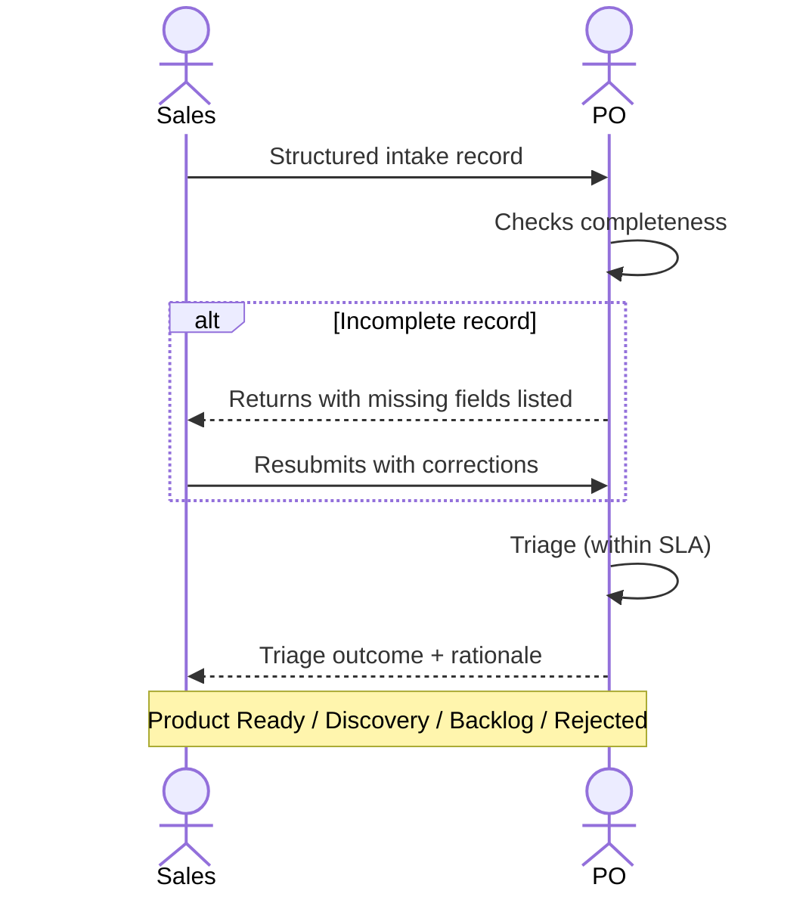

# Interaction 01 — Sales → PO

**Direction:** Sales initiates. PO receives.
**Layer:** Upstream → Intake Layer

> Sales, CS, Marketing, and the CEO intake channel are instances of the **Submitter** persona — the boundary persona. Its reasoning, trust model, and record data structure are consolidated in [`../personas/01-submitter.md`](../personas/01-submitter.md). This interaction describes the *handoff*; the persona describes *how the record becomes ready*.

---

## Trigger

A prospect or existing customer expresses a pain point, gap, or need tied to a deal or renewal.

---

## What Sales Must Provide

- Structured intake record with: source, type, problem description, business impact, priority
- Commercial context: which customer, deal stage, revenue at risk, deadline sensitivity
- Stakeholders: who on the customer side cares, who has decision authority
- Preliminary scope boundary: what the customer described as a need (not a solution)

---

## What the PO Does With This

- Reviews the record for completeness before accepting it
- Triages within the SLA defined by priority level
- Responds with one of the following: Product Ready, Discovery, Opportunity Backlog, Rejected — with rationale

---

## Ownership Transfer

**From Sales:** Responsibility for the demand signal ends here. Sales has no further action until the triage outcome is communicated.
**To the PO:** Owns the intake record from this point — triage decision, routing, and communicating the outcome back to Sales.
**Artifact transferred:** Complete intake record.

---

## Gate

The PO does not accept intake records without a problem description, business impact, or priority justification. Sales is expected to complete the record before submitting it — not after.

The gate is quantitative: the record is ready when `gateReady = true` — all blocking requirements (problem, originator, reach, impact) resolved by an **honest disposition**, not necessarily answered with certainty. "I don't know the exact ARR yet" does not block if it comes as a premise to validate or a Discovery route (see [`../personas/01-submitter.md` §6](../personas/01-submitter.md)). What blocks is the *absence of a disposition* — a blocking requirement left empty.

---

## Failure Path

If the intake is incomplete, the PO returns it to Sales with the specific missing fields noted. Sales does not receive a verbal acknowledgment as a substitute for a complete record.

"Incomplete" here means a blocking requirement **with no disposition** — not a low-confidence field. `low_confidence` fields travel with the record (graduated, with a `hint` of what would elevate them) and count as partials in the Readiness Score; they do not trigger a return.

---

## What Sales Must NOT Do

- Communicate solution commitments or deadlines to the customer before triage is complete
- Escalate directly to CTO, Tech Leads, or Engineering to "move faster"
- Submit the same demand multiple times to increase urgency

---

## Sequence

