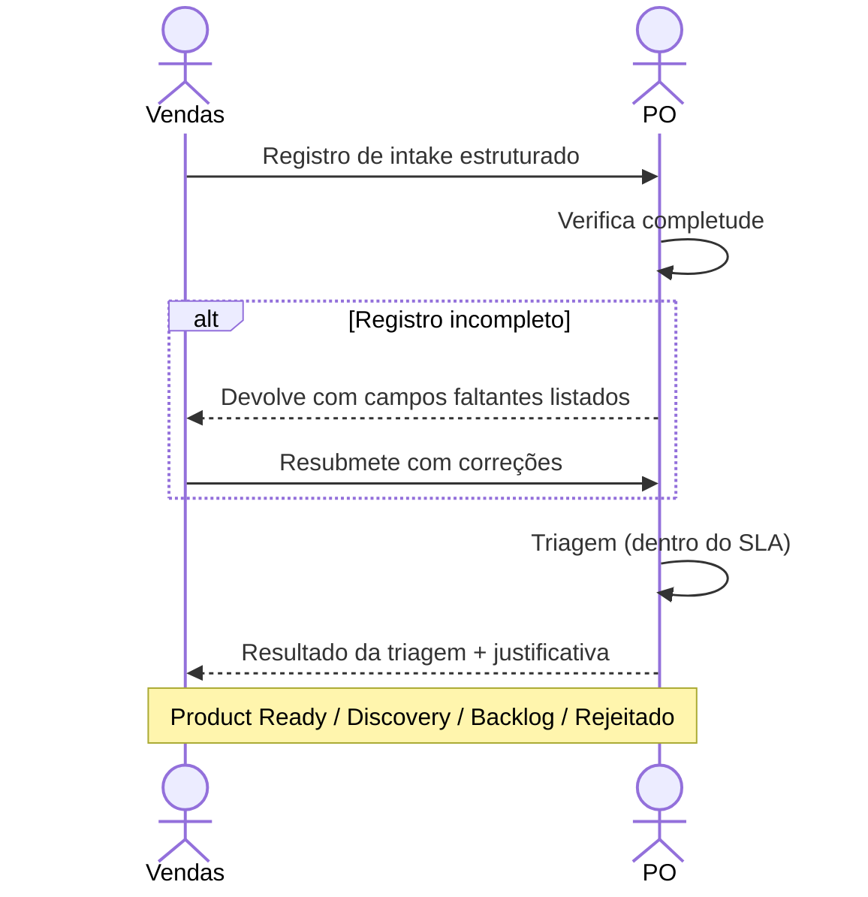

# Interação 01 — Vendas → PO

**Direção:** Vendas inicia. PO recebe.
**Camada:** Upstream → Camada de Intake

> Vendas, CS, Marketing e o canal de intake do CEO são instâncias da persona **Submitter** — a persona de fronteira. Seu raciocínio, o modelo de confiança e a estrutura de dados do registro estão consolidados em [`../personas/01-submitter.md`](../personas/01-submitter.md). Esta interação descreve o *handoff*; a persona descreve *como o registro fica pronto*.

---

## Gatilho

Um prospect ou cliente existente expressa uma dor, lacuna ou necessidade vinculada a um deal ou renovação.

---

## O que Vendas Deve Fornecer

- Registro de intake estruturado com: origem, tipo, descrição do problema, impacto de negócio, prioridade
- Contexto comercial: qual cliente, estágio do deal, receita em risco, sensibilidade de prazo
- Stakeholders: quem no lado do cliente se importa, quem tem autoridade de decisão
- Limite preliminar de escopo: o que o cliente descreveu como necessidade (não uma solução)

---

## O que o PO Faz Com Isso

- Revisa o registro quanto à completude antes de aceitá-lo
- Faz a triagem dentro do SLA definido pelo nível de prioridade
- Responde com um dos seguintes: Product Ready, Discovery, Opportunity Backlog, Rejeitado — com justificativa

---

## Transferência de Ownership

**De Vendas:** A responsabilidade pelo sinal de demanda termina aqui. Vendas não tem mais ação até que o resultado da triagem seja comunicado.
**Para o PO:** Detém o registro de intake a partir deste ponto — decisão de triagem, roteamento e comunicação do resultado de volta para Vendas.
**Artefato transferido:** Registro de intake completo.

---

## Gate

O PO não aceita registros de intake sem descrição do problema, impacto de negócio ou justificativa de prioridade. Espera-se que Vendas complete o registro antes de submetê-lo — não depois.

O gate é quantitativo: o registro está pronto quando `gateReady = true` — todos os requisitos bloqueantes (problema, originador, alcance, impacto) resolvidos por uma **disposição honesta**, não necessariamente respondidos com certeza. "Ainda não sei o ARR exato" não bloqueia se vier como premissa a validar ou rota de Discovery (ver [`../personas/01-submitter.md` §6](../personas/01-submitter.md)). O que bloqueia é a *ausência de disposição* — um requisito bloqueante deixado vazio.

---

## Caminho de Falha

Se o intake estiver incompleto, o PO o devolve para Vendas com os campos específicos faltantes anotados. Vendas não recebe um reconhecimento verbal como substituto a um registro completo.

"Incompleto" aqui significa requisito bloqueante **sem disposição** — não campo com baixa confiança. Campos `low_confidence` viajam com o registro (graduados, com `hint` do que os elevaria) e contam como parciais no Readiness Score; eles não causam devolução.

---

## O que Vendas NÃO Deve Fazer

- Comunicar compromissos de solução ou prazos ao cliente antes que a triagem seja concluída
- Escalar diretamente para CTO, Tech Leads ou Engenharia para "andar mais rápido"
- Submeter a mesma demanda múltiplas vezes para aumentar a urgência

---

## Sequência

