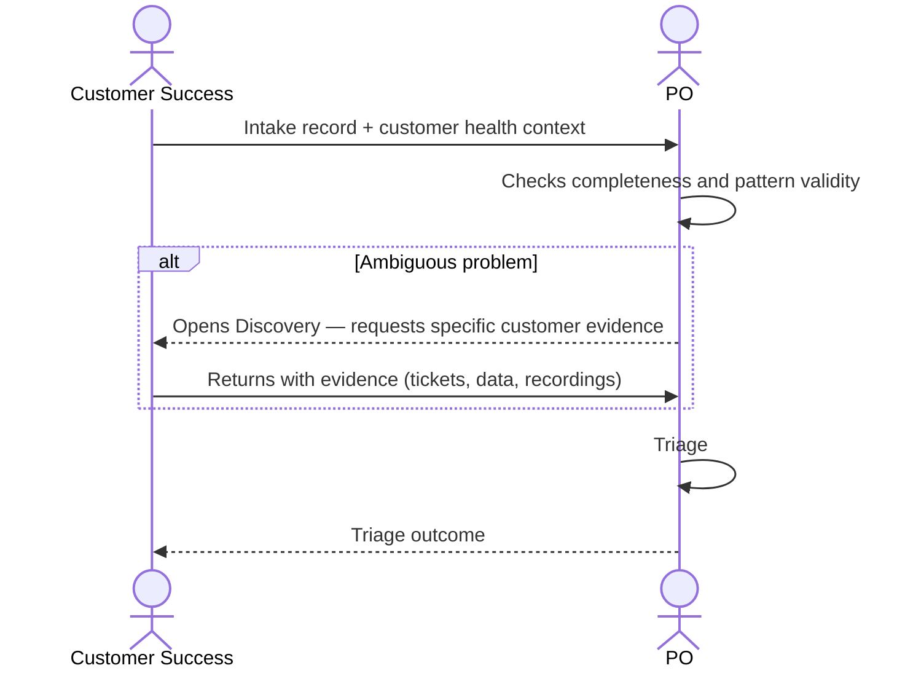

# Interaction 02 — CS → PO

**Direction:** Customer Success initiates. PO receives.
**Layer:** Upstream → Intake Layer

> CS, Sales, Marketing, and the CEO intake channel are instances of the **Submitter** persona — the boundary persona. Its reasoning, trust model, and record data structure are consolidated in [`../personas/01-submitter.md`](../personas/01-submitter.md). This interaction describes the *handoff*; the persona describes *how the record becomes ready*.

---

## Trigger

A customer reports friction, a retention risk is identified, or a recurring workaround is documented.

---

## What CS Must Provide

- Structured intake record with: source (Customer), type, problem description, business impact
- Customer health context: which customer, friction frequency, usage data, retention risk signal
- Severity indicator: is this causing active churn risk or is it an adoption gap?
- Evidence: support tickets, NPS data, call recordings, or notes

---

## What the PO Does With This

- Reviews and triages against the current queue
- Weighs the signal against other demands already in rationalization
- May ask CS for additional customer data if the problem is ambiguous

---

## Ownership Transfer

**From CS:** Responsibility for the signal ends here. CS does not follow up directly with Engineering or make commitments to the customer about deadlines.
**To the PO:** Owns the intake record and the triage decision. Responsible for communicating the outcome back to CS.
**Artifact transferred:** Intake record + customer health context.

---

## Gate

CS cannot submit "the customer is unhappy" as a problem description. The intake must describe the specific friction with observable and reproducible context.

Much of CS's material (tickets, NPS, recordings) enters as an `inferred` disposition — extracted from customer artifacts, with `source` recorded and partial confidence. This is valid for passing the gate: the requirement does not need to be answered "by hand" by CS if the evidence supports it. The gate (`gateReady`) requires an honest disposition per blocking requirement, not total certainty (see [`../personas/01-submitter.md` §6](../personas/01-submitter.md)).

---

## Failure Path

If CS cannot describe the problem specifically, the PO opens a Discovery to collect the missing context with CS as the primary source. In the data model, this is the `discovery` disposition (time-boxed) rather than a return — the requirement counts as *resolved-as-unknown* while the Discovery runs.

---

## What CS Must NOT Do

- Promise the customer a fix, deadline, or priority before triage is complete
- Submit problems that are isolated incidents without evidence of a pattern
- Bypass the PO and go directly to Engineering when a customer is frustrated

---

## Sequence

