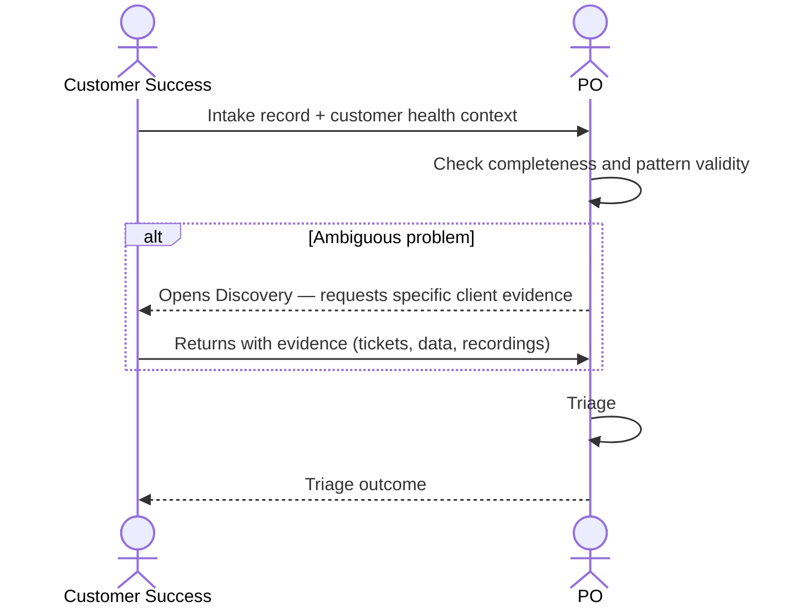

# Interaction 02 — CS → PO

**Direction:** Customer Success initiates. PO receives.
**Layer:** Upstream → Intake Layer

---

## Trigger

A customer reports friction, a retention risk is identified, or a recurring workaround is documented.

---

## What CS Must Provide

- Structured intake record with: origin (Client), type, problem statement, business impact
- Customer health context: which customer, frequency of friction, usage data, retention risk signal
- Severity indicator: is this causing active churn risk or is it an adoption gap?
- Evidence: support tickets, NPS data, call recordings or notes

---

## What PO Does With It

- Reviews and triages against current queue
- Weights the signal against other demands already in rationalization
- May ask CS to provide additional client data if the problem is ambiguous

---

## Ownership Transferred

**From CS:** Accountability for the signal ends here. CS does not follow up directly with Engineering or make commitments to the client on timing.
**To PO:** Owns the intake record and the triage decision. Responsible for communicating the outcome back to CS.
**Artifact handed over:** Intake record + customer health context.

---

## Gate

CS cannot submit "the client is unhappy" as a problem statement. The intake must describe the specific friction with observable, reproducible context.

---

## Failure Path

If CS cannot describe the problem specifically, PO opens a Discovery to gather the missing context with CS as the primary source.

---

## What CS Must NOT Do

- Promise the customer a fix, timeline, or priority before triage is complete
- Submit problems that are individual one-off incidents without pattern evidence
- Bypass PO and go directly to Engineering when a client is frustrated

---

## Sequence

