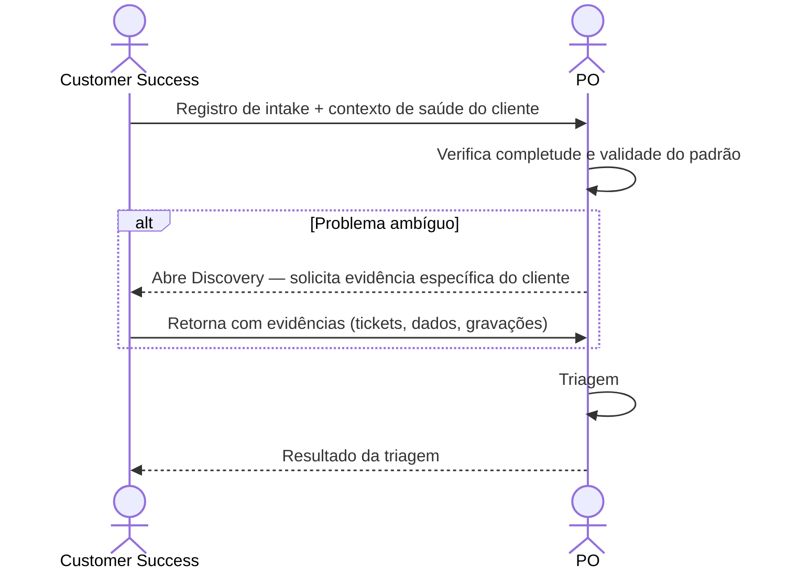

# Interação 02 — CS → PO

**Direção:** Customer Success inicia. PO recebe.
**Camada:** Upstream → Camada de Intake

> CS, Vendas, Marketing e o canal de intake do CEO são instâncias da persona **Submitter** — a persona de fronteira. Seu raciocínio, o modelo de confiança e a estrutura de dados do registro estão consolidados em [`../personas/01-submitter.md`](../personas/01-submitter.md). Esta interação descreve o *handoff*; a persona descreve *como o registro fica pronto*.

---

## Gatilho

Um cliente relata atrito, um risco de retenção é identificado, ou um workaround recorrente é documentado.

---

## O que CS Deve Fornecer

- Registro de intake estruturado com: origem (Cliente), tipo, descrição do problema, impacto de negócio
- Contexto de saúde do cliente: qual cliente, frequência do atrito, dados de uso, sinal de risco de retenção
- Indicador de severidade: isso está causando risco ativo de churn ou é uma lacuna de adoção?
- Evidências: tickets de suporte, dados de NPS, gravações de chamadas ou notas

---

## O que o PO Faz Com Isso

- Revisa e faz a triagem contra a fila atual
- Pondera o sinal frente a outras demandas já em racionalização
- Pode pedir ao CS dados adicionais do cliente se o problema for ambíguo

---

## Transferência de Ownership

**De CS:** A responsabilidade pelo sinal termina aqui. CS não faz follow-up diretamente com Engenharia nem faz compromissos ao cliente sobre prazo.
**Para o PO:** Detém o registro de intake e a decisão de triagem. Responsável por comunicar o resultado de volta ao CS.
**Artefato transferido:** Registro de intake + contexto de saúde do cliente.

---

## Gate

CS não pode submeter "o cliente está insatisfeito" como descrição do problema. O intake deve descrever o atrito específico com contexto observável e reproduzível.

Muito do material do CS (tickets, NPS, gravações) entra como disposição `inferred` — extraída dos artefatos do cliente, com `source` registrada e confiança parcial. Isso é válido para atingir o gate: o requisito não precisa ser respondido "à mão" pelo CS se a evidência o sustenta. O gate (`gateReady`) exige uma disposição honesta por requisito bloqueante, não certeza total (ver [`../personas/01-submitter.md` §6](../personas/01-submitter.md)).

---

## Caminho de Falha

Se CS não conseguir descrever o problema especificamente, o PO abre um Discovery para coletar o contexto faltante com CS como fonte primária. No modelo de dados, isso é a disposição `discovery` (time-boxed) em vez de uma devolução — o requisito conta como *resolvido-como-incógnita* enquanto o Discovery roda.

---

## O que CS NÃO Deve Fazer

- Prometer ao cliente uma correção, prazo ou prioridade antes que a triagem seja concluída
- Submeter problemas que sejam incidentes isolados sem evidência de padrão
- Contornar o PO e ir diretamente à Engenharia quando um cliente está frustrado

---

## Sequência

