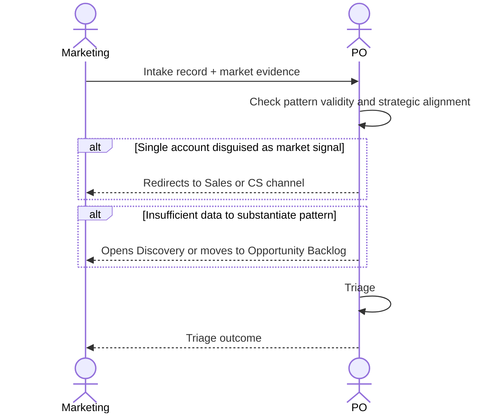

# Interaction 03 — Marketing → PO

**Direction:** Marketing initiates. PO receives.
**Layer:** Upstream → Intake Layer

---

## Trigger

Market intelligence identifies a relevant gap, competitive signal, or segment-level pattern.

---

## What Marketing Must Provide

- Structured intake record with: origin (Market), type, problem statement at segment level
- Market evidence: competitive analysis, industry data, campaign insights
- Differentiation from individual client requests — this is a pattern, not a single account

---

## What PO Does With It

- Evaluates strategic alignment and whether the signal is differentiated from existing demand
- May merge with existing intake if the same pattern has already been captured
- Responds with triage outcome

---

## Ownership Transferred

**From Marketing:** Accountability for the market signal ends here. Marketing does not define solutions or follow up with Engineering directly.
**To PO:** Owns the intake record and the triage decision. Responsible for communicating the outcome back to Marketing.
**Artifact handed over:** Intake record + market evidence.

---

## Gate

Marketing intake must describe a segment-level pattern. A single account's request submitted as a "market signal" is redirected to Sales or CS as the appropriate channel.

---

## Failure Path

If Marketing cannot substantiate the pattern with data, PO opens Discovery or moves to Opportunity Backlog pending more evidence.

---

## What Marketing Must NOT Do

- Submit individual client requests as market signals
- Define the solution or desired feature
- Represent a single account's preference as a segment trend without data

---

## Sequence

