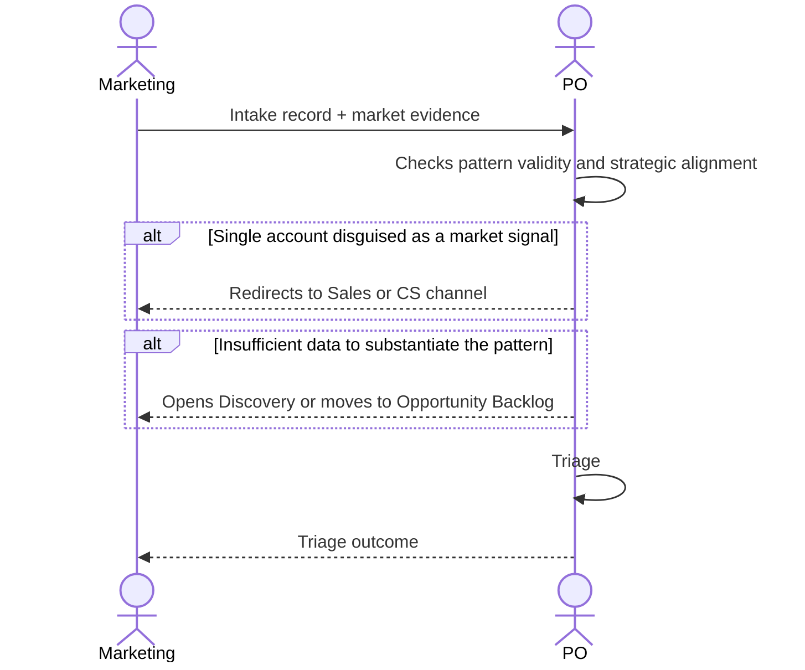

# Interaction 03 — Marketing → PO

**Direction:** Marketing initiates. PO receives.
**Layer:** Upstream → Intake Layer

> Marketing, Sales, CS, and the CEO intake channel are instances of the **Submitter** persona — the boundary persona. Its reasoning, trust model, and record data structure are consolidated in [`../personas/01-submitter.md`](../personas/01-submitter.md). This interaction describes the *handoff*; the persona describes *how the record becomes ready*.

---

## Trigger

Market intelligence identifies a relevant gap, competitive signal, or segment-level pattern.

---

## What Marketing Must Provide

- Structured intake record with: source (Market), type, segment-level problem description
- Market evidence: competitive analysis, industry data, campaign insights
- Differentiation from individual customer requests — this is a pattern, not a single account

---

## What the PO Does With This

- Evaluates strategic alignment and whether the signal is differentiated from existing demand
- May merge with an existing intake if the same pattern has already been captured
- Responds with the triage outcome

---

## Ownership Transfer

**From Marketing:** Responsibility for the market signal ends here. Marketing does not define solutions or follow up with Engineering directly.
**To the PO:** Owns the intake record and the triage decision. Responsible for communicating the outcome back to Marketing.
**Artifact transferred:** Intake record + market evidence.

---

## Gate

The Marketing intake must describe a segment-level pattern. A single-account request submitted as a "market signal" is redirected to Sales or CS as the appropriate channel.

Market signals often carry inherent uncertainty: the gate (`gateReady`) accepts this as long as it comes as an honest disposition — `assumption` ("we are assuming segment X feels this") with `to validate`, or `discovery` when data does not yet substantiate the pattern. Reach and impact enter graduated by confidence, not as certainties (see [`../personas/01-submitter.md` §6](../personas/01-submitter.md)).

---

## Failure Path

If Marketing cannot substantiate the pattern with data, the PO opens a Discovery or moves to Opportunity Backlog pending more evidence. Opening Discovery is the `discovery` disposition (time-boxed) on the record — the pattern is marked as *to investigate*, not returned without a route.

---

## What Marketing Must NOT Do

- Submit individual customer requests as market signals
- Define the desired solution or feature
- Represent a single account's preference as a segment trend without data

---

## Sequence

