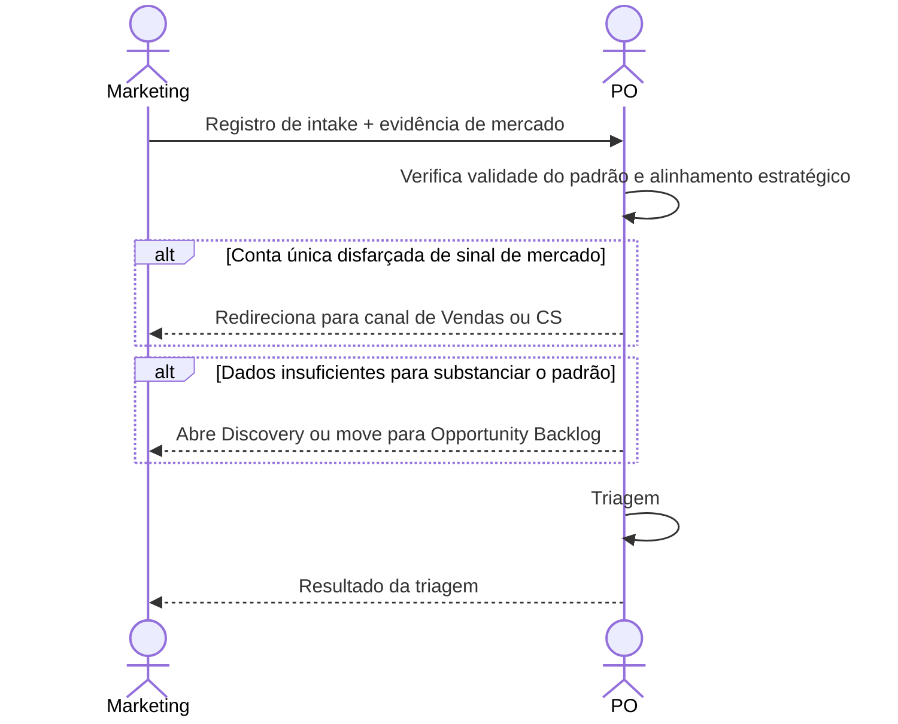

# Interação 03 — Marketing → PO

**Direção:** Marketing inicia. PO recebe.
**Camada:** Upstream → Camada de Intake

---

## Gatilho

Inteligência de mercado identifica uma lacuna relevante, sinal competitivo ou padrão a nível de segmento.

---

## O que Marketing Deve Fornecer

- Registro de intake estruturado com: origem (Mercado), tipo, descrição do problema a nível de segmento
- Evidência de mercado: análise competitiva, dados do setor, insights de campanhas
- Diferenciação de pedidos individuais de clientes — isso é um padrão, não uma conta única

---

## O que o PO Faz Com Isso

- Avalia alinhamento estratégico e se o sinal é diferenciado da demanda existente
- Pode mesclar com um intake existente se o mesmo padrão já tiver sido capturado
- Responde com o resultado da triagem

---

## Transferência de Ownership

**De Marketing:** A responsabilidade pelo sinal de mercado termina aqui. Marketing não define soluções nem faz follow-up com Engenharia diretamente.
**Para o PO:** Detém o registro de intake e a decisão de triagem. Responsável por comunicar o resultado de volta ao Marketing.
**Artefato transferido:** Registro de intake + evidência de mercado.

---

## Gate

O intake de Marketing deve descrever um padrão a nível de segmento. O pedido de uma conta única submetido como "sinal de mercado" é redirecionado para Vendas ou CS como canal apropriado.

---

## Caminho de Falha

Se Marketing não conseguir substanciar o padrão com dados, o PO abre Discovery ou move para Opportunity Backlog aguardando mais evidências.

---

## O que Marketing NÃO Deve Fazer

- Submeter pedidos de clientes individuais como sinais de mercado
- Definir a solução ou funcionalidade desejada
- Representar a preferência de uma conta única como tendência de segmento sem dados

---

## Sequência

