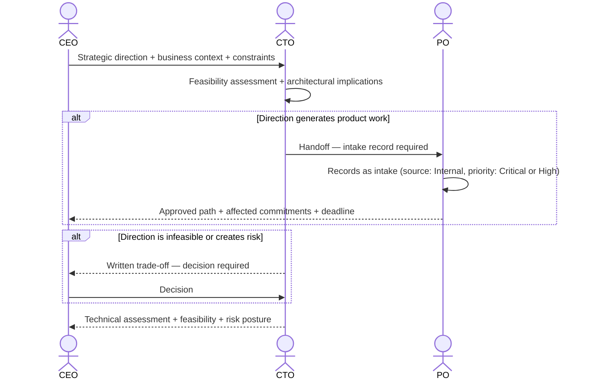

# Interaction 04 — CEO → CTO

**Direction:** CEO initiates. CTO receives.
**Layer:** Executive → Technical Leadership

---

## Trigger

A strategic decision requires alignment from technical leadership — a new market direction, an architectural commitment, a compliance obligation, or an executive decision with direct implications for how the platform is built or operated.

---

## What the CEO Must Provide

- Context: the business driver and why it is relevant now
- The decision or direction taken (not a solution — the expected outcome)
- Any external constraints (regulatory, contractual, deadline) that are non-negotiable
- Explicit request: is this a notice, a scope decision, or an action item for the CTO?

---

## What the CTO Does With This

- Evaluates technical feasibility and infrastructure implications
- Identifies architectural decisions that must be made as a consequence
- Determines whether the direction generates work that needs to enter the process (via PO intake) or is a platform-level investment decision
- Communicates to the CEO: what is feasible, what the risks are, and what commitments can be made

---

## Ownership Transfer

**From the CEO:** Strategic direction is transferred. The CEO does not communicate technical implications directly to Engineering or the PM.
**To the CTO:** Owns the feasibility assessment and the work routing decision into the process. If product work is generated, the CTO initiates the handoff to the PO — not the CEO.
**Artifact transferred:** Strategic direction + business context + non-negotiable constraints.

---

## Gate

The CTO does not absorb direction silently. Every executive input that results in technical work must produce an intake record (via PO) or a documented architectural decision. Nothing enters Engineering informally from this interaction.

---

## Failure Path

If the CEO's direction is technically infeasible, introduces unacceptable risk, or conflicts with existing architectural commitments, the CTO produces a written assessment and escalates the trade-off back to the CEO. The CTO does not veto unilaterally — they present the cost and require an explicit decision.

---

## What the CEO Must NOT Do

- Communicate technical direction directly to Engineering, Tech Leads, or PM
- Expect an immediate implementation commitment before a feasibility assessment is complete
- Override an existing architectural decision without documented sign-off from the CTO

---

## Sequence

