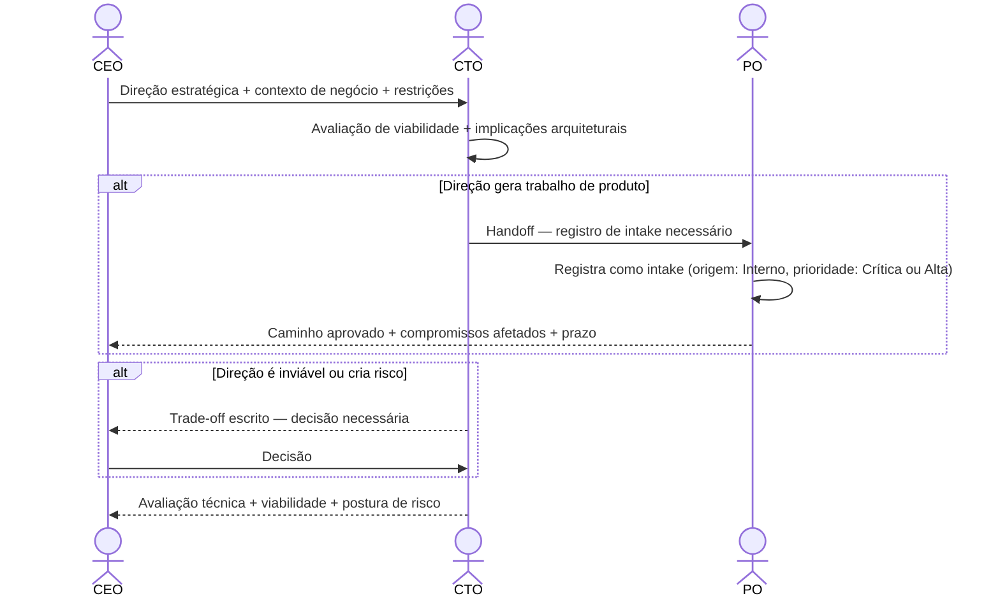

# Interação 04 — CEO → CTO

**Direção:** CEO inicia. CTO recebe.
**Camada:** Executivo → Liderança Técnica

---

## Gatilho

Uma decisão estratégica requer alinhamento da liderança técnica — uma nova direção de mercado, um compromisso arquitetural, uma obrigação de conformidade, ou uma decisão executiva com implicações diretas sobre como a plataforma é construída ou operada.

---

## O que o CEO Deve Fornecer

- Contexto: o driver de negócio e por que é relevante agora
- A decisão ou direção tomada (não uma solução — o resultado esperado)
- Quaisquer restrições externas (regulatórias, contratuais, de prazo) que são não-negociáveis
- Pedido explícito: isso é um aviso, uma decisão de escopo ou um item de ação para o CTO?

---

## O que o CTO Faz Com Isso

- Avalia viabilidade técnica e implicações de infraestrutura
- Identifica decisões arquiteturais que devem ser tomadas como consequência
- Determina se a direção gera trabalho que precisa entrar no processo (via intake do PO) ou é uma decisão de investimento a nível de plataforma
- Comunica ao CEO: o que é viável, quais são os riscos e quais compromissos podem ser assumidos

---

## Transferência de Ownership

**Do CEO:** A direção estratégica é transferida. O CEO não comunica implicações técnicas diretamente à Engenharia ou ao PM.
**Para o CTO:** Detém a avaliação de viabilidade e a decisão de roteamento do trabalho para o processo. Se trabalho de produto for gerado, o CTO inicia o handoff para o PO — não o CEO.
**Artefato transferido:** Direção estratégica + contexto de negócio + restrições não-negociáveis.

---

## Gate

O CTO não absorve direção silenciosamente. Todo input executivo que resulte em trabalho técnico deve produzir um registro de intake (via PO) ou uma decisão arquitetural documentada. Nada entra na Engenharia informalmente a partir desta interação.

---

## Caminho de Falha

Se a direção do CEO for tecnicamente inviável, introduzir risco inaceitável ou conflitar com compromissos arquiteturais existentes, o CTO produz uma avaliação escrita e escala o trade-off de volta ao CEO. O CTO não veta unilateralmente — ele apresenta o custo e requer uma decisão explícita.

---

## O que o CEO NÃO Deve Fazer

- Comunicar direção técnica diretamente à Engenharia, Tech Leads ou PM
- Esperar um compromisso de implementação imediato antes que uma avaliação de viabilidade seja concluída
- Sobrepor uma decisão arquitetural existente sem sign-off documentado do CTO

---

## Sequência

