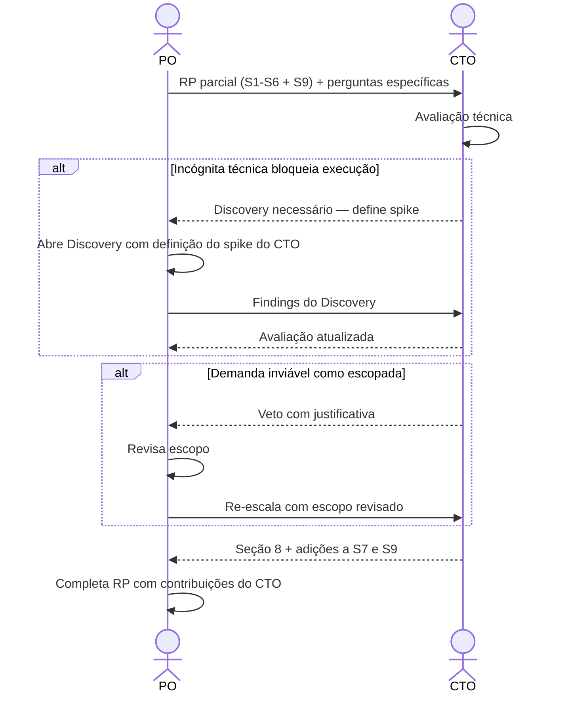

# Interação 05 — PO → CTO (Escalada Arquitetural)

**Direção:** PO inicia. CTO recebe.
**Camada:** Dentro da Camada de Intake

---

## Gatilho

Durante a racionalização, o PO identifica que a demanda toca qualquer um dos seguintes:
- Nova infraestrutura
- Mudanças a nível de plataforma
- Impacto de multi-tenancy
- Modificações de comportamento de IA/runtime
- Implicações de segurança
- Integrações externas com incógnitas significativas
- Qualquer decisão que possa afetar a integridade arquitetural da plataforma

---

## O que o PO Deve Fornecer

- Readiness Package parcialmente preenchido (Seções 1–6 e 9 no mínimo)
- Perguntas específicas ou incógnitas que requerem o input do CTO
- Restrições de negócio e contexto de prazo

---

## O que o CTO Produz

- **Seção 8** (Impacto Técnico e Arquitetura): sistemas afetados, restrições arquiteturais, padrões a seguir ou evitar
- **Adições à Seção 7** (Integrações): viabilidade técnica, protocolos, riscos conhecidos
- **Adições à Seção 9** (Riscos e Dependências): riscos técnicos e mitigações
- Sign-off ou veto explícito sobre a abordagem arquitetural

---

## Transferência de Ownership

**Do PO:** As incógnitas técnicas são transferidas. O PO retém o ownership geral do Readiness Package mas não pode avançá-lo até que a contribuição do CTO seja devolvida.
**Para o CTO:** Detém a avaliação técnica — Seção 8, adições às Seções 7 e 9, e qualquer veredicto de viabilidade. O CTO não é dono das seções de produto ou negócio.
**Artefato transferido:** Readiness Package parcial (Seções 1–6 + 9) + perguntas técnicas específicas.

---

## Gate

O CTO não preenche as seções de negócio ou produto do Readiness Package. A contribuição do CTO é limitada à avaliação técnica. Se o CTO determinar que a demanda é tecnicamente inviável como escopada, o PO revisa o escopo — o CTO não redefine o produto.

---

## Caminho de Falha

Se o CTO identificar que a demanda não pode ser executada sem resolver uma incógnita técnica, a demanda volta para Discovery. O CTO define o spike ou investigação necessária; o PO determina o time-box.

---

## O que o PO NÃO Deve Fazer

- Enviar um pacote incompleto sem identificar as perguntas específicas para o CTO
- Esperar que o CTO preencha seções de produto ou negócio
- Revisar silenciosamente as restrições técnicas do CTO após receber a avaliação

---

## Sequência

