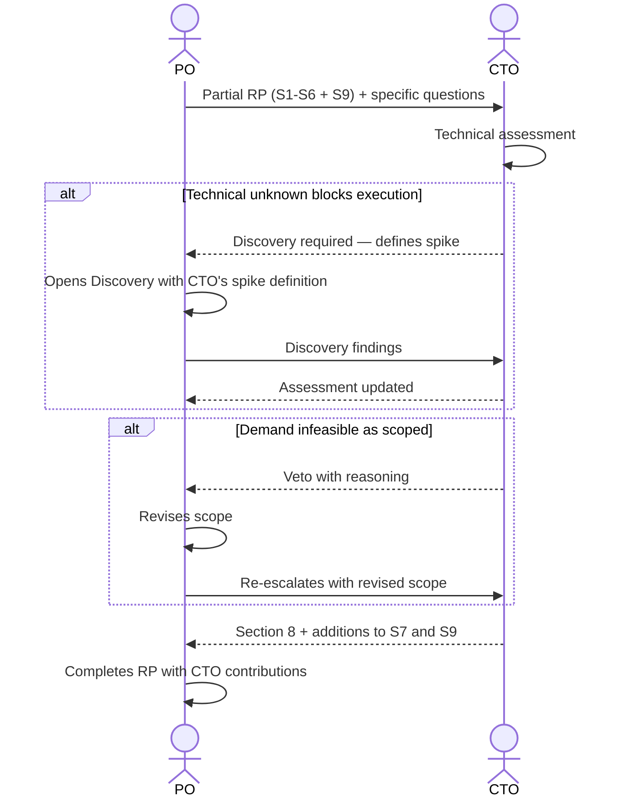

# Interaction 05 — PO → CTO (Architectural Escalation)

**Direction:** PO initiates. CTO receives.
**Layer:** Within Intake Layer

---

## Trigger

During rationalization, the PO identifies that the demand touches any of the following:
- New infrastructure
- Platform-level changes
- Multi-tenancy impact
- AI/runtime behavior modifications
- Security implications
- External integrations with significant unknowns
- Any decision that could affect the platform's architectural integrity

---

## What PO Must Provide

- Partially completed Readiness Package (Sections 1–6 and 9 at minimum)
- Specific questions or unknowns that require the CTO's input
- Business constraints and timeline context

---

## What CTO Produces

- **Section 8** (Technical Impact & Architecture): affected systems, architectural constraints, patterns to follow or avoid
- **Section 7 additions** (Integrations): technical feasibility, protocols, known risks
- **Section 9 additions** (Risks & Dependencies): technical risks and mitigations
- Explicit sign-off or veto on the architectural approach

---

## Ownership Transferred

**From PO:** The technical unknowns are handed over. PO retains ownership of the Readiness Package overall but cannot progress it until the CTO's contribution is returned.
**To CTO:** Owns the technical assessment — Section 8, additions to Sections 7 and 9, and any feasibility verdict. CTO does not own the product or business sections.
**Artifact handed over:** Partial Readiness Package (Sections 1–6 + 9) + specific technical questions.

---

## Gate

The CTO does not fill in the business or product sections of the Readiness Package. The CTO's contribution is bounded to technical assessment. If the CTO determines the demand is technically infeasible as scoped, the PO revises the scope — the CTO does not redefine the product.

---

## Failure Path

If the CTO identifies that the demand cannot be executed without resolving a technical unknown, the demand returns to Discovery. The CTO defines the spike or investigation required; the PO time-boxes it.

---

## What PO Must NOT Do

- Send an incomplete package without identifying the specific questions for the CTO
- Expect the CTO to fill product or business sections
- Silently revise the CTO's technical constraints after receiving the assessment

---

## Sequence

