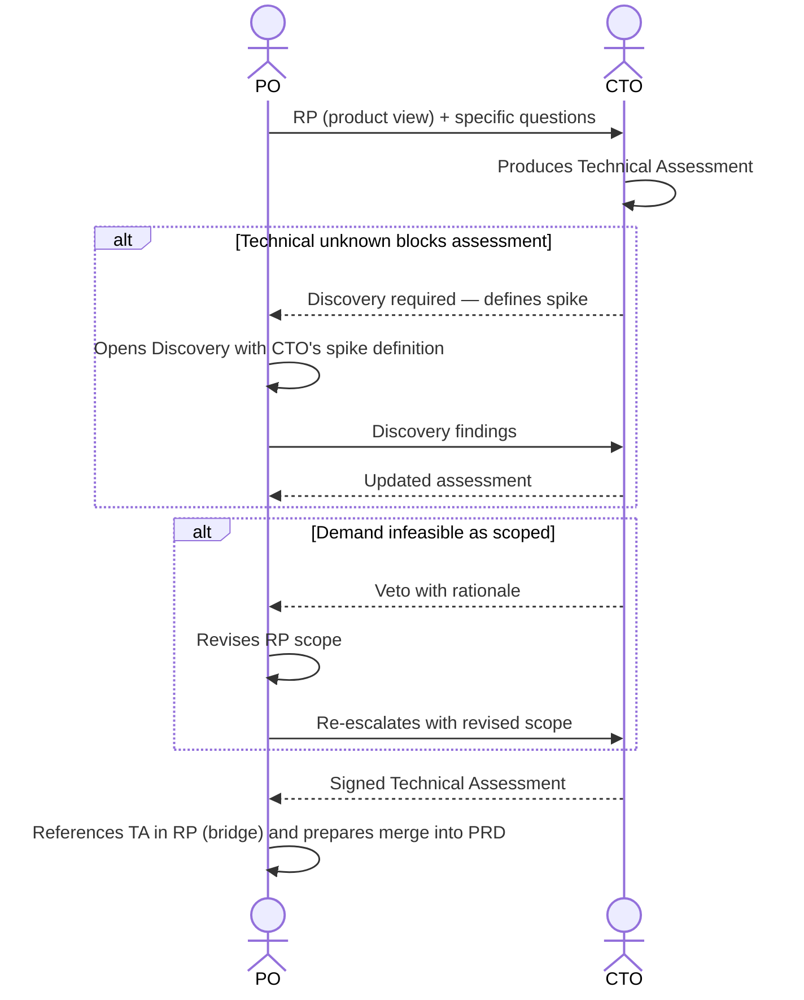

# Interaction 05 — PO → CTO (Architectural Escalation)

**Direction:** PO initiates. CTO receives.
**Layer:** Within the Intake Layer

> **Structural change (see [`personas/02-po.md` §2 and §10](../personas/02-po.md)).** The CTO **does not fill sections of the Readiness Package**. They produce their own artifact — the **[Technical Assessment](../templates/03-technical-assessment.md) (TA)** — in parallel with the RP. The RP references the TA via a bridge (status + verdict + link); the merge of the two happens in the **PRD**. The CTO responds to the RP; they do not co-edit it.

---

## Trigger

During rationalization, the PO identifies that the demand touches any of the following:
- New infrastructure
- Platform-level changes
- Multi-tenancy impact
- AI/runtime behavior modifications
- Security implications
- External integrations with significant unknowns
- Any decision that may affect the architectural integrity of the platform

---

## What the PO Must Provide

- The **Readiness Package** (the product view — not empty sections for the CTO to fill)
- **Specific technical questions** or unknowns that require the CTO's input
- Business constraints and deadline context

---

## What the CTO Produces

A **Technical Assessment** ([`03-technical-assessment.md`](../templates/03-technical-assessment.md)) — a separate artifact authored exclusively by the CTO:

- **Feasibility verdict** (feasible / feasible with caveats / infeasible as scoped) + rationale
- **Architectural impact**: affected systems, data model, events, multi-tenancy, security, performance, observability
- **Integrations**: technical feasibility, protocols, known third-party risks
- **Hard constraints** that affect scope
- **Technical risks** and mitigations
- **ADRs** at the architectural level (suggested by AI, approved/adjusted by the CTO)
- **Firm effort and cost** (replaces the PO's preliminary estimate)

---

## Ownership Transfer

**From the PO:** Technical unknowns are transferred. The PO retains ownership of the RP but cannot freeze it (`freezeReady`) until the TA is returned signed when it was requested.
**To the CTO:** Owns the entire **Technical Assessment** and the feasibility verdict. The CTO **does not own** the product or business sections and **does not edit the RP**.
**Artifact transferred:** the RP (product view) + specific technical questions. The CTO returns a new artifact (the TA), not edits to the RP.

---

## Gate

The CTO does not fill the product or business sections. Their contribution is the Technical Assessment. If the CTO determines that the demand is **infeasible as scoped**, they veto with rationale; the PO revises the RP scope — the CTO does not redefine the product.

---

## Failure Path

If the CTO identifies that the demand cannot be assessed without resolving a technical unknown, the demand goes back to Discovery. The CTO defines the required spike or investigation (recorded in the TA); the PO determines the time-box.

---

## What the PO Must NOT Do

- Hand over "empty RP sections" expecting the CTO to fill them
- Send the escalation without specific technical questions
- Silently revise the CTO's constraints after receiving the assessment

---

## Sequence

