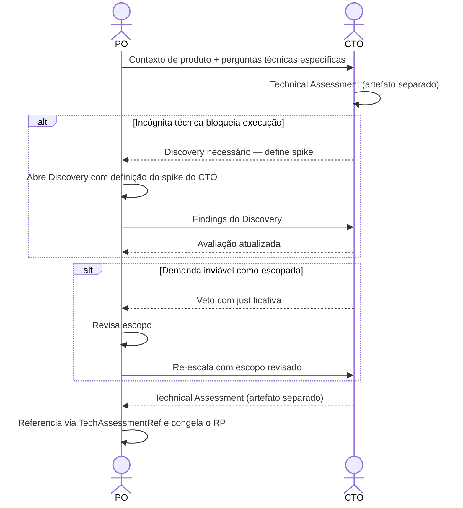

# Interação 05 — PO → CTO (Escalada Arquitetural)

**Direção:** PO inicia. CTO recebe.
**Camada:** Dentro da Camada de Intake

---

## Gatilho

Durante a racionalização, o PO identifica que a demanda toca qualquer um dos seguintes:
- Nova infraestrutura
- Mudanças a nível de plataforma
- Impacto de multi-tenancy
- Modificações de comportamento de IA/runtime
- Implicações de segurança
- Integrações externas com incógnitas significativas
- Qualquer decisão que possa afetar a integridade arquitetural da plataforma

---

## O que o PO Deve Fornecer

- Contexto de produto da racionalização em andamento (problema, escopo, jornadas, regras de negócio, riscos de produto)
- Perguntas específicas ou incógnitas que requerem o input do CTO
- Restrições de negócio e contexto de prazo

---

## O que o CTO Produz

O CTO produz um artefato próprio — o **Technical Assessment** — e **nunca edita o RP**:

- **Viabilidade e constraints arquiteturais**: sistemas afetados, restrições, padrões a seguir ou evitar
- **Integrações**: viabilidade técnica, protocolos, riscos conhecidos
- **Riscos técnicos e mitigações**: ADRs sugeridos
- Sign-off ou veto explícito sobre a abordagem arquitetural

---

## Transferência de Ownership

**Do PO:** As incógnitas técnicas são transferidas. O PO retém o ownership exclusivo do Readiness Package mas não pode congelá-lo até que o Technical Assessment seja devolvido.
**Para o CTO:** Detém o Technical Assessment — viabilidade, constraints, arquitetura, riscos técnicos e qualquer veredicto. O CTO não é dono das seções de produto ou negócio e nunca edita o RP.
**Artefato transferido:** Contexto de produto da racionalização + perguntas técnicas específicas.

---

## Gate

O CTO não edita o Readiness Package — produz o Technical Assessment como artefato separado, que o RP referencia via `TechAssessmentRef`. A contribuição do CTO é limitada à avaliação técnica. Se o CTO determinar que a demanda é tecnicamente inviável como escopada, o PO revisa o escopo — o CTO não redefine o produto.

---

## Caminho de Falha

Se o CTO identificar que a demanda não pode ser executada sem resolver uma incógnita técnica, a demanda volta para Discovery. O CTO define o spike ou investigação necessária; o PO determina o time-box.

---

## O que o PO NÃO Deve Fazer

- Escalar sem identificar as perguntas específicas para o CTO
- Esperar que o CTO edite o RP ou preencha seções de produto ou negócio
- Revisar silenciosamente as restrições técnicas do CTO após receber o Technical Assessment

---

## Sequência

