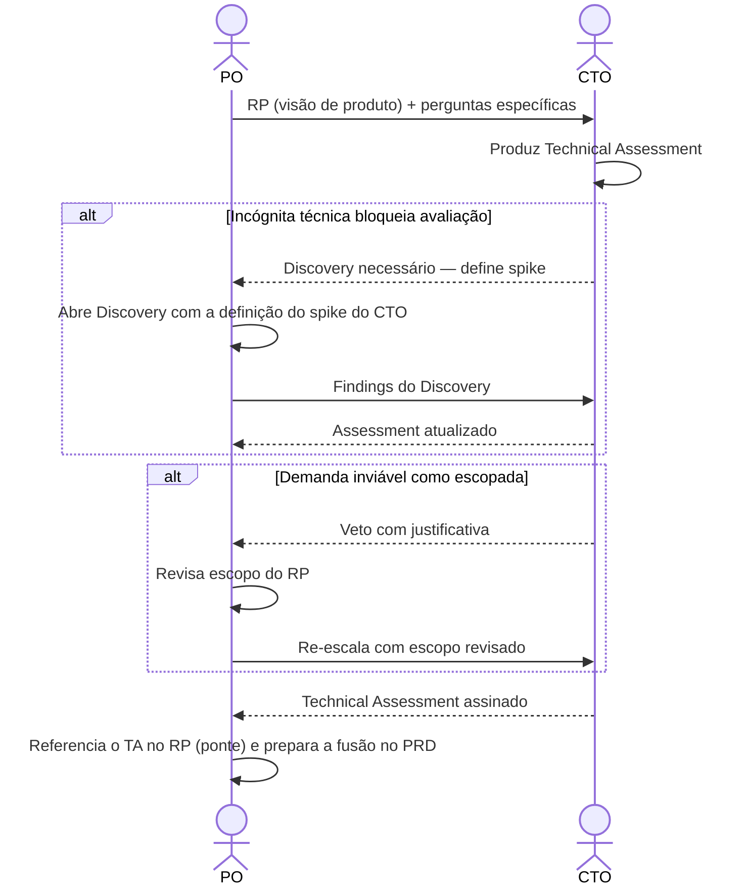

# Interação 05 — PO → CTO (Escalada Arquitetural)

**Direção:** PO inicia. CTO recebe.
**Camada:** Dentro da Camada de Intake

> **Mudança estrutural (ver [`personas/02-po.md` §2 e §10](../personas/02-po.md)).** O CTO **não preenche seções do Readiness Package**. Ele produz um **artefato próprio — o [Technical Assessment](../templates/03-technical-assessment.md) (TA)** — em paralelo ao RP. O RP referencia o TA via uma ponte (status + veredito + link); a fusão dos dois acontece no **PRD**. O CTO responde ao RP, não o co-edita.

---

## Gatilho

Durante a racionalização, o PO identifica que a demanda toca qualquer um dos seguintes:
- Nova infraestrutura
- Mudanças a nível de plataforma
- Impacto de multi-tenancy
- Modificações de comportamento de IA/runtime
- Implicações de segurança
- Integrações externas com incógnitas significativas
- Qualquer decisão que possa afetar a integridade arquitetural da plataforma

---

## O que o PO Deve Fornecer

- O **Readiness Package** (a visão de produto — não seções vazias para o CTO preencher)
- **Perguntas técnicas específicas** ou incógnitas que requerem o input do CTO
- Restrições de negócio e contexto de prazo

---

## O que o CTO Produz

Um **Technical Assessment** ([`03-technical-assessment.md`](../templates/03-technical-assessment.md)) — artefato separado, de autoria exclusiva do CTO:

- **Veredito de viabilidade** (viável / viável com ressalvas / inviável como escopado) + justificativa
- **Impacto arquitetural**: sistemas afetados, modelo de dados, eventos, multi-tenancy, segurança, performance, observabilidade
- **Integrações**: viabilidade técnica, protocolos, riscos conhecidos de terceiros
- **Constraints rígidas** que afetam o escopo
- **Riscos técnicos** e mitigações
- **ADRs** no nível arquitetural (sugeridos pela IA, aprovados/ajustados pelo CTO)
- **Esforço e custo firme** (substitui a estimativa preliminar do PO)

---

## Transferência de Ownership

**Do PO:** As incógnitas técnicas são transferidas. O PO retém o ownership do RP, mas não pode congelá-lo (`freezeReady`) até que o TA volte assinado quando foi requisitado.
**Para o CTO:** Detém o **Technical Assessment** inteiro e o veredito de viabilidade. O CTO **não é dono** das seções de produto ou negócio e **não edita o RP**.
**Artefato transferido:** o RP (visão de produto) + perguntas técnicas específicas. O CTO devolve um artefato novo (o TA), não edições no RP.

---

## Gate

O CTO não preenche as seções de produto ou negócio. Sua contribuição é o Technical Assessment. Se o CTO determinar que a demanda é **inviável como escopada**, ele veta com justificativa; o PO revisa o escopo do RP — o CTO não redefine o produto.

---

## Caminho de Falha

Se o CTO identificar que a demanda não pode ser avaliada sem resolver uma incógnita técnica, a demanda volta para Discovery. O CTO define o spike ou investigação necessária (registrado no TA); o PO determina o time-box.

---

## O que o PO NÃO Deve Fazer

- Entregar "seções vazias do RP" esperando que o CTO as preencha
- Enviar a escalada sem perguntas técnicas específicas
- Revisar silenciosamente as constraints do CTO após receber o assessment

---

## Sequência

