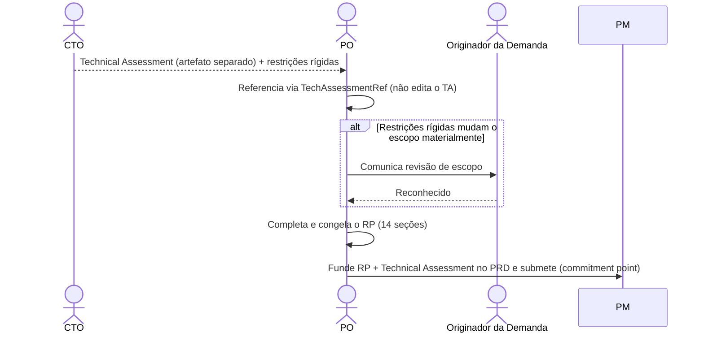

# Interação 06 — CTO → PO (Devolução da Avaliação Técnica)

**Direção:** CTO inicia a devolução. PO integra.
**Camada:** Dentro da Camada de Intake

---

## Gatilho

O CTO concluiu a avaliação técnica de uma demanda que foi escalada pelo PO.

---

## O que o CTO Entrega

O CTO entrega um artefato próprio — o **Technical Assessment** — e **nunca edita o RP**:

- **Viabilidade e constraints arquiteturais**: padrões a seguir, limites rígidos, decisões arquiteturais necessárias
- **Sistemas e componentes afetados**: infraestrutura, multi-tenancy, segurança, comportamento de IA/runtime
- **Riscos técnicos e mitigações**: probabilidade, impacto, ADRs sugeridos
- **Diretrizes para a quebra técnica downstream**
- Quaisquer restrições rígidas que afetam o escopo (ex.: "isso não pode usar o modelo de sessão existente — requer uma nova máquina de estado")

---

## O que o PO Faz Com Isso

- **Referencia** o Technical Assessment no RP via `TechAssessmentRef` — não copia o conteúdo para o corpo do RP
- Revisa os limites de escopo se restrições rígidas foram introduzidas
- Completa as seções restantes do RP com base no quadro técnico atualizado
- Congela o RP e funde-o ao Technical Assessment no **PRD**, que submete ao PM — o **commitment point**

---

## Transferência de Ownership

**Do CTO:** O Technical Assessment está completo e devolvido. A responsabilidade do CTO para esta demanda termina aqui, a menos que o PO apresente uma discordância ou mudanças de escopo exijam re-escalada.
**Para o PO:** Detém o congelamento do RP e a montagem do PRD — referenciando o Technical Assessment, revisando o escopo se necessário, comunicando ao originador da demanda e submetendo o PRD ao PM.
**Artefato transferido:** Technical Assessment (artefato separado; o CTO nunca edita o RP).

---

## Gate

O PO não modifica nem suaviza as restrições técnicas do CTO. Se o CTO disser que uma restrição é não-negociável, ela é não-negociável. Se o PO discordar, ele apresenta a discordância explicitamente — não revisa silenciosamente a restrição.

---

## Caminho de Falha

Se as restrições do CTO tornarem o escopo original inentregável, o PO documenta o escopo revisado e comunica a mudança ao originador da demanda (Vendas/CS/CEO) antes de submeter ao PM.

---

## O que o PO NÃO Deve Fazer

- Suavizar ou reinterpretar silenciosamente restrições técnicas para preservar o escopo original
- Editar o Technical Assessment do CTO ou submeter o PRD ao PM sem referenciá-lo
- Pular a comunicação ao originador da demanda se o escopo mudar materialmente

---

## Sequência

