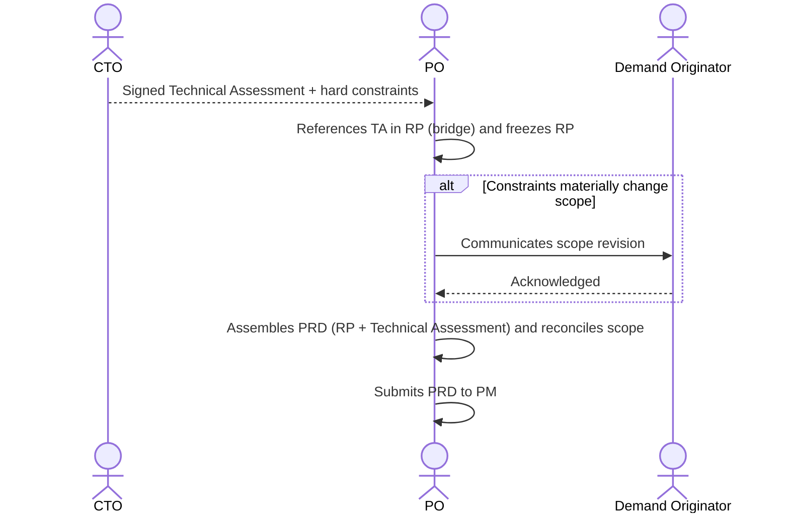

# Interaction 06 — CTO → PO (Technical Assessment Return)

**Direction:** CTO initiates the return. PO merges into the PRD.
**Layer:** Within the Intake Layer

> **Structural change (see [`personas/02-po.md` §10](../personas/02-po.md)).** The CTO returns a **separate artifact — the [Technical Assessment](../templates/03-technical-assessment.md)** — not "edits to Sections 7/8/9 of the RP." The PO **does not integrate the CTO's text into the RP**; they **reference** the TA in the RP and merge the two into the **PRD**.

---

## Trigger

The CTO has completed the Technical Assessment for a demand escalated by the PO.

---

## What the CTO Delivers

- **Technical Assessment** ([`03-technical-assessment.md`](../templates/03-technical-assessment.md)) signed, containing:
  - Feasibility verdict + rationale
  - Architectural impact, integrations, technical risks, ADRs, firm effort/cost
  - **Hard constraints** that affect scope (e.g., "cannot use the existing session model — requires a new state machine")

---

## What the PO Does With This

- **References** the TA in the RP (bridge `TechAssessmentRef`: status = signed, verdict, link) — **does not copy the CTO's content into the RP**
- Revises the RP scope boundaries if hard constraints were introduced
- Freezes the RP (`freezeReady`) and **assembles the PRD** = RP + Technical Assessment
- Submits the **PRD** to the PM

---

## Ownership Transfer

**From the CTO:** The Technical Assessment is complete and returned. The CTO's responsibility ends here, unless the PO raises a disagreement or scope changes require re-escalation. **The CTO is co-author of the PRD** (the technical half).
**To the PO:** Owns the PRD assembly — referencing the TA, reconciling scope, and submitting to the PM.
**Artifact transferred:** the Technical Assessment (complete artifact) + hard constraints.

---

## Gate

The PO does not modify or soften the CTO's technical constraints. If the CTO states that a constraint is non-negotiable, it is non-negotiable. If the PO disagrees, they raise the disagreement explicitly — they do not silently rewrite the TA (which, in any case, they have no authorship to edit).

---

## Failure Path

If the CTO's constraints make the original scope undeliverable, the PO documents the revised scope in the **Scope Reconciliation** section of the PRD and communicates the change to the demand originator (Sales/CS/CEO) before submitting to the PM.

---

## What the PO Must NOT Do

- Copy/edit the CTO's content into the RP (the TA is a separate artifact)
- Silently soften or reinterpret technical constraints to preserve scope
- Submit the PRD without reconciling scope when a veto or hard constraint was issued

---

## Sequence

