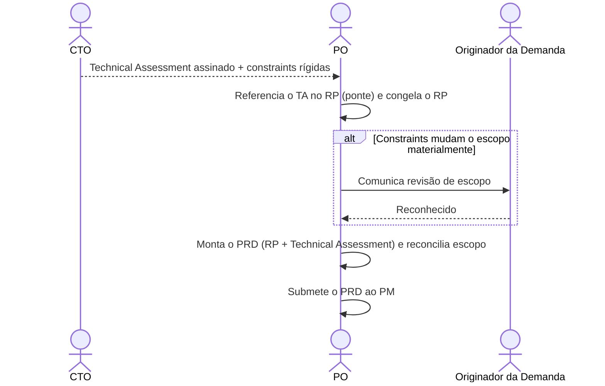

# Interação 06 — CTO → PO (Devolução do Technical Assessment)

**Direção:** CTO inicia a devolução. PO funde no PRD.
**Camada:** Dentro da Camada de Intake

> **Mudança estrutural (ver [`personas/02-po.md` §10](../personas/02-po.md)).** O CTO devolve um **artefato próprio — o [Technical Assessment](../templates/02-technical-assessment.md)** — não "edições nas Seções 7/8/9 do RP". O PO **não integra texto do CTO dentro do RP**; ele **referencia** o TA no RP e funde os dois no **PRD**.

---

## Gatilho

O CTO concluiu o Technical Assessment de uma demanda escalada pelo PO.

---

## O que o CTO Entrega

- **Technical Assessment** ([`02-technical-assessment.md`](../templates/02-technical-assessment.md)) assinado, contendo:
  - Veredito de viabilidade + justificativa
  - Impacto arquitetural, integrações, riscos técnicos, ADRs, esforço/custo firme
  - **Constraints rígidas** que afetam o escopo (ex.: "não pode usar o modelo de sessão existente — requer nova máquina de estado")

---

## O que o PO Faz Com Isso

- **Referencia** o TA no RP (ponte `TechAssessmentRef`: status = assinado, veredito, link) — **não copia o conteúdo do CTO para dentro do RP**
- Revisa os limites de escopo do RP se constraints rígidas foram introduzidas
- Congela o RP (`freezeReady`) e **monta o PRD** = RP + Technical Assessment
- Submete o **PRD** ao PM

---

## Transferência de Ownership

**Do CTO:** O Technical Assessment está completo e devolvido. A responsabilidade do CTO termina aqui, a menos que o PO apresente discordância ou mudanças de escopo exijam re-escalada. **O CTO é coautor do PRD** (a metade técnica).
**Para o PO:** Detém a montagem do PRD — referenciar o TA, reconciliar o escopo, e submeter ao PM.
**Artefato transferido:** o Technical Assessment (artefato completo) + constraints rígidas.

---

## Gate

O PO não modifica nem suaviza as constraints técnicas do CTO. Se o CTO disser que uma constraint é não-negociável, ela é não-negociável. Se o PO discordar, apresenta a discordância explicitamente — não reescreve silenciosamente o TA (que, aliás, ele não tem autoria para editar).

---

## Caminho de Falha

Se as constraints do CTO tornarem o escopo original inentregável, o PO documenta o escopo revisado na **Reconciliação de Escopo** do PRD e comunica a mudança ao originador da demanda (Vendas/CS/CEO) antes de submeter ao PM.

---

## O que o PO NÃO Deve Fazer

- Copiar/editar o conteúdo do CTO para dentro do RP (o TA é artefato separado)
- Suavizar ou reinterpretar silenciosamente constraints técnicas para preservar o escopo
- Submeter o PRD sem reconciliar o escopo quando houve veto ou constraint rígida

---

## Sequência

