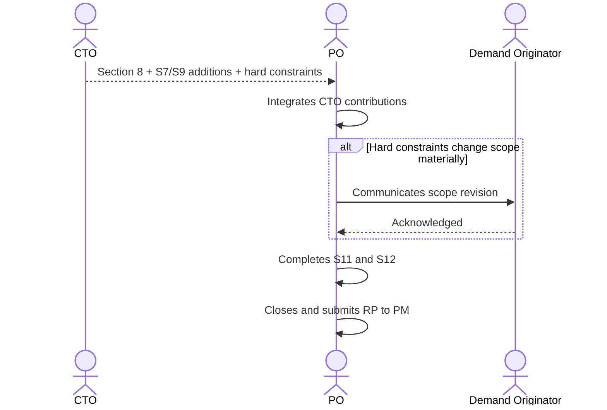

# Interaction 06 — CTO → PO (Technical Assessment Return)

**Direction:** CTO initiates return. PO integrates.
**Layer:** Within Intake Layer

---

## Trigger

CTO has completed the technical assessment of a demand that was escalated from the PO.

---

## What CTO Delivers

- **Section 8** filled: affected systems, components, infrastructure, architectural decisions required
- **Risk additions to Section 9**: technical risks with likelihood, impact, and mitigation strategy
- **Integration clarifications in Section 7**: protocols, constraints, known third-party limitations
- Any hard constraints that affect scope (e.g., "this cannot use the existing session model — requires a new state machine")

---

## What PO Does With It

- Integrates the CTO's contributions into the Readiness Package
- Revises scope boundaries if hard constraints were introduced
- Completes remaining sections (11, 12) based on the updated technical picture
- Closes the package and submits to PM

---

## Ownership Transferred

**From CTO:** Technical assessment is complete and handed back. CTO's responsibility for this demand ends here unless the PO surfaces a disagreement or scope changes require re-escalation.
**To PO:** Owns the completion of the Readiness Package — integrating the CTO's contributions, revising scope if necessary, communicating to the demand originator, and submitting to PM.
**Artifact handed over:** Section 8 + additions to Sections 7 and 9 + hard constraints.

---

## Gate

The PO does not modify or soften the CTO's technical constraints. If the CTO says a constraint is non-negotiable, it is non-negotiable. If the PO disagrees, they surface the disagreement explicitly — they do not quietly revise the constraint.

---

## Failure Path

If the CTO's constraints make the original scope undeliverable, the PO documents the revised scope and communicates the change back to the demand originator (Sales/CS/CEO) before submitting to PM.

---

## What PO Must NOT Do

- Quietly soften or reinterpret technical constraints to preserve the original scope
- Submit to PM without integrating the CTO's contributions
- Skip communication to the demand originator if scope changes materially

---

## Sequence

