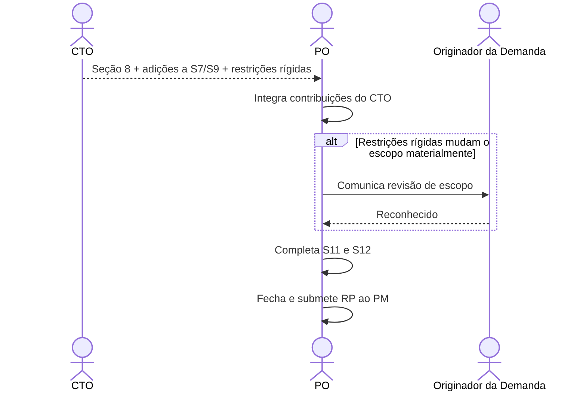

# Interação 06 — CTO → PO (Devolução da Avaliação Técnica)

**Direção:** CTO inicia a devolução. PO integra.
**Camada:** Dentro da Camada de Intake

---

## Gatilho

O CTO concluiu a avaliação técnica de uma demanda que foi escalada pelo PO.

---

## O que o CTO Entrega

- **Seção 8** preenchida: sistemas afetados, componentes, infraestrutura, decisões arquiteturais necessárias
- **Adições de risco à Seção 9**: riscos técnicos com probabilidade, impacto e estratégia de mitigação
- **Esclarecimentos de integração na Seção 7**: protocolos, restrições, limitações conhecidas de terceiros
- Quaisquer restrições rígidas que afetam o escopo (ex.: "isso não pode usar o modelo de sessão existente — requer uma nova máquina de estado")

---

## O que o PO Faz Com Isso

- Integra as contribuições do CTO no Readiness Package
- Revisa os limites de escopo se restrições rígidas foram introduzidas
- Completa as seções restantes (11, 12) com base no quadro técnico atualizado
- Fecha o pacote e submete ao PM

---

## Transferência de Ownership

**Do CTO:** A avaliação técnica está completa e devolvida. A responsabilidade do CTO para esta demanda termina aqui, a menos que o PO apresente uma discordância ou mudanças de escopo exijam re-escalada.
**Para o PO:** Detém a conclusão do Readiness Package — integrando as contribuições do CTO, revisando o escopo se necessário, comunicando ao originador da demanda e submetendo ao PM.
**Artefato transferido:** Seção 8 + adições às Seções 7 e 9 + restrições rígidas.

---

## Gate

O PO não modifica nem suaviza as restrições técnicas do CTO. Se o CTO disser que uma restrição é não-negociável, ela é não-negociável. Se o PO discordar, ele apresenta a discordância explicitamente — não revisa silenciosamente a restrição.

---

## Caminho de Falha

Se as restrições do CTO tornarem o escopo original inentregável, o PO documenta o escopo revisado e comunica a mudança ao originador da demanda (Vendas/CS/CEO) antes de submeter ao PM.

---

## O que o PO NÃO Deve Fazer

- Suavizar ou reinterpretar silenciosamente restrições técnicas para preservar o escopo original
- Submeter ao PM sem integrar as contribuições do CTO
- Pular a comunicação ao originador da demanda se o escopo mudar materialmente

---

## Sequência

