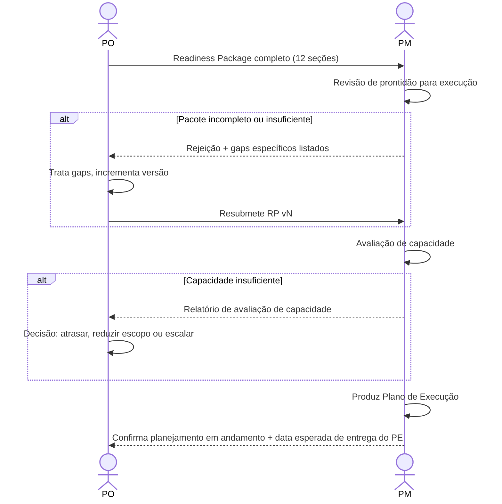

# Interação 07 — PO → PM (Handoff do Readiness Package)

**Direção:** PO inicia. PM recebe.
**Camada:** Camada de Intake → Downstream

---

## Gatilho

O Readiness Package está completo — todas as 12 seções preenchidas, contribuições do CTO integradas se necessário, e o PO revisou o pacote completo quanto à consistência interna.

---

## O que o PO Deve Fornecer

- Readiness Package completo (todas as 12 seções)
- Sign-off do CTO documentado nos metadados do pacote (se escalada arquitetural ocorreu)
- Nível de prioridade e contexto de negócio que embasou a decisão de avançar esta demanda agora
- Quaisquer dependências externas conhecidas ou bloqueadores (ações necessárias do cliente, procurement pendente)

---

## O que o PM Faz Com Isso

- Revisa o pacote quanto à prontidão de execução: escopo, riscos e dependências estão suficientemente definidos para planejar?
- Executa uma avaliação de capacidade antes de produzir qualquer prazo
- Produz o Plano de Execução: marcos, estrutura de sprint, alocação de capacidade, mapa de dependências, gatilhos de escalada
- Confirma ao PO que o planejamento começou e fornece prazo esperado para o Plano de Execução

---

## Transferência de Ownership

**Do PO:** A racionalização de produto está completa e transferida. O PO não conduz mais esta demanda no dia a dia — decisões de execução pertencem ao PM a partir deste ponto.
**Para o PM:** Detém o Plano de Execução, avaliação de capacidade, estrutura de sprint e entrega de marcos. O PM é o principal responsável até que o loop de feedback se feche de volta ao PO.
**Artefato transferido:** Readiness Package completo (todas as 12 seções).

---

## Gate

O PM tem autoridade explícita para rejeitar o Readiness Package e devolvê-lo ao PO. O PM não começa o planejamento com um pacote incompleto. A rejeição deve incluir o motivo específico — não um genérico "precisa de mais detalhes."

---

## Caminho de Falha

Se o PM rejeitar, o PO trata apenas os gaps sinalizados e resubmete. A versão do pacote incrementa. A rejeição e o motivo são documentados no Histórico de Revisão.

---

## O que o PO NÃO Deve Fazer

- Submeter um pacote com qualquer das 12 seções incompleta ou preenchida com placeholder
- Omitir bloqueadores externos conhecidos do pacote
- Pressionar o PM para começar o planejamento antes que o pacote seja aceito

---

## Sequência

