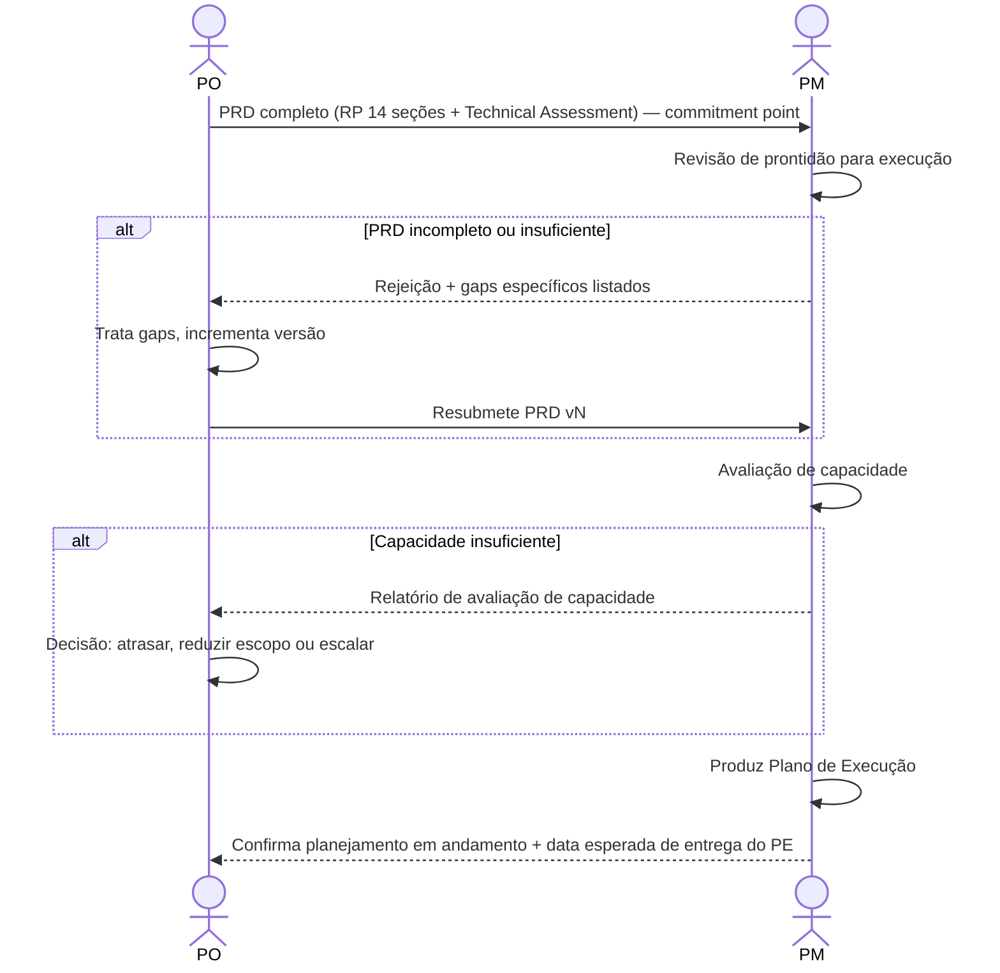

# Interação 07 — PO → PM (Handoff do PRD)

**Direção:** PO inicia. PM recebe.
**Camada:** Camada de Intake → Downstream

---

## Gatilho

O RP está congelado — todas as 14 seções com disposição honesta — e fundido ao Technical Assessment do CTO (se houve escalada arquitetural) no **PRD**. Cruzar essa fusão é o **commitment point**: encerra o arco do PO. O PO revisou o PRD quanto à consistência interna.

---

## O que o PO Deve Fornecer

- PRD completo (RP congelado de 14 seções + Technical Assessment do CTO)
- Technical Assessment do CTO referenciado via `TechAssessmentRef` (se escalada arquitetural ocorreu)
- Nível de prioridade e contexto de negócio que embasou a decisão de avançar esta demanda agora
- Quaisquer dependências externas conhecidas ou bloqueadores (ações necessárias do cliente, procurement pendente)

---

## O que o PM Faz Com Isso

- Revisa o PRD quanto à prontidão de execução: escopo, riscos e dependências estão suficientemente definidos para planejar?
- Executa uma avaliação de capacidade antes de produzir qualquer prazo
- Produz o Plano de Execução: marcos, estrutura de sprint, alocação de capacidade, mapa de dependências, gatilhos de escalada
- Confirma ao PO que o planejamento começou e fornece prazo esperado para o Plano de Execução

---

## Transferência de Ownership

**Do PO:** A racionalização de produto está completa e transferida. O PO não conduz mais esta demanda no dia a dia — decisões de execução pertencem ao PM a partir deste ponto.
**Para o PM:** Detém o Plano de Execução, avaliação de capacidade, estrutura de sprint e entrega de marcos. O PM é o principal responsável até que o loop de feedback se feche de volta ao PO.
**Artefato transferido:** PRD completo (RP congelado de 14 seções + Technical Assessment) — o commitment point.

---

## Gate

O PM tem autoridade explícita para rejeitar o PRD e devolvê-lo ao PO (gaps técnicos seguem ao CTO). O PM não começa o planejamento com um PRD incompleto. A rejeição deve incluir o motivo específico — não um genérico "precisa de mais detalhes."

---

## Caminho de Falha

Se o PM rejeitar, o PO trata apenas os gaps sinalizados e resubmete. A versão do PRD incrementa. A rejeição e o motivo são documentados no Histórico de Revisão.

---

## O que o PO NÃO Deve Fazer

- Encaminhar um PRD com qualquer das 14 seções do RP incompleta ou preenchida com placeholder
- Omitir bloqueadores externos conhecidos do PRD
- Pressionar o PM para começar o planejamento antes que o PRD seja aceito

---

## Sequência

