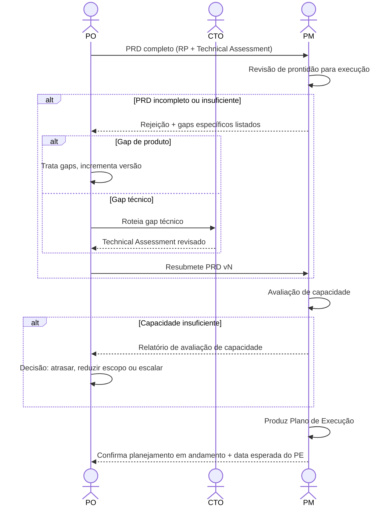

# Interação 07 — PO → PM (Handoff do PRD)

**Direção:** PO inicia. PM recebe.
**Camada:** Camada de Intake → Downstream

> **Mudança estrutural (ver [`personas/02-po.md` §2 e §11](../personas/02-po.md)).** O artefato transferido ao PM é o **[PRD](../templates/04-prd.md)** — a fusão do Readiness Package (PO) com o Technical Assessment (CTO) — **não o RP isolado**. É o PRD que abre o downstream.

---

## Gatilho

O **PRD** está completo: o RP congelado (`freezeReady`), o Technical Assessment assinado (ou justificado como não necessário), o escopo reconciliado, e o PO revisou a fusão quanto à consistência interna.

---

## O que o PO Deve Fornecer

- **PRD completo** (RP + Technical Assessment fundidos)
- **Sign-off duplo** documentado nos metadados (PO + CTO, quando houve escalada)
- Nível de prioridade e contexto de negócio que embasou avançar esta demanda agora
- Dependências externas conhecidas ou bloqueadores (ações do cliente, procurement pendente)

---

## O que o PM Faz Com Isso

- Revisa o PRD quanto à prontidão de execução: escopo, riscos (produto **e** técnicos) e dependências estão suficientemente definidos para planejar?
- Executa uma avaliação de capacidade antes de produzir qualquer prazo
- Produz o Plano de Execução: marcos, estrutura de sprint, alocação de capacidade, mapa de dependências, gatilhos de escalada
- Confirma ao PO que o planejamento começou e fornece prazo esperado para o Plano de Execução

---

## Transferência de Ownership

**Do PO:** A racionalização de produto está completa e transferida. O PO não conduz mais esta demanda no dia a dia — decisões de execução pertencem ao PM. (O PO permanece dono do Product Backlog e do fechamento do loop de feedback.)
**Para o PM:** Detém o Plano de Execução, avaliação de capacidade, estrutura de sprint e entrega de marcos.
**Artefato transferido:** o **PRD completo** (RP + Technical Assessment).

---

## Gate

O PM tem autoridade explícita para rejeitar o PRD e devolvê-lo. O PM não começa o planejamento com um pacote incompleto. A rejeição deve incluir o motivo específico — não um genérico "precisa de mais detalhes". Conforme o gap, o PO (produto) ou o CTO (técnico) trata só os gaps e incrementa a versão.

---

## Caminho de Falha

Se o PM rejeitar, o gap é roteado ao autor responsável (PO para produto, CTO para técnico). A versão do PRD incrementa. A rejeição e o motivo são documentados no Histórico de Revisão.

---

## O que o PO NÃO Deve Fazer

- Submeter um PRD com seções incompletas ou preenchidas com placeholder
- Omitir bloqueadores externos conhecidos
- Pressionar o PM para começar o planejamento antes que o PRD seja aceito

---

## Sequência

