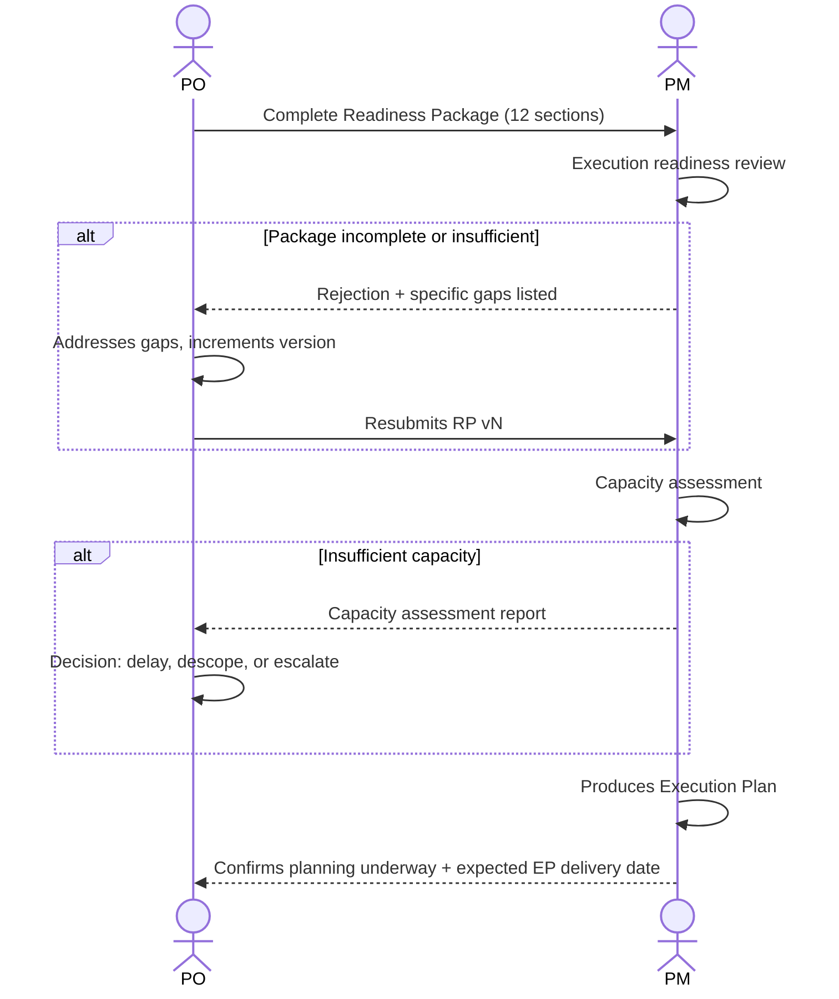

# Interaction 07 — PO → PM (Readiness Package Handoff)

**Direction:** PO initiates. PM receives.
**Layer:** Intake Layer → Downstream

---

## Trigger

The Readiness Package is complete — all 12 sections filled, CTO contributions integrated if required, and PO has reviewed the full package for internal consistency.

---

## What PO Must Provide

- Complete Readiness Package (all 12 sections)
- CTO sign-off documented in package metadata (if architectural escalation occurred)
- Priority level and business context that informed the decision to advance this demand now
- Any known external dependencies or blockers (client actions required, procurement pending)

---

## What PM Does With It

- Reviews the package for execution readiness: are the scope, risks, and dependencies sufficiently defined to plan?
- Runs a capacity assessment before producing any timeline
- Produces the Execution Plan: milestones, sprint structure, capacity allocation, dependency map, escalation triggers
- Confirms to the PO that planning has begun and provides an expected timeline for the Execution Plan

---

## Ownership Transferred

**From PO:** Product rationalization is complete and handed over. PO no longer drives this demand day-to-day — execution decisions belong to PM from this point forward.
**To PM:** Owns the Execution Plan, capacity assessment, sprint structure, and milestone delivery. PM is the primary accountability holder until the feedback loop closes back to PO.
**Artifact handed over:** Complete Readiness Package (all 12 sections).

---

## Gate

The PM has explicit authority to reject the Readiness Package and return it to the PO. The PM does not start planning on an incomplete package. Rejection must include the specific reason — not a general "needs more detail."

---

## Failure Path

If PM rejects, the PO addresses only the flagged gaps and resubmits. The package version increments. The rejection and reason are documented in the Revision History.

---

## What PO Must NOT Do

- Submit a package with any of the 12 sections incomplete or placeholder-filled
- Omit known external blockers from the package
- Pressure PM to start planning before the package is accepted

---

## Sequence

