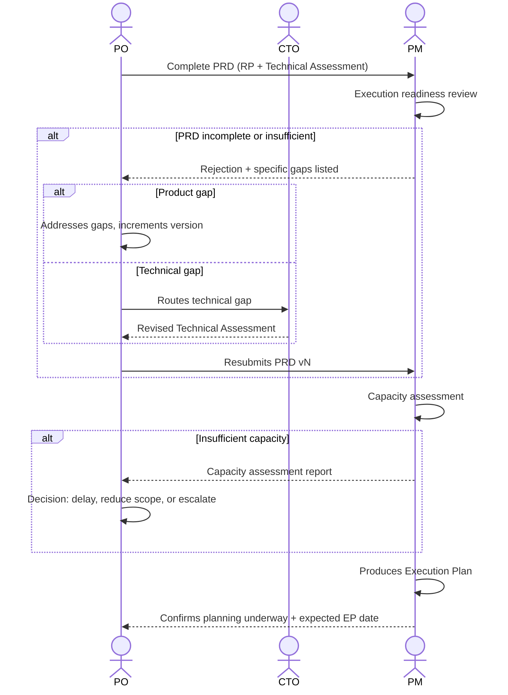

# Interaction 07 — PO → PM (PRD Handoff)

**Direction:** PO initiates. PM receives.
**Layer:** Intake Layer → Downstream

> **Structural change (see [`personas/02-po.md` §2 and §11](../personas/02-po.md)).** The artifact transferred to the PM is the **[PRD](../templates/04-prd.md)** — the merge of the Readiness Package (PO) with the Technical Assessment (CTO) — **not the RP in isolation**. It is the PRD that opens the downstream.

---

## Trigger

The **PRD** is complete: the RP is frozen (`freezeReady`), the Technical Assessment is signed (or justified as not required), scope is reconciled, and the PO has reviewed the merge for internal consistency.

---

## What the PO Must Provide

- **Complete PRD** (RP + Technical Assessment merged)
- **Dual sign-off** documented in the metadata (PO + CTO, when an escalation occurred)
- Priority level and business context that justified advancing this demand now
- Known external dependencies or blockers (customer actions, pending procurement)

---

## What the PM Does With This

- Reviews the PRD for execution readiness: are scope, risks (product **and** technical), and dependencies sufficiently defined to plan?
- Runs a capacity assessment before producing any deadline
- Produces the Execution Plan: milestones, sprint structure, capacity allocation, dependency map, escalation triggers
- Confirms to the PO that planning has started and provides the expected date for the Execution Plan

---

## Ownership Transfer

**From the PO:** Product rationalization is complete and transferred. The PO no longer drives this demand day-to-day — execution decisions belong to the PM. (The PO remains owner of the Product Backlog and closing the feedback loop.)
**To the PM:** Owns the Execution Plan, capacity assessment, sprint structure, and milestone delivery.
**Artifact transferred:** the **complete PRD** (RP + Technical Assessment).

---

## Gate

The PM has explicit authority to reject the PRD and return it. The PM does not start planning with an incomplete package. The rejection must include the specific reason — not a generic "needs more detail." Depending on the gap, the PO (product) or the CTO (technical) addresses only those gaps and increments the version.

---

## Failure Path

If the PM rejects, the gap is routed to the responsible author (PO for product, CTO for technical). The PRD version increments. The rejection and reason are documented in the Revision History.

---

## What the PO Must NOT Do

- Submit a PRD with incomplete sections or placeholder-filled content
- Omit known external blockers
- Pressure the PM to start planning before the PRD is accepted

---

## Sequence

