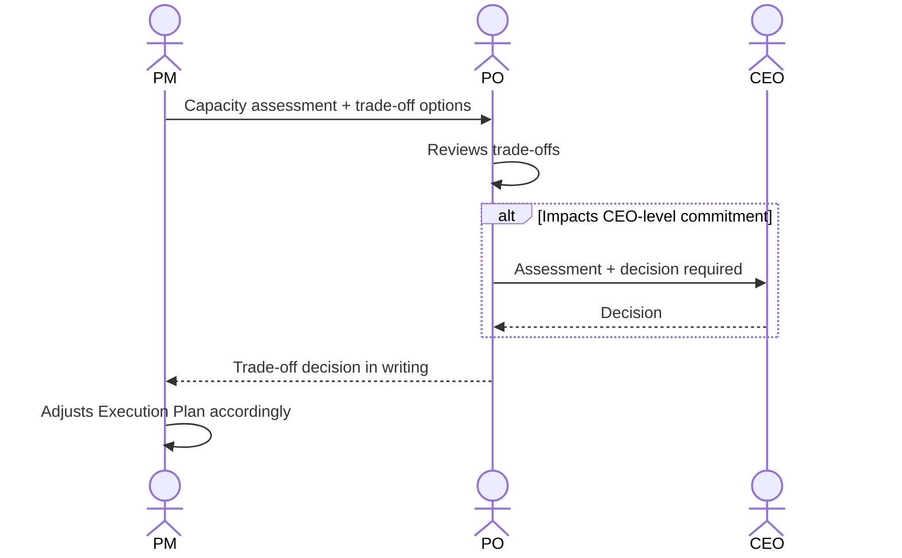

# Interaction 08 — PM → PO (Capacity Escalation)

**Direction:** PM initiates. PO receives.
**Layer:** Within Downstream

---

## Trigger

PM's capacity assessment reveals that the team cannot absorb the approved demand without impacting existing commitments.

---

## What PM Must Provide

- Written capacity assessment: current load per engineer, skill gaps, conflict map
- Specific trade-off options: descope option A vs. delay existing commitment B vs. phase the delivery
- Estimated impact of each option on current commitments

---

## What PO Does With It

- Reviews the trade-offs
- Makes a prioritization decision in consultation with the CEO if executive commitments are involved
- Communicates the decision back to PM in writing

---

## Ownership Transferred

**From PM:** The capacity conflict is surfaced and handed to PO for a trade-off decision. PM cannot resolve this unilaterally — it requires a prioritization authority.
**To PO:** Owns the trade-off decision. PO must return a written decision to PM before execution planning can continue. If the decision requires CEO input, PO is accountable for that escalation.
**Artifact handed over:** Capacity assessment + written trade-off options.

---

## Gate

PM does not absorb capacity problems silently. If execution requires compromising an existing commitment, the PO must approve the trade-off explicitly. No silent overcommitment.

---

## Failure Path

If PO cannot make the decision alone (e.g., impacts a CEO-level commitment), PO escalates to CEO with the PM's assessment and returns with a decision.

---

## What PM Must NOT Do

- Start planning under capacity pressure without surfacing the conflict
- Make a trade-off decision unilaterally without PO approval
- Communicate a timeline to the client before the trade-off is resolved

---

## Sequence

