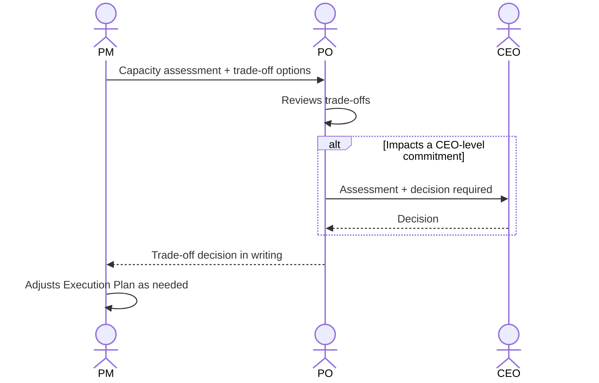

# Interaction 08 — PM → PO (Capacity Escalation)

**Direction:** PM initiates. PO receives.
**Layer:** Within the Downstream

---

## Trigger

The PM's capacity assessment reveals that the team cannot absorb the approved demand without impacting existing commitments.

---

## What the PM Must Provide

- Written capacity assessment: current load per engineer, skill gaps, conflict map
- Specific trade-off options: scope reduction option A vs. delaying commitment B vs. phased delivery
- Estimated impact of each option on current commitments

---

## What the PO Does With This

- Reviews the trade-offs
- Makes a prioritization decision in consultation with the CEO if executive commitments are involved
- Communicates the decision back to the PM in writing

---

## Ownership Transfer

**From the PM:** The capacity conflict is presented and transferred to the PO for a trade-off decision. The PM cannot resolve this unilaterally — it requires a prioritization authority.
**To the PO:** Owns the trade-off decision. The PO must return a written decision to the PM before execution planning can continue. If the decision requires CEO input, the PO is responsible for that escalation.
**Artifact transferred:** Capacity assessment + written trade-off options.

---

## Gate

The PM does not silently absorb capacity problems. If execution requires compromising an existing commitment, the PO must explicitly approve the trade-off. No silent over-commitment.

---

## Failure Path

If the PO cannot make the decision alone (e.g., it impacts a CEO-level commitment), the PO escalates to the CEO with the PM's assessment and returns with a decision.

---

## What the PM Must NOT Do

- Start planning under capacity pressure without surfacing the conflict
- Make a trade-off decision unilaterally without PO approval
- Communicate a deadline to the customer before the trade-off is resolved

---

## Sequence

