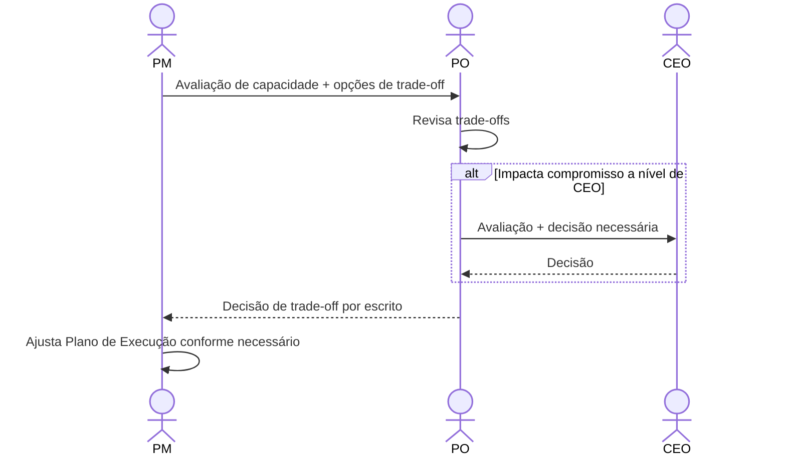

# Interação 08 — PM → PO (Escalada de Capacidade)

**Direção:** PM inicia. PO recebe.
**Camada:** Dentro do Downstream

---

## Gatilho

A avaliação de capacidade do PM revela que o time não consegue absorver a demanda aprovada sem impactar compromissos existentes.

---

## O que o PM Deve Fornecer

- Avaliação de capacidade escrita: carga atual por engenheiro, gaps de competência, mapa de conflitos
- Opções específicas de trade-off: opção de redução de escopo A vs. atraso do compromisso B vs. entrega faseada
- Impacto estimado de cada opção sobre os compromissos atuais

---

## O que o PO Faz Com Isso

- Revisa os trade-offs
- Toma uma decisão de priorização em consulta com o CEO se compromissos executivos estiverem envolvidos
- Comunica a decisão de volta ao PM por escrito

---

## Transferência de Ownership

**Do PM:** O conflito de capacidade é apresentado e transferido ao PO para uma decisão de trade-off. O PM não pode resolver isso unilateralmente — requer uma autoridade de priorização.
**Para o PO:** Detém a decisão de trade-off. O PO deve retornar uma decisão escrita ao PM antes que o planejamento de execução possa continuar. Se a decisão requerer input do CEO, o PO é responsável por essa escalada.
**Artefato transferido:** Avaliação de capacidade + opções escritas de trade-off.

---

## Gate

O PM não absorve problemas de capacidade silenciosamente. Se a execução exige comprometer um compromisso existente, o PO deve aprovar o trade-off explicitamente. Sem supercomprometimento silencioso.

---

## Caminho de Falha

Se o PO não puder tomar a decisão sozinho (ex.: impacta um compromisso a nível de CEO), o PO escala ao CEO com a avaliação do PM e retorna com uma decisão.

---

## O que o PM NÃO Deve Fazer

- Começar o planejamento sob pressão de capacidade sem apresentar o conflito
- Tomar uma decisão de trade-off unilateralmente sem aprovação do PO
- Comunicar um prazo ao cliente antes que o trade-off seja resolvido

---

## Sequência

