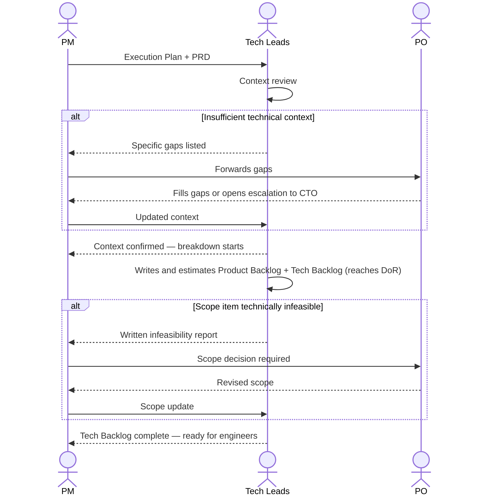

# Interaction 09 — PM → Tech Leads (Execution Plan Handoff)

**Direction:** PM initiates. Tech Leads receive.
**Layer:** Within the Downstream

---

## Trigger

The Execution Plan is complete and the PM has verified that capacity is sufficient to begin.

---

## What the PM Must Provide

- Complete Execution Plan: milestones, sprint structure, dependency map, escalation triggers
- PRD (passed along — Tech Leads need the full product and technical context: RP + Technical Assessment)
- Specific questions for the Tech Leads to answer before the breakdown begins (if any)
- External dependency deadlines: any actions required from outside the team (customer records, procurement, infrastructure provisioning by the CTO)

---

## What the Tech Leads Produce

- Confirmation that they have sufficient context to start the technical breakdown
- Product Backlog: epics, stories, and tasks with acceptance criteria (written and estimated by the Tech Leads — derived from the product user stories in the PRD; this is where the **Definition of Ready** is reached)
- Tech Backlog: ADRs, task breakdown, refined estimates, Definition of Done, rollout strategy
- Escalation to the PM if any scope item is technically infeasible or requires a decision

---

## Ownership Transfer

**From the PM:** Execution planning is complete and transferred. The PM remains responsible for milestones and escalation triggers, but day-to-day technical execution is now in the Tech Leads' hands.
**To the Tech Leads:** Own the technical breakdown — ADRs, task definition, effort refinement, the Product Backlog, and the Tech Backlog. They write and estimate epics, stories, and tasks from the product user stories in the PRD.
**Artifact transferred:** Execution Plan + complete PRD.

---

## Gate

Tech Leads do not start the breakdown before confirming they have sufficient context. If the PRD is missing technical detail they need, they surface it to the PM — they do not silently work around it.

---

## Failure Path

If Tech Leads identify a scope item that is technically infeasible or requires a decision outside their authority, they return it to the PM with a written description. The PM escalates to the PO. The PO revises scope or escalates to the CTO.

---

## What the PM Must NOT Do

- Hand off without passing the complete PRD
- Set a deadline for the breakdown before Tech Leads have confirmed sufficient context
- Absorb feasibility reports without escalating to the PO

---

## Sequence

