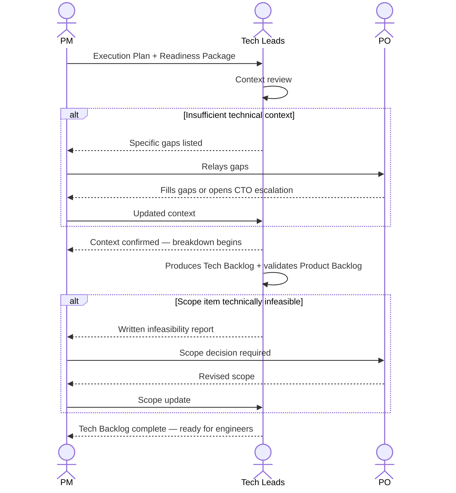

# Interaction 09 — PM → Tech Leads (Execution Plan Handoff)

**Direction:** PM initiates. Tech Leads receive.
**Layer:** Within Downstream

---

## Trigger

The Execution Plan is complete and the PM has verified capacity is sufficient to begin.

---

## What PM Must Provide

- Complete Execution Plan: milestones, sprint structure, dependency map, escalation triggers
- Readiness Package (passed through — Tech Leads need the full product and technical context)
- Specific questions for Tech Leads to answer before breakdown begins (if any)
- External dependency timeline: any actions required from outside the team (client registrations, procurement, CTO infrastructure provisioning)

---

## What Tech Leads Produce

- Confirmation that they have sufficient context to begin technical breakdown
- Product Backlog: epics, stories, acceptance criteria, edge cases, user journeys (owned by PO — Tech Lead validates)
- Tech Backlog: ADRs, task breakdown, refined estimates, Definition of Done, rollout strategy
- Escalation to PM if any scope item is technically impossible or requires a decision

---

## Ownership Transferred

**From PM:** Execution planning is complete and handed over. PM remains accountable for milestones and escalation triggers but day-to-day technical execution is now in Tech Leads' hands.
**To Tech Leads:** Own the technical breakdown — ADRs, task definition, effort refinement, and the Tech Backlog. Also responsible for validating the Product Backlog stories.
**Artifact handed over:** Execution Plan + complete Readiness Package.

---

## Gate

Tech Leads do not begin breakdown until they have confirmed they have sufficient context. If the Readiness Package is missing technical detail they need, they surface it to the PM — not silently work around it.

---

## Failure Path

If Tech Leads identify a scope item that is technically infeasible or requires a decision outside their authority, they return it to PM with a written description. PM escalates to PO. PO revises scope or escalates to CTO.

---

## What PM Must NOT Do

- Hand off without passing the full Readiness Package
- Set a breakdown deadline before Tech Leads have confirmed sufficient context
- Absorb scope infeasibility reports without escalating to PO

---

## Sequence

