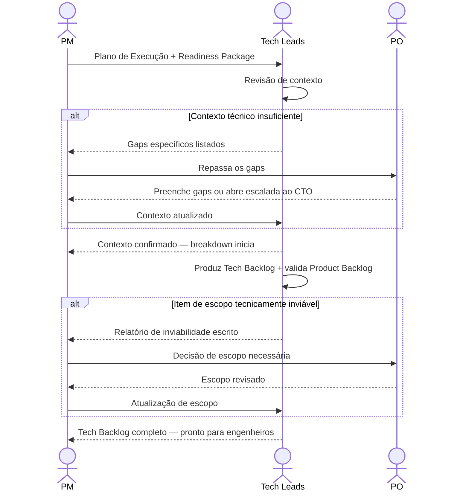

# Interação 09 — PM → Tech Leads (Handoff do Plano de Execução)

**Direção:** PM inicia. Tech Leads recebem.
**Camada:** Dentro do Downstream

---

## Gatilho

O Plano de Execução está completo e o PM verificou que a capacidade é suficiente para começar.

---

## O que o PM Deve Fornecer

- Plano de Execução completo: marcos, estrutura de sprint, mapa de dependências, gatilhos de escalada
- Readiness Package (repassado — Tech Leads precisam do contexto completo de produto e técnico)
- Perguntas específicas para os Tech Leads responderem antes do breakdown começar (se houver)
- Prazo de dependências externas: quaisquer ações necessárias de fora do time (registros de clientes, procurement, provisionamento de infraestrutura pelo CTO)

---

## O que os Tech Leads Produzem

- Confirmação de que têm contexto suficiente para iniciar o breakdown técnico
- Product Backlog: épicos, histórias, critérios de aceite, edge cases, jornadas de usuário (de propriedade do PO — Tech Lead valida)
- Tech Backlog: ADRs, breakdown de tarefas, estimativas refinadas, Definição de Pronto, estratégia de rollout
- Escalada ao PM se qualquer item de escopo for tecnicamente impossível ou requerer uma decisão

---

## Transferência de Ownership

**Do PM:** O planejamento de execução está completo e transferido. O PM permanece responsável pelos marcos e gatilhos de escalada, mas a execução técnica no dia a dia está agora nas mãos dos Tech Leads.
**Para os Tech Leads:** Detêm o breakdown técnico — ADRs, definição de tarefas, refinamento de esforço e o Tech Backlog. Também responsáveis por validar as histórias do Product Backlog.
**Artefato transferido:** Plano de Execução + Readiness Package completo.

---

## Gate

Os Tech Leads não começam o breakdown antes de confirmar que têm contexto suficiente. Se o Readiness Package estiver faltando detalhe técnico de que precisam, eles apresentam ao PM — não trabalham silenciosamente em torno disso.

---

## Caminho de Falha

Se os Tech Leads identificarem um item de escopo tecnicamente inviável ou que requer uma decisão fora de sua autoridade, devolvem ao PM com uma descrição escrita. O PM escala ao PO. O PO revisa o escopo ou escala ao CTO.

---

## O que o PM NÃO Deve Fazer

- Fazer o handoff sem passar o Readiness Package completo
- Definir um prazo para o breakdown antes que os Tech Leads tenham confirmado contexto suficiente
- Absorver relatórios de inviabilidade de escopo sem escalar ao PO

---

## Sequência

