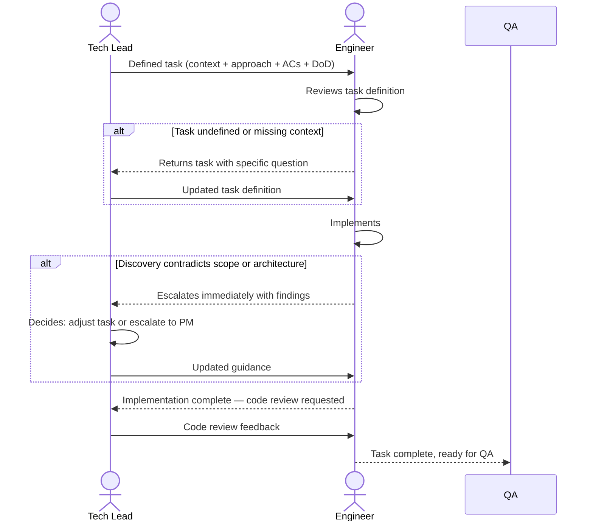

# Interaction 10 — Tech Leads → Engineers (Task Assignment)

**Direction:** Tech Leads initiate. Engineers receive.
**Layer:** Within Downstream

---

## Trigger

Tech Backlog is complete — tasks are fully defined with context, constraints, acceptance criteria, and a clear Definition of Done.

---

## What Tech Leads Must Provide Per Task

- What needs to be built (from the product story, not rewritten by the Tech Lead)
- Technical approach and constraints (ADR reference if applicable)
- Acceptance criteria (from Product Backlog story + technical additions)
- Definition of Done for the task
- Dependencies on other tasks (sequencing requirements)
- Known risks or edge cases the engineer must handle

---

## What Engineers Do With It

- Implement within the defined approach — no unilateral architectural departures
- Surface any technical discovery that contradicts the defined scope or architecture immediately
- Complete code review before marking a task done
- Hand off to QA when all acceptance criteria are implemented

---

## Ownership Transferred

**From Tech Leads:** Task definition is complete and handed over. Tech Leads retain oversight (code review, escalation handling) but implementation is now the engineer's responsibility.
**To Engineers:** Own the implementation of each assigned task — within the defined approach, acceptance criteria, and Definition of Done. Any departure from the defined approach requires explicit Tech Lead approval.
**Artifact handed over:** Defined task (context + technical approach + acceptance criteria + DoD + dependencies).

---

## Gate

Engineers do not start tasks without a complete definition. A task without context, constraints, and acceptance criteria is returned to the Tech Lead — not picked up and interpreted.

---

## Failure Path

If an engineer discovers that the implementation contradicts the architecture or uncovers an edge case not covered in the task definition, they escalate to the Tech Lead immediately. The engineer does not absorb the ambiguity silently and deliver a workaround.

---

## What Engineers Must NOT Do

- Make unilateral architectural decisions outside the defined approach
- Start a task that is missing context or acceptance criteria
- Silently absorb a scope discovery and deliver a workaround without surfacing it

---

## Sequence

