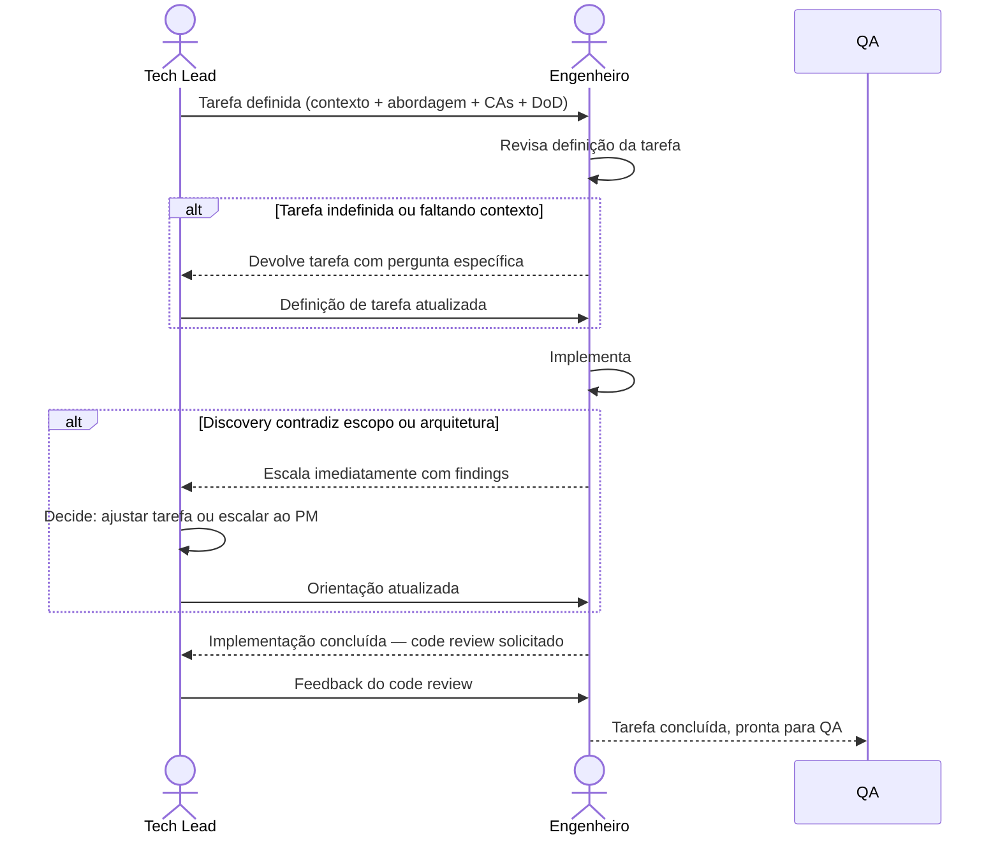

# Interação 10 — Tech Leads → Engenheiros (Atribuição de Tarefas)

**Direção:** Tech Leads iniciam. Engenheiros recebem.
**Camada:** Dentro do Downstream

---

## Gatilho

O Tech Backlog está completo — tarefas totalmente definidas com contexto, restrições, critérios de aceite e uma Definição de Pronto clara.

---

## O que os Tech Leads Devem Fornecer por Tarefa

- O que precisa ser construído (da história de produto, não reescrito pelo Tech Lead)
- Abordagem técnica e restrições (referência ao ADR se aplicável)
- Critérios de aceite (da história do Product Backlog + adições técnicas)
- Definição de Pronto para a tarefa
- Dependências de outras tarefas (requisitos de sequenciamento)
- Riscos conhecidos ou edge cases que o engenheiro deve tratar

---

## O que os Engenheiros Fazem Com Isso

- Implementam dentro da abordagem definida — sem departures arquiteturais unilaterais
- Apresentam qualquer discovery técnico que contradiga o escopo ou arquitetura definidos imediatamente
- Completam code review antes de marcar uma tarefa como pronta
- Fazem handoff para QA quando todos os critérios de aceite estão implementados

---

## Transferência de Ownership

**Dos Tech Leads:** A definição de tarefa está completa e transferida. Os Tech Leads mantêm supervisão (code review, tratamento de escaladas), mas a implementação é agora responsabilidade do engenheiro.
**Para os Engenheiros:** Detêm a implementação de cada tarefa atribuída — dentro da abordagem definida, critérios de aceite e Definição de Pronto. Qualquer desvio da abordagem definida requer aprovação explícita do Tech Lead.
**Artefato transferido:** Tarefa definida (contexto + abordagem técnica + critérios de aceite + DoD + dependências).

---

## Gate

Engenheiros não começam tarefas sem uma definição completa. Uma tarefa sem contexto, restrições e critérios de aceite é devolvida ao Tech Lead — não é pega e interpretada.

---

## Caminho de Falha

Se um engenheiro descobrir que a implementação contradiz a arquitetura ou encontrar um edge case não coberto na definição da tarefa, escala ao Tech Lead imediatamente. O engenheiro não absorve a ambiguidade silenciosamente e entrega um workaround.

---

## O que os Engenheiros NÃO Devem Fazer

- Tomar decisões arquiteturais unilaterais fora da abordagem definida
- Começar uma tarefa que está faltando contexto ou critérios de aceite
- Absorver silenciosamente um discovery de escopo e entregar um workaround sem apresentá-lo

---

## Sequência

