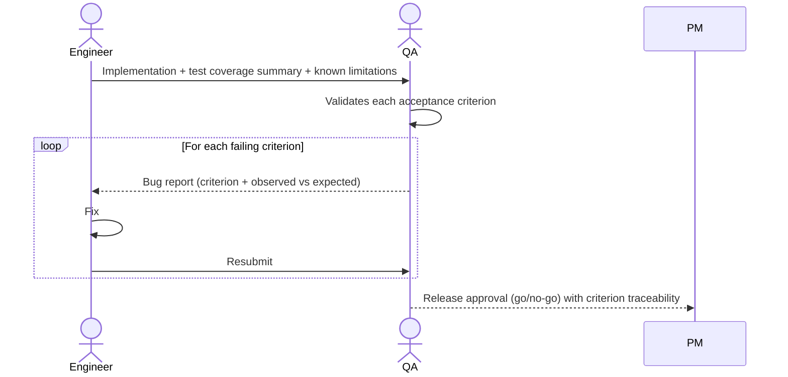

# Interaction 11 — Engineers → QA (Handoff for Testing)

**Direction:** Engineers initiate. QA receives.
**Layer:** Within Downstream

---

## Trigger

All acceptance criteria for a story or defined task set are implemented, unit tests pass, and code review is complete.

---

## What Engineers Must Provide

- Implementation summary: what was built, what was changed, what was not implemented and why
- Test coverage summary: unit and integration tests written
- Known limitations or deferred edge cases (if any, must be documented — not silently omitted)
- Environment and setup instructions if the feature requires specific configuration to test

---

## What QA Produces

- Validation against every acceptance criterion defined in the Product Backlog story
- Edge case testing based on the edge cases defined per story
- Regression suite pass confirmation
- Release approval (go) or rejection (no-go) with specific failing criteria listed

---

## Ownership Transferred

**From Engineers:** Implementation is complete and handed over. Engineers no longer make changes to the feature without a QA bug report initiating it — no unsolicited modifications during QA.
**To QA:** Owns the validation cycle — acceptance criterion traceability, edge case testing, regression, and the go/no-go release decision. QA is the sole issuer of release approval.
**Artifact handed over:** Implementation + test coverage summary + known limitations.

---

## Gate

QA does not issue a release approval without explicitly validating all acceptance criteria. A "looks good to me" without traceability to the defined criteria is not a valid gate pass.

---

## Failure Path

If QA finds a failing acceptance criterion, it is returned to the Engineer with a bug report tracing the failure to the specific criterion. Engineers fix and re-submit to QA — they do not renegotiate the acceptance criterion.

---

## What Engineers Must NOT Do

- Hand off without a code review completed
- Omit known limitations or deferred edge cases from the summary
- Submit to QA before unit tests pass

---

## Sequence

