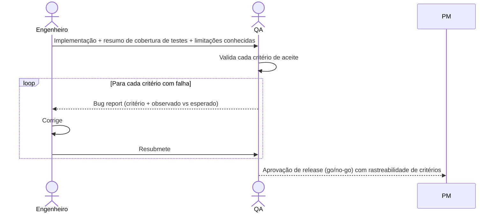

# Interação 11 — Engenheiros → QA (Handoff para Testes)

**Direção:** Engenheiros iniciam. QA recebe.
**Camada:** Dentro do Downstream

---

## Gatilho

Todos os critérios de aceite para uma história ou conjunto de tarefas definidas estão implementados, testes unitários passam e o code review está completo.

---

## O que os Engenheiros Devem Fornecer

- Resumo de implementação: o que foi construído, o que foi alterado, o que não foi implementado e por quê
- Resumo de cobertura de testes: testes unitários e de integração escritos
- Limitações conhecidas ou edge cases adiados (se houver, devem ser documentados — não omitidos silenciosamente)
- Instruções de ambiente e configuração se a funcionalidade requer configuração específica para testar

---

## O que o QA Produz

- Validação contra cada critério de aceite definido na história do Product Backlog
- Testes de edge cases baseados nos edge cases definidos por história
- Confirmação de aprovação do regression suite
- Aprovação de release (go) ou rejeição (no-go) com critérios com falha listados especificamente

---

## Transferência de Ownership

**Dos Engenheiros:** A implementação está completa e transferida. Engenheiros não fazem mais alterações na funcionalidade sem que um bug report do QA as inicie — sem modificações não solicitadas durante o QA.
**Para o QA:** Detém o ciclo de validação — rastreabilidade de critérios de aceite, testes de edge cases, regressão e a decisão go/no-go de release. O QA é o único emissor de aprovação de release.
**Artefato transferido:** Implementação + resumo de cobertura de testes + limitações conhecidas.

---

## Gate

O QA não emite uma aprovação de release sem validar explicitamente todos os critérios de aceite. Um "parece bom" sem rastreabilidade aos critérios definidos não é um gate pass válido.

---

## Caminho de Falha

Se o QA encontrar um critério de aceite com falha, ele é devolvido ao Engenheiro com um bug report rastreando a falha ao critério específico. Engenheiros corrigem e resubmetem ao QA — não renegociam o critério de aceite.

---

## O que os Engenheiros NÃO Devem Fazer

- Fazer o handoff sem um code review completo
- Omitir limitações conhecidas ou edge cases adiados do resumo
- Submeter ao QA antes que os testes unitários passem

---

## Sequência

