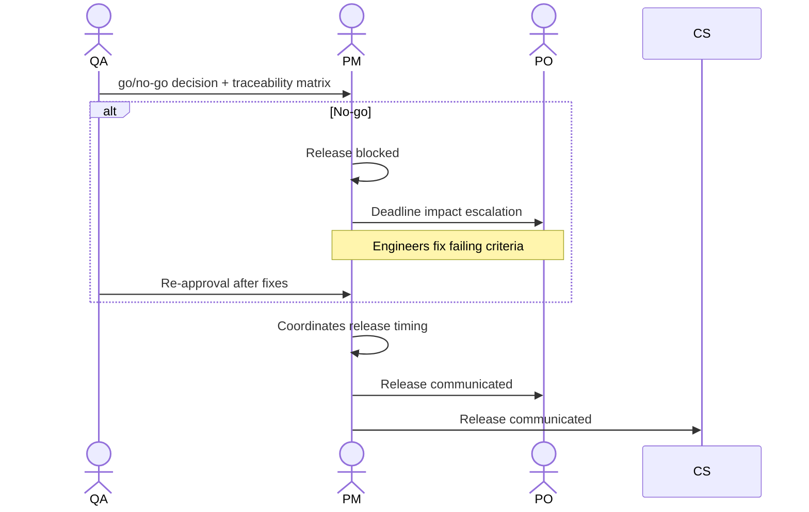

# Interaction 12 — QA → PM (Release Approval)

**Direction:** QA initiates. PM receives.
**Layer:** Within the Downstream

---

## Trigger

All acceptance criteria have been validated and QA is issuing a go or no-go decision.

---

## What QA Must Provide

- Explicit go/no-go decision
- Traceability matrix: each acceptance criterion and its validation result
- List of any known issues deferred from this release (with documented justification for the deferral)
- Test environment summary (confirming that the staging environment matched the production configuration)

---

## What the PM Does With This

- Coordinates release timing with Tech Leads and Engineers
- Communicates the release to CS and the PO
- Initiates the feedback loop within 5 business days

---

## Ownership Transfer

**From QA:** Validation is complete and the release decision is transferred. QA's responsibility for this cycle ends with the go/no-go issuance — unless a no-go triggers a re-validation cycle.
**To the PM:** Owns release coordination, timing, and communication to CS and the PO. The PM cannot release without a go from QA and cannot override a no-go.
**Artifact transferred:** go/no-go decision + traceability matrix + deferred issues list.

---

## Gate

The PM does not override a QA no-go. If QA issues a no-go, the release is blocked until the failing criteria are resolved and QA re-approves. The PM escalates deadline implications to the PO.

---

## Failure Path

If a no-go significantly impacts a customer commitment or milestone, the PM produces a revised plan and communicates it to the PO and CS before the customer is informed.

---

## What the PM Must NOT Do

- Override or circumvent a QA no-go decision
- Release without a go decision from QA
- Communicate a release to customers before QA has issued go

---

## Sequence

