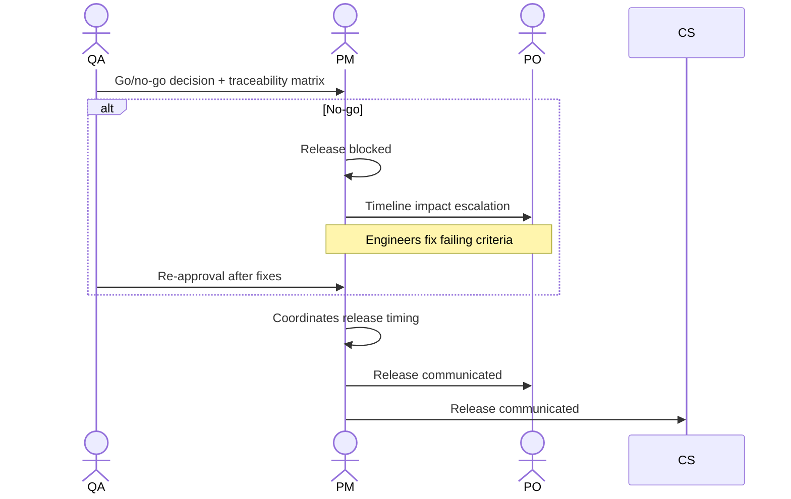

# Interaction 12 — QA → PM (Release Approval)

**Direction:** QA initiates. PM receives.
**Layer:** Within Downstream

---

## Trigger

All acceptance criteria have been validated and QA is issuing a go or no-go decision.

---

## What QA Must Provide

- Explicit go/no-go decision
- Traceability matrix: each acceptance criterion and its validation result
- List of any known issues deferred from this release (with documented justification for deferral)
- Test environment summary (confirming staging environment matched production configuration)

---

## What PM Does With It

- Coordinates release timing with Tech Leads and Engineers
- Communicates the release to CS and PO
- Initiates the feedback loop within 5 business days

---

## Ownership Transferred

**From QA:** Validation is complete and the release decision is handed over. QA's accountability for this cycle ends with the go/no-go issuance — unless a no-go triggers a re-validation cycle.
**To PM:** Owns the release coordination, timing, and communication to CS and PO. PM cannot release without a go from QA and cannot override a no-go.
**Artifact handed over:** Go/no-go decision + traceability matrix + deferred issues list.

---

## Gate

PM does not override a QA no-go. If QA issues a no-go, the release is blocked until the failing criteria are resolved and QA re-approves. PM escalates timeline implications to PO.

---

## Failure Path

If a no-go significantly impacts a client commitment or milestone, PM produces a revised plan and communicates to PO and CS before the client is informed.

---

## What PM Must NOT Do

- Override or bypass a QA no-go decision
- Release without a go decision from QA
- Communicate a release to clients before QA has issued go

---

## Sequence

