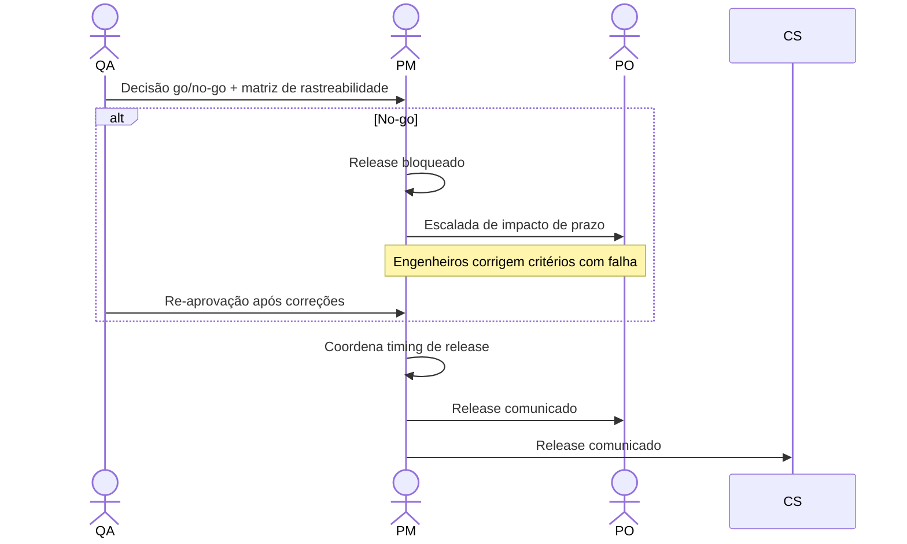

# Interação 12 — QA → PM (Aprovação de Release)

**Direção:** QA inicia. PM recebe.
**Camada:** Dentro do Downstream

---

## Gatilho

Todos os critérios de aceite foram validados e o QA está emitindo uma decisão de go ou no-go.

---

## O que o QA Deve Fornecer

- Decisão explícita de go/no-go
- Matriz de rastreabilidade: cada critério de aceite e seu resultado de validação
- Lista de quaisquer issues conhecidos adiados deste release (com justificativa documentada para o adiamento)
- Resumo do ambiente de teste (confirmando que o ambiente de staging correspondeu à configuração de produção)

---

## O que o PM Faz Com Isso

- Coordena o timing de release com Tech Leads e Engenheiros
- Comunica o release ao CS e ao PO
- Inicia o loop de feedback dentro de 5 dias úteis

---

## Transferência de Ownership

**Do QA:** A validação está completa e a decisão de release é transferida. A responsabilidade do QA para este ciclo termina com a emissão do go/no-go — a menos que um no-go acione um ciclo de re-validação.
**Para o PM:** Detém a coordenação de release, timing e comunicação ao CS e PO. O PM não pode fazer o release sem um go do QA e não pode sobrepor um no-go.
**Artefato transferido:** Decisão go/no-go + matriz de rastreabilidade + lista de issues adiados.

---

## Gate

O PM não sobrepõe um no-go do QA. Se o QA emitir um no-go, o release é bloqueado até que os critérios com falha sejam resolvidos e o QA reaprove. O PM escala as implicações de prazo ao PO.

---

## Caminho de Falha

Se um no-go impactar significativamente um compromisso com cliente ou marco, o PM produz um plano revisado e comunica ao PO e ao CS antes que o cliente seja informado.

---

## O que o PM NÃO Deve Fazer

- Sobrepor ou contornar uma decisão de no-go do QA
- Fazer o release sem uma decisão de go do QA
- Comunicar um release a clientes antes que o QA tenha emitido go

---

## Sequência

