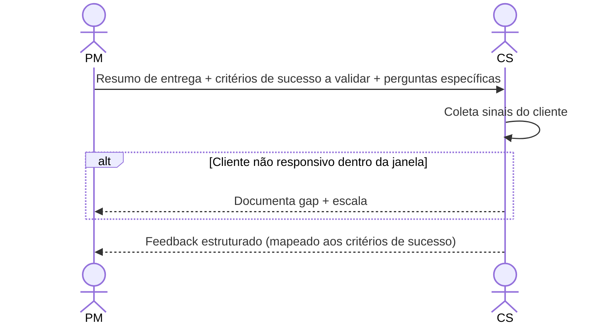

# Interação 13 — PM → CS (Resumo de Entrega)

**Direção:** PM inicia. CS recebe.
**Camada:** Pós-Entrega

---

## Gatilho

O release foi concluído. O PM inicia o loop de feedback dentro de 5 dias úteis.

---

## O que o PM Fornece

- Resumo do que foi entregue e do que foi adiado
- Critérios de sucesso definidos no Readiness Package — para CS validar contra o comportamento do cliente
- Quaisquer limitações pós-release conhecidas ou pontos de monitoramento
- Perguntas específicas para CS coletar dos clientes (sinal de adoção, atrito, confirmação de resultado)

---

## O que CS Faz Com Isso

- Coleta satisfação do cliente e sinais de adoção
- Documenta atrito ou comportamento inesperado pós-release
- Retorna feedback estruturado ao PM e ao PO dentro da janela acordada

---

## Transferência de Ownership

**Do PM:** Fatos de entrega e critérios de sucesso são transferidos. O PM não coleta feedback do cliente diretamente — esse canal pertence ao CS.
**Para o CS:** Detém a coleta de sinais do cliente — indicadores de adoção, relatórios de atrito e feedback estruturado mapeado aos critérios de sucesso. O CS é responsável por retornar o feedback dentro da janela acordada.
**Artefato transferido:** Resumo de entrega + critérios de sucesso a validar + perguntas específicas para clientes.

---

## Gate

CS não resume o feedback como "o cliente está feliz" ou "o cliente não está feliz." O feedback deve ser estruturado contra os critérios de sucesso definidos no pacote.

---

## Caminho de Falha

Se CS não conseguir coletar sinal significativo dentro da janela acordada (ex.: cliente não responsivo), CS documenta o gap e escala ao PM. O loop não é deixado aberto silenciosamente.

---

## O que CS NÃO Deve Fazer

- Prometer ao cliente uma funcionalidade de follow-up ou correção baseada no feedback sem triagem do PO
- Submeter feedback não estruturado ("geralmente positivo")
- Deixar a janela de feedback aberta indefinidamente sem escalar

---

## Sequência

